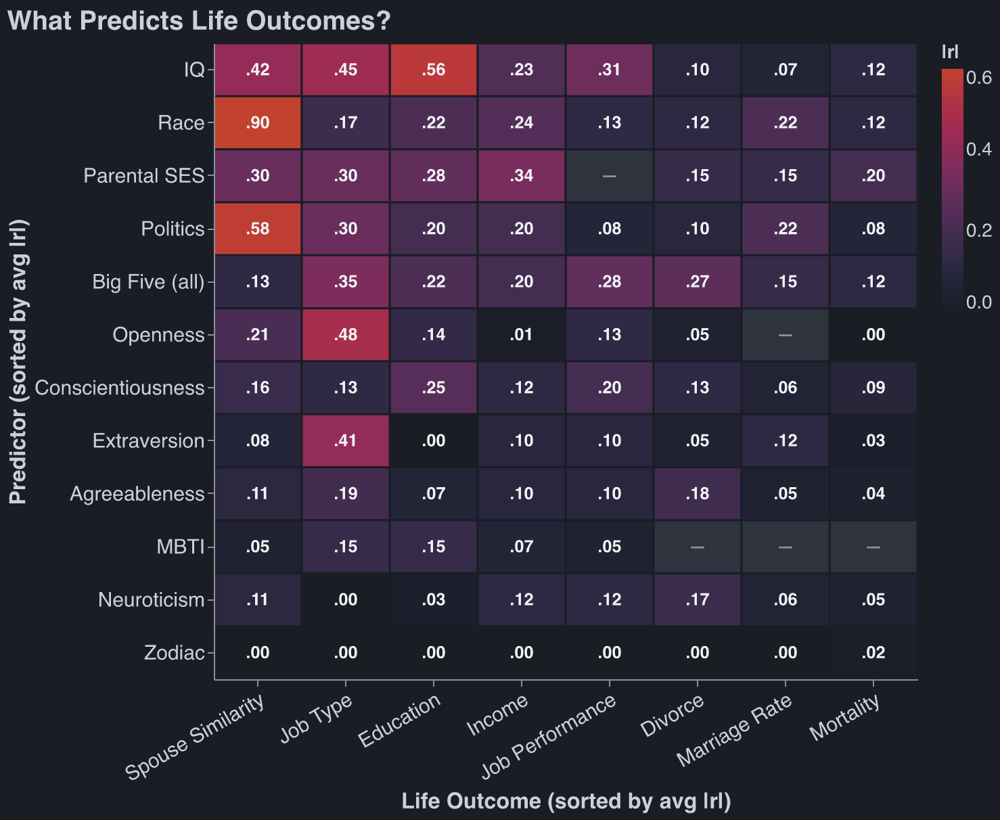

In one of
[Aella’s recent posts](https://aella.substack.com/p/what-if-we-looked-at-all-of-questionspace), she
crowd-sources a ton of personal questions from the internet, gives them in a survey, and then does
[factor analysis](https://en.wikipedia.org/wiki/Factor_analysis) on the data. Most of the time,
$F_1$ (the biggest explanatory factor) is … politics (see for [yourself](https://chaosfactor.xyz/)).

The cynical explanation is: _Twitter is full of boneheads, they were probably asking questions like
“is Elon Musk cool."_ But anecdotally, it seems people’s political opinions have much more
information value than their personality test scores.

My half-baked take: psychologists purposefully remove politics from their ‘personality’ tests. Some
of the biggest uses for MBTI are team-building and get-to-know-you activities. “I’m an INTJ” is a
good icebreaker _because_ it’s milquetoast. Imagine the counterfactual: “I’m 85th percentile
economically conservative, 91st percentile socially conservative, and I’m not going to dignify your
request for my pronouns with a response.”

In nerd land, what makes a test ‘real’ is its predictive power. So let’s put
[MBTI](https://en.wikipedia.org/wiki/Myers%E2%80%93Briggs_Type_Indicator) and
[OCEAN (Big 5)](https://en.wikipedia.org/wiki/Big_Five_personality_traits) to the test. Can they
predict, or are they at least correlated with, things like your income and who you marry? How strong
are the correlations relative to other possible predictors like race or IQ?

<!-- @robbie done (claude3) -->

Sources by predictor. _Spouse similarity_: [Horwitz 2023](@horwitz). _IQ_:
[Strenze 2007](@strenze), [Sackett 2022](@sackett), [Calvin 2011](@calvin). _Big Five_: framework
[Ozer 2006](@ozer); grades [Poropat 2009](@poropat); "job type" = RIASEC interest fit
[Mount 2005](@mount); job performance [Zell & Lesick 2022](@zell); income [Ng 2005](@ng); divorce &
mortality [Roberts 2007](@roberts). _MBTI_: [Pittenger 2005](@pittenger). _Astrology_:
[Carlson 1985](@carlson); season-of-birth [Doblhammer 2001](@doblhammer). _Race_:
[Roth 2003](@roth), [Pew 2017](@pew), plus US Census & CDC gaps. _Parental SES_:
[Chetty 2014](@chetty), [Sirin 2005](@sirin). _Politics_: [Alford 2011](@alford),
[Gallup 2024](@gallup), [Warraich 2022](@warraich).

Methodology: lazy. I asked Claude, and Claude looked up the answers from previous studies. The
numbers pass my sniff test.[^1]

_Takeaways:_

1. Personality tests are bad at predicting life outcomes.
2. MBTI is better than your Zodiac, but not by much. This is not true of OCEAN.
3. One sees IQ at the top of the chart and is happy for meritocracy, but then sees race #2, and
   sighs. Then one notices that the best predictor of income is parental SES, and sighs again.

Before you dunk on me in the comments - “_your income causes your political opinions, not the other
way around!_”[^2] - I know. The causal arrow goes both ways.[^3] The data is still interesting! And
the causal arrow _does not_ flip for race and parental SES.

[^2]: Or any other iteration of “_But x causes y, not vice versa,_”.

[^3]:
    A [British paper](@powdthavee) found that winning the lottery makes you more conservative. This
    was in-line with British politics at the time: rich people were right wing.

## B Roll

You live a couple months longer if you were [born in Autumn](@doblhammer), so your Zodiac does
predict something.

I had two copies of Claude crunch the numbers in this table, then had them compare their results.
Both Claudes immediately said “well, the other agent is probably right about OCEAN and income.”
Claude scores high on agreeableness.

OCEAN was constructed by pulling personality words from the dictionary, culling some based on vibes,
then asking people to rate themselves on a scale from 1 to x for each of these words, then doing
factor analysis on the data. But the culling purposefully excluded words that were ‘evaluative’
which is why we don’t see political affiliation in the data. This was a conscious decision, and
‘values’ ended up as a separate category.

A million different people have come up with their ‘n personality factors’ based on a lexical
approach similar to OCEAN. I would love to see a paper that does factor analysis without excluding
IQ-loaded or politics-loaded questions.

Some of the most creative survey questions from Aella’s respondents:

> Sometimes it’s good to murder. Not self-defense when under attack, but premeditated murder.

> I would feel inclined to engage in sexual behavior with a clone of myself, given the opportunity.

> In group chats, I lurk more than I comment

> I am more sentient than most people

> It’s a disappointment if a person needs light to go to the bathroom in their own home

> Help I’m trapped in the server room hosting this survey! Only selecting strongly agree will free
> me

<!-- @robbie done (claude4) -->

[Full list of questions](https://chaosfactor.xyz/averages/) from Aella’s survey.

<!-- Source definitions for the heatmap (collected into the Sources section by cite.js; order here doesn't matter). -->

{@horwitz}: Horwitz, Smith, et al. (2023), "Evidence of correlations between human partners based on
systematic reviews and meta-analyses of 22 traits," _Nature Human Behaviour_ 7:1568–1583 — the
assortative-mating (spouse-similarity) correlations for every trait and IQ.
<https://pmc.ncbi.nlm.nih.gov/articles/PMC10967253/>

{@strenze}: Strenze (2007), "Intelligence and socioeconomic success: A meta-analytic review of
longitudinal research," _Intelligence_ 35:401–426 — IQ vs education (.56), occupational status
(.45), income (.23). <https://gwern.net/doc/iq/ses/2007-strenze.pdf>

{@sackett}: Sackett, Zhang, Berry & Lievens (2022), "Revisiting meta-analytic estimates of validity
in personnel selection," _Journal of Applied Psychology_ 107(11):2040–2068 — cognitive-ability job
performance operational validity ≈ .31 (observed ≈ .22), down from Schmidt & Hunter's .51 once the
range-restriction corrections are fixed. <https://pubmed.ncbi.nlm.nih.gov/34968080/>

{@calvin}: Calvin, Deary, Batty, et al. (2011), "Intelligence in youth and all-cause mortality:
systematic review with meta-analysis," _International Journal of Epidemiology_ 40(3):626–644.
<https://academic.oup.com/ije/article/40/3/626/742085>

{@ozer}: Ozer & Benet-Martínez (2006), "Personality and the Prediction of Consequential Outcomes,"
_Annual Review of Psychology_ 57:401–421 — the predictor × outcome column framework (directional,
not numeric). <https://gwern.net/doc/psychology/personality/2006-ozer.pdf>

{@poropat}: Poropat (2009), "A meta-analysis of the five-factor model of personality and academic
performance," _Psychological Bulletin_ 135(2):322–338 — the "education" column is school grades
(GPA), where conscientiousness leads. <https://pubmed.ncbi.nlm.nih.gov/19254083/>

{@mount}: Mount, Barrick, Scullen & Rounds (2005), "Higher-order dimensions of the Big Five and the
Big Six vocational interest types," _Personnel Psychology_ 58:447–478 — the "job type" column is
occupational-interest (RIASEC) fit, not status; openness↔artistic ≈ .48, extraversion↔enterprising ≈
.41. <http://www.sitesbysarah.com/mbwp/Pubs/2005_Mount_Barrick_Scullen_Rounds_PP.pdf>

{@zell}: Zell & Lesick (2022), "Big five personality traits and performance: A quantitative
synthesis of 50+ meta-analyses," _Journal of Personality_ 90(4):559–573 — Big Five vs job
performance. <https://pubmed.ncbi.nlm.nih.gov/34687041/>

{@ng}: Ng, Eby, Sorensen & Feldman (2005), "Predictors of objective and subjective career success: A
meta-analysis," _Personnel Psychology_ 58:367–408 — personality vs income/salary.
<https://doi.org/10.1111/j.1744-6570.2005.00515.x>

{@roberts}: Roberts, Kuncel, Shiner, Caspi & Goldberg (2007), "The Power of Personality,"
_Perspectives on Psychological Science_ 2(4):313–345 — Big Five vs divorce and mortality (e.g.
neuroticism → divorce ≈ .17).
<https://projects.ori.org/lrg/PDFs_papers/Roberts_etal_2007_Power_of_personality_PPS.pdf>

{@pittenger}: Pittenger (2005), "Cautionary Comments Regarding the Myers-Briggs Type Indicator,"
_Consulting Psychology Journal_ 57(3):210–221 — MBTI's poor test-retest reliability and predictive
validity; the small MBTI cells are ceilings borrowed from the Big Five trait each dimension proxies.
<https://www.researchgate.net/publication/232494957_Cautionary_comments_regarding_the_Myers-Briggs_Type_Indicator>

{@carlson}: Carlson (1985), "A double-blind test of astrology," _Nature_ 318:419–425 — astrologers
matched natal charts to personality profiles at chance. <https://www.nature.com/articles/318419a0>

{@doblhammer}: Doblhammer & Vaupel (2001), "Lifespan depends on month of birth," _PNAS_
98(5):2934–2939 — autumn-born (Austria/Denmark) outlive spring-born by ~3–7 months; a
prenatal/seasonal effect, not astrology. <https://www.pnas.org/doi/10.1073/pnas.041431898>

{@roth}: Roth, Huffcutt & Bobko (2003), "Ethnic Group Differences in Measures of Job Performance: A
New Meta-Analysis," _Journal of Applied Psychology_ 88(4):694–706 — Black–White job-performance d ≈
0.27 (≈ r .13). <https://doi.org/10.1037/0021-9010.88.4.694>

{@pew}: Pew Research Center (2017), "Intermarriage in the U.S. 50 Years After Loving v. Virginia" —
17% of 2015 newlyweds (and 10% of all married people) are intermarried, i.e. ~83–90%+ same-race.
<https://www.pewresearch.org/short-reads/2017/06/12/key-facts-about-race-and-marriage-50-years-after-loving-v-virginia/>

{@chetty}: Chetty, Hendren, Kline & Saez (2014), "Where is the Land of Opportunity? The Geography of
Intergenerational Mobility in the United States," _Quarterly Journal of Economics_ 129(4) — US
parent–child income rank correlation ≈ 0.34.
<https://opportunityinsights.org/paper/land-of-opportunity/>

{@sirin}: Sirin (2005), "Socioeconomic Status and Academic Achievement: A Meta-Analytic Review of
Research," _Review of Educational Research_ 75(3):417–453 — SES ↔ achievement r ≈ .29.
<https://doi.org/10.3102/00346543075003417>

{@alford}: Alford, Hatemi, Hibbing, Martin & Eaves (2011), "The Politics of Mate Choice," _Journal
of Politics_ 73(2):362–379 — spousal political concordance r ≈ .58–.65, higher than personality or
physical traits. <https://digitalcommons.unl.edu/poliscifacpub/108/>

{@gallup}: Gallup (2024), "When and Why Marriage Became Partisan" — 65% of Republicans vs 50% of
Democrats are married. <https://news.gallup.com/poll/646793/why-marriage-became-partisan.aspx>

{@warraich}: Warraich, Kaltenboeck, et al. (2022), "Political environment and mortality rates in the
United States, 2001–19," _BMJ_ 377:e069308 — a ~15% red/blue county mortality gap; ecological, so
the individual-level correlation is far smaller than the gap suggests.
<https://www.bmj.com/content/377/bmj.e069308>

{@powdthavee}: Powdthavee & Oswald (2014), "Does Money Make People Right-Wing and Inegalitarian? A
Longitudinal Study of Lottery Winners," IZA Discussion Paper 7934 — British panel data; lottery
winners shift right and become less egalitarian, scaling with win size.
<https://www.iza.org/publications/dp/7934>

[^1]:
    Claude wants to include this methodological note on the heatmap values: The numbers in this
    table are absolute values of correlation coefficients ($|r|$), but not every cell is a pure
    Pearson $r$. Most cells — anything with a continuous predictor (IQ, Big Five scores, political
    orientation) and a continuous outcome (income, mortality) — are standard Pearson correlations
    drawn from meta-analyses. When the predictor is categorical but binary (e.g., comparing two
    racial groups on income), the statistic is a point-biserial correlation, which is mathematically
    identical to Pearson $r$. When the predictor is categorical with multiple groups (e.g., race
    with 5 categories predicting income), the reported values are typically eta coefficients
    ($\eta$), which represent the square root of variance explained by group membership —
    functionally analogous to $r$ but not identical. The most problematic cell is race → spouse
    similarity, where both variables are multi-category nominal. No version of Pearson $r$ applies
    here. The technically correct statistic is Cramér’s $V \approx 0.60$, but $V$ is normalized by
    the number of categories and systematically produces lower values for larger tables — the same
    data collapsed to a $2 \times 2$ table yields $\phi \approx 0.90$. We report 0.90 because every
    other cell uses a Pearson-scale metric, and placing 0.60 next to (say) politics → spouse at
    $r = 0.58$ would falsely imply comparable sorting strength, when racial endogamy
    ([83–95% of marriages are same-race](@pew)) is far stronger than partisan sorting. IQ → job
    performance ($r = 0.31$) is the post-Sackett (2022) corrected consensus, well below the older
    Schmidt & Hunter estimate ($r = 0.51$) that still appears in textbooks. All values should be
    read as approximate effect sizes for comparison across the table, not as precise estimates for
    any individual cell.
