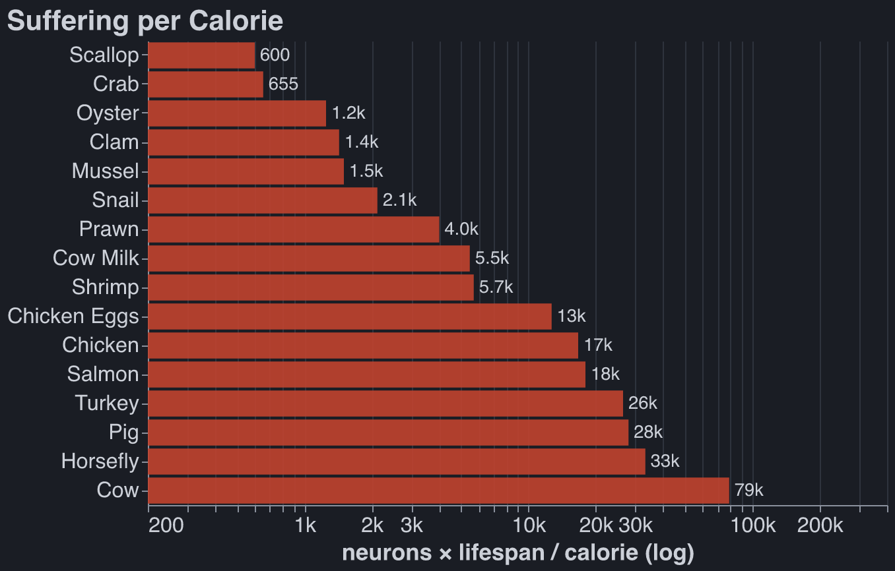
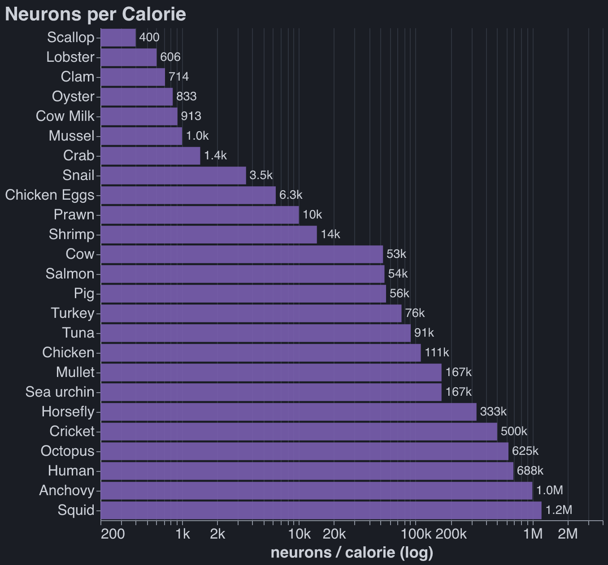

_Update 1/31/26: This
[ACX post](https://slatestarcodex.com/2019/12/11/acc-is-eating-meat-a-net-harm/) does most of the
data deep dive I have been postponing. They claim fish aren't conscious. I don't think consciousness
is well-defined, but I have updated down on the moral weight of fish. Today I am pescatarian and
trying to kick my egg habit._

Epistemic Status: Every two years God bestows upon me dietary wisdom which I am compelled to share
with the world. Unfortunately, God's new revelations tend to contradict his previous ones, just like
in the real Bible. You are reading the gospel of Bob 2025 edition, predicted half life 2 years.

# I: Bob's Diet, A History

## TLDR:

2017: I read _Natural Born Heroes_ by Christopher McDougall and become convinced that some form of
Paleo/Keto/Atkins diet is healthiest. It worked: I lost 40 pounds in ~2 months. I never felt or
looked better.

2020: Paul and Lucia, both of whom I met walking the Camino de Santiago, convince me that I am
ethically obliged to be vegan. I become vegetarian in October 2020, then fully vegan in August 2021.

2025: I get six separate fevers Jan - June 2025. I always felt that veganism was a health sacrifice,
but these fevers are the straw (or the barbell) that breaks this camel's back. I start eating eggs
and dairy in June 2025.

## Becoming Vegan

Ryan and Oliver, two friends from college, convinced the rational part of my brain that factory
farming is evil around 2019. I tried for quite a while to reason my way out of this. Here are some
horrible arguments against being vegetarian that I knew were bad, but repeated mentally in reflexive
attempts to reduce cognitive dissonance:

- Vegetarians annoyingly impose their values on others when they ask to eat somewhere with
  vegetarian options. (Don't meat-eaters impose their values too, but get away with it because
  they're the majority?)
- Being vegetarian is not on the Pareto frontier of lifestyle changes that help the environment
  while preserving quality of life. Thus vegetarians are virtue signalers, QED. (But veganism
  certainly _is_ on the Pareto frontier for maximizing animal welfare, and that's what I was trying
  to do!)
- Being vegetarian is blue-tribe, and in 2019 I was in the red tribe (by Stanford standards), though
  that would change quickly.
- Shouldn't you just avoid factory farmed meat? This question is complicated and I still don't know
  the answer.

During this time period I made a half-hearted attempt to only eat 'happy meats,' ie not factory
farmed food. This didn't work for several reasons:

- Labels like 'cage-free' are in my estimation fairly meaningless. Even cage free chickens spend
  their diseased existence in a miserably crowded coop, constantly trodding through a swamp of feces
  and never seeing the light of day. Maybe there's a meaningful food label out there that truly
  guarantees that the animal I'm eating lived a happy life, but I have not found it.
- I wasn't prepared to quiz friends and restaurants who cooked for me on the origin of the meat I
  was eating. Not eating meat ever is a thing; you call yourself a vegetarian. Not eating meat that
  was produced in a factory farm isn't a thing; people call you obnoxious.[^1]

[^1]:
    I know it's counterproductive, but to this day, people calling themselves flexitarians or
    claiming the title vegetarian when they do sometimes eat meat annoys me. I appreciate that you
    eat less meat, but making up a title for this fact comes across as self-aggrandizing.

No rational discourse was going to change my meat-eating habits at that point in time. I could not
become part of the soy-eating blue tribe. Luckily, in 2021 while walking the Camino de Santiago, I
met several vegans I liked. Most influential was Paul.

Paul was vegan for environmental reasons, which I thought of as dumb because it is not on the Pareto
frontier of lifestyle changes that reduce emissions while preserving quality of life. Paul was not
dumb; he had already made all the lifestyle changes on said Pareto frontier. He was vegan, never
took planes, always used carpools or public transit, never bought new clothing, never consumed
single-use plastic, etc. Paul was monk-like in his dedication, rational in his decisions, and
presented normally to strangers; he was a vegan I wanted to imitate. (I cared more about how I
presented back then).

## A Conflicted Vegan

I always thought vegetarianism/veganism was a health sacrifice. I continue to believe that the two
best dietary heuristics are 1) eat what a caveman would eat and 2) eat what makes you feel good.
Veganism was a step backward on both fronts.

My mouth has never stopped watering at the smell of a hamburger on a grill. I was vegan because
System II told me it was the right thing to do, not because System I felt guilty.

Initially I hated the aesthetics of veganism. I was living in a frat house. I got called a soy boy
much more frequently than I was praised for my ethics. Eventually I stopped hanging out with the
people who called me a soy boy, not literally because they called me that, but because they are
exactly the type of person you think they are. Gradually veganism meshed well with the rest of my
persona.

# II: A First Principles Diet

In June 2025 I decided that veganism was too damaging to my health. Vegetarianism was the default
step backward. After realizing I had used this cognitive shortcut, I decided to use first principles
to propose a diet; hence this post.

## Why is Meat-Eating Bad?

To some, it is because you are effectively _killing animals_. When you slaughter a cow or send a
bullet through a moose's skull, it suffers in the moments leading to its death. ChatGPT tells me
this is on the order of seconds in both cases, which is small relative to the total suffering
experienced by any being.

Killing animals feels not nearly as bad as factory farming, that is, _keeping animals alive_ in
horrific conditions. Pigs in factory farms live in pens so small they don't have the room to turn
around. Ammonia-laden air burns lungs and eyes. Baby pigs have their tails cut off, otherwise a pig
in another pen will chew it off in distress. I won't bore you with similar descriptions of other
animals.

### The Least Bad Metric

Is there any good way to quantify the suffering of animals? I was hopeful that the rationalist
blogging universe would help me find the answer, but it had few concrete suggestions. The best
attempt at a first principles approach was something like "neuron count $\approx$ moral weight."
Everyone hates this solution
([example](https://forum.effectivealtruism.org/posts/Mfq7KxQRvkeLnJvoB/why-neuron-counts-shouldn-t-be-used-as-proxies-for-moral)),
but no one proposes anything better.

I propose something better:
$\text{suffering caused} \approx \text{neuron count} \times \text{time spent on a factory farm}$.
This is of course oversimplified. I sit here awaiting your better metric, dear reader. In the
meantime I will use my flawed-but-plausible one.

## The Rankings

I pulled the numbers here from Google / Claude / ChatGPT and did some light sanity checking. I hope
they are all within one or two orders of magnitude of the true answer.
([Link](https://github.com/robbiethompson18/personal-website/blob/main/posts/bobs-diet/rankings.csv))[^3]

[^3]:
    The internet cannot agree on how many calories or neurons there are in a tuna or salmon. I have
    low confidence in the numbers for vertebrate fish.

Lifespan reflects the amount of time we can expect the animal to spend on a factory farm, so animals
which aren't farmed don't appear in this graph.

If you're going to eat a farmed animal, bivalves (clams, mussels, oysters, scallops) are by far your
best bet. Natant decapods (shrimps and prawns) also score well.

UPDATE 5/17/2026:

1. Based on readings I've done since writing this post, fish seem categorically dumber / less
   sentient per neuron than other animals on the list. I would take the opposite of the conclusion
   suggested here, which is that salmon are the most inhumane farmed animal.
2. Tuna are often 'farmed' in that they are captured and fattened before slaughter, despite the
   suggestion in the table that no one farms them.

# III: Objections

### Free Range

The two obvious strategies arising from this chart are 1) don't eat factory farmed meat, or 2) don't
eat factory farmed meat unless it's a bivalve, a crustacean, or dairy.

I have deep apprehensions about eating wild animals and wiping away my guilt:

- I suspect that average consumer eats a roughly fixed amount of, say, beef, and will pay \$x more
  for free-range than factory farmed. I also suspect that the supply of free-range beef is fairly
  inelastic: beef production is very land-intensive. If you agree with these assumptions, then my
  buying 1lb of free-range beef brings into existence ~1lb of factory-farmed beef. The same goes for
  wild meat, eg salmon.
- I worry that by buying free-range beef I'd be indirectly burning down the Amazon so that cattle
  can graze in Brazil. About free-range pork and fowl, I am uneducated.
- It's not easy to determine whether or not the animal on your plate lived a humane life. I have no
  trust in certifying labels. I could be convinced that specific farms are good.

I consider this objection unresolved. I'm still curious about:

1. How fungible people's meat consumption is across species.
2. If it's possible for me to buy animal products that I'm extremely confident are humanely raised.
3. How land intensive various forms of human animal agriculture are, and how bad this is for the
   environment.

### Don't You Care About The Environment?

Yes, I do, and I wrote about this a bit more
[here](https://robbiewmthompson.com/blog/plastic-straws)[^4]

[^4]:
    I don't know how to perform any calculation that converts kg of $\text{CO}_2$ emitted to units
    of suffering experienced by sentient beings. If you can, please let me know!

### Farmed Shrimp Eat Fishmeal

Correct. And fishmeal normally comes from anchovies, which are much smarter than shrimp. ChatGPT
wants me to believe that 1 pound of shrimp production requires ~.2 pounds of fishmeal. These
anchovies are caught wild. This doesn't change my conclusions.

### Horseflies Don't Look So Good

And as a former eater of horseflies and former believer in insect meats, I am distressed by this.
Raw size is a bad heuristic.

### Some Animals Don't Have Brains At All

Correct. Bivalves don't have a brain or a central nervous system, and they're the first animals on
my list! People with wrinklier brains than mine propose that total cortical neurons are a better
heuristic for moral weight than total neurons. I have no opinion.

# IV. Conclusion

I have decided to include animal protein in my diet, but I want to minimize the animal suffering
that this choice causes. _Being vegetarian is not the optimal solution to this problem._ To
determine what is, I will have to answer the open questions in the free range section. For now, I'll
be eating natant decapods, bivalves, dairy, and (guiltily) some eggs.

UPDATE 4/10/2026: I eat everything and feel guilty about it :(.

# V. B-roll

No one farms lobster or crab because they're cannibals, so you can't leave them in a shared pen.

A dairy cow produces [_35!_ liters of milk per day](@cow-milk).

A chicken can go [from birth to six pounds and slaughtered in 5-7 weeks](@broiler). They are kept
under constant light so that they keep eating, and cages are heated so that no calories are wasted
on staying warm.

If you think keeping animals alive poses no moral cost and the only evil part is the killing, then I
think you're wrong. But if you're right, then neurons/calorie is the correct metric. Here's that
table below. Humans fall between anchovies and octopi.

{@cow-milk}: Holstein Association USA, _Do You Know This About Holstein Cattle?_ — a US Holstein
averages ~80 lb (~35 L) of milk a day. <https://www.holsteinusa.com/pdf/fact_sheet_cattle.pdf>

{@broiler}: The Humane League, "What Are Broiler Chickens and How Long Do They Live?" — modern
broilers reach ~6.5 lb at ~47 days (about 6-7 weeks).
<https://thehumaneleague.org/article/broiler-chickens>
