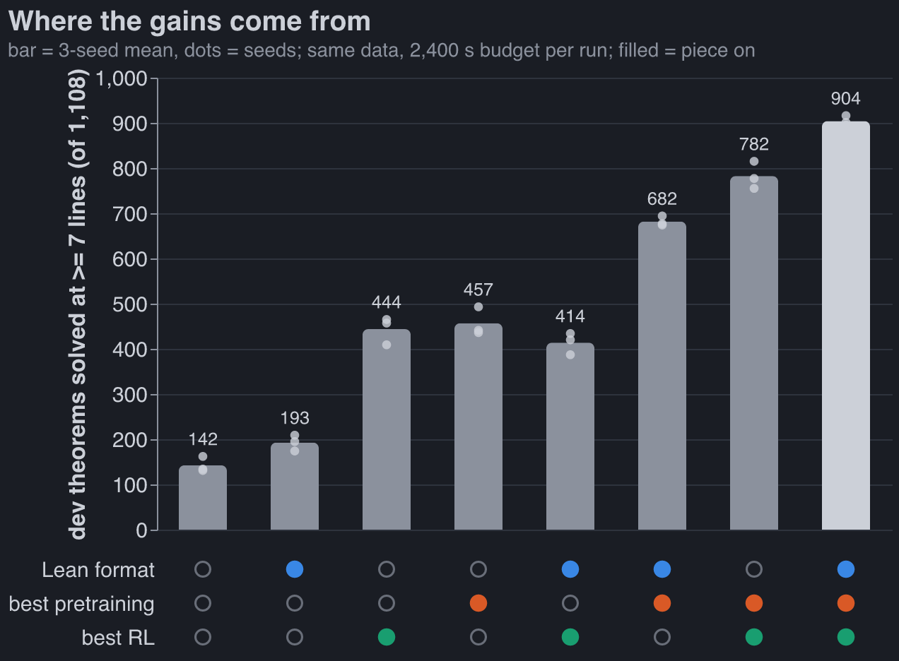
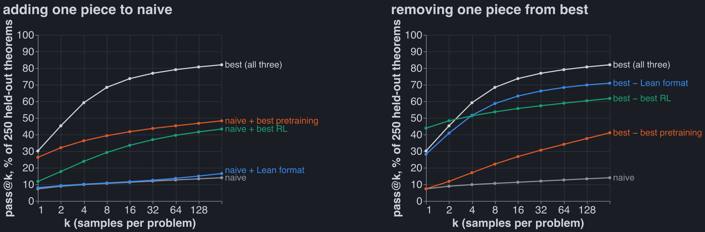
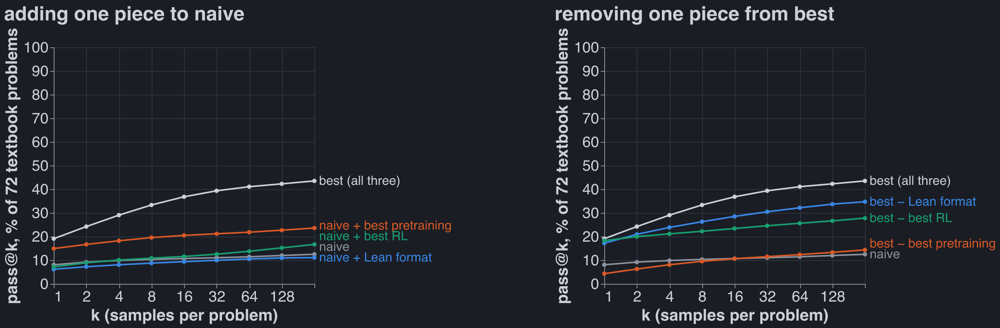
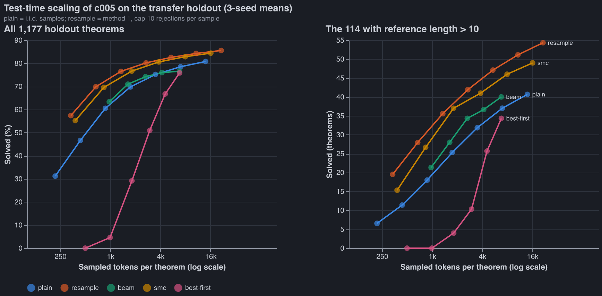
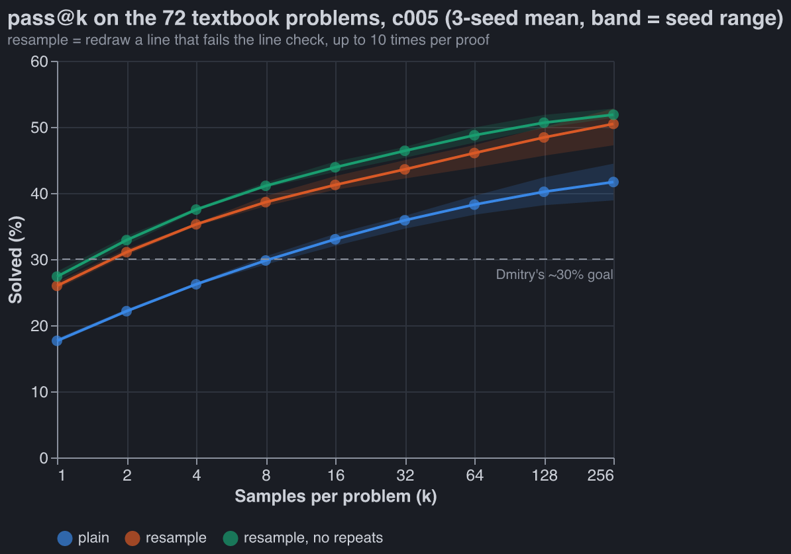
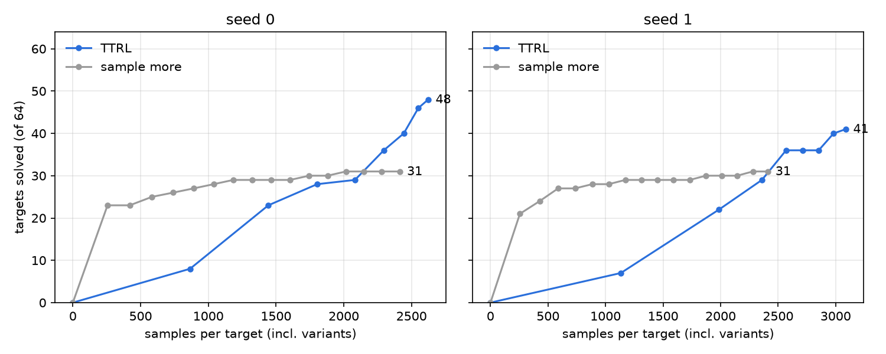
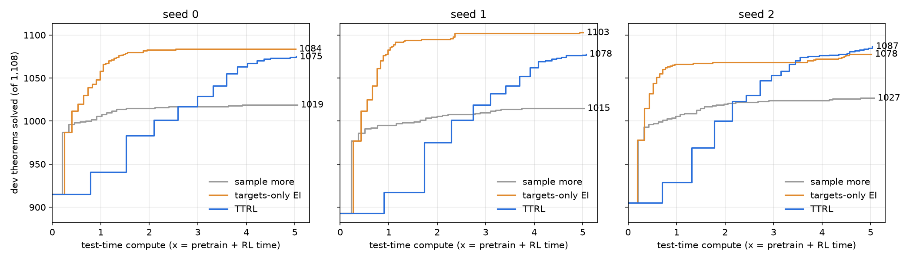
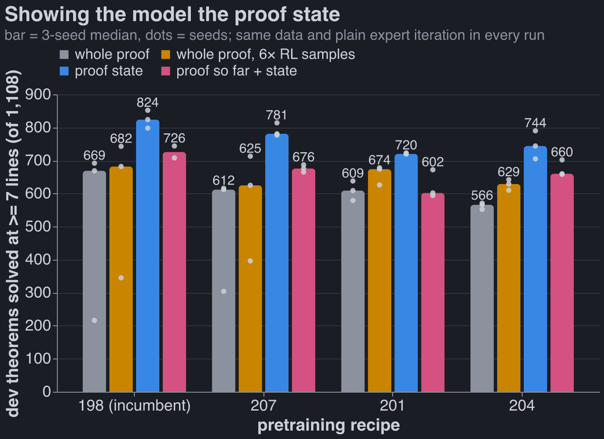

For context, see [last week's post](https://robbiewmthompson.com/blog/pretraining-ablations/).

## Combining models

Where the 762 extra theorems come from, averaging each piece's effect over the other two:

| piece       | naive → best                                                                    | average effect |
| ----------- | ------------------------------------------------------------------------------- | -------------- |
| pretraining | autoresearch run 012's baseline → the autoresearch incumbent (186)              | **+408**       |
| RL          | the harness's plain expert iteration → Leon's recipe + verifier-guided sampling | **+268**       |
| data format | token format → Dan's Lean format                                                | **+92**        |

- **Pretraining matters most**, which I did not expect: I predicted the ordering RL > format >
  pretraining. On its own, better pretraining triples the naive pipeline (142 → 457).
- **The Lean format only pays with good pretraining.** With the naive pretraining it adds +50 (with
  plain RL) or −30 (with Leon's RL); with the 186 pretraining it adds +225 and +122. This is the
  largest interaction in the table (+82). The 186 recipe was found by searching in the Lean format,
  which is part of why.
- **Pretraining and RL add up**: their interaction is +6.
- **Leon's RL buys coverage, not accuracy.** It lowers pass@1 on held-out theorems (44% → 30%) and
  raises pass@64 (59% → 79%). Our metric is pass@64, which rewards that.
- **The textbook set finally moves.** Last week none of 184 pretraining runs got past ~22 of 72. The
  combined model gets 31; it is the RL step that moves it (best pretraining + plain RL: 20).

How the effects are computed

A factor's effect is the mean of the four cells at its best level minus the mean of the four at its
naive level. Interactions are the same contrast on products of ±1 codes, divided by 4: format ×
pretraining +82, format × RL −46, pretraining × RL +6, all three −6.

## The combined model

| stage       | piece                                                                                                                                                                          | from                                                      |
| ----------- | ------------------------------------------------------------------------------------------------------------------------------------------------------------------------------ | --------------------------------------------------------- |
| data        | 155k cap-6 proofs, the ladder RL and transfer pools                                                                                                                            | Dan                                                       |
| format      | `lean_seq`: Lean 4 tactic proofs, one symbol per token; reward = Lean ∧ nd_verify                                                                                              | Dan                                                       |
| pretraining | autoresearch incumbent 186: 6 × 384 Peri-LN, 4 ALiBi + 4 NoPE heads, Muon, MTP, 300 s                                                                                          | autoresearch (last week's post)                           |
| RL          | expert iteration in 15 small rounds (400 targets, ~32 samples each), hardest-first queue, training samples at T 1.0, fresh AdamW per round, GEM loss                           | Leon (evolved by his GEAR agents)                         |
| RL sampling | verifier-guided: every `have` the model writes is checked against the rules given the lines before it; a bad line is rolled back in the KV cache and resampled (up to 4 times) | Leon's run-2 sampler, ported to the Lean format this week |

It got there in four steps on the same pretrained weights (details in our private group repo):
Leon's RL recipe +117 (687 → 804), the full RL target pool +4 (noise), guided sampling +101 (905,
but over the time budget), then the same guided run sped up and cut off at 1,800 s so the whole
pipeline fits in 2,400 s (904). Charles's result that plain expert iteration matches GRPO agreed
with Leon's choice, so there was nothing of his to add.

Verifier-guided sampling in the Lean format

Leon's sampler checked `abs`-format proof lines, which are already natural-deduction lines. In the
Lean format a line is a `have n7 : F := term ;`, possibly inside nested
`( fun ( n3 : A ) => by ... )` boxes. At every `;`, the Lean prefix is parsed with Dan's own Lean →
ND parser (stopped at the cut) and each new ND line goes through Leon's incremental checker. Checks:
0 false rejects on 23,936 line checks of real proofs, 0 false accepts on 9,000 mutated proofs, and
the KV-cache rollback reproduces an un-rolled-back forward to 7e-7 in the logits. On the pretrained
model it accepts ~55% more samples per round. The final proof is still checked by Lean and
nd_verify; guidance only prunes.

## Where the gains come from

All 8 combinations of {naive, best} × {format, pretraining, RL}, three seeds each, fresh, under one
protocol: same data, same 1,500 RL targets, 300 s of pretraining, at most 2,400 s end to end (the
longest took 2,374 s), one A40 (three runs got an RTX A6000, the same chip).

250 theorems from the held-out half of the transfer pool, all 7-14 lines, never used to pick
anything; 256 samples per theorem. pass@k per theorem is the unbiased estimator 1 − C(n − c, k) /
C(n, k) from n = 256 samples with c verified, averaged over theorems and then over the three seeds.

Without Leon's RL (orange on the right) the curve starts highest and flattens early: plain expert
iteration sharpens the model onto proofs it already finds. Leon's recipe samples its training proofs
at T 1.0 and trains with GEM, a loss built to keep the output distribution spread out, and the
curves show it: lower at k = 1, far higher by k = 8.

Dmitry's textbook set, 72 problems nobody trained on: 58 with reference proofs of 1 to 33 lines plus
14 without a reference, scored like the held-out set. The best seed solves 32 of 72. On the naive
pretraining the data format adds nothing and RL about 3 problems; only better pretraining lifts the
left panel clearly. On the right, removing the pretraining collapses the model back to naive.

| pipeline           | dev (of 1,108) | held-out pass@1 | pass@64 | pass@256 | textbook pass@256 |
| ------------------ | -------------- | --------------- | ------- | -------- | ----------------- |
| naive              | 142            | 7%              | 13%     | 14%      | 13%               |
| + Lean format      | 193            | 8%              | 14%     | 17%      | 11%               |
| + best pretraining | 457            | 26%             | 45%     | 48%      | 24%               |
| + best RL          | 444            | 12%             | 40%     | 43%      | 17%               |
| **best**           | **904**        | 30%             | **79%** | **82%**  | **44%**           |
| − Lean format      | 782            | 28%             | 68%     | 71%      | 35%               |
| − best pretraining | 414            | 7%              | 34%     | 41%      | 14%               |
| − best RL          | 682            | **44%**         | 59%     | 62%      | 28%               |

## Test-time scaling

Everything above spends 64 independent samples per theorem. Here the weights are frozen, and the
question is what smarter inference buys.

Setup: five inference methods, all 1,177 held-out theorems (114 longer than 10 lines), three seeds.
Compute is tokens sampled per theorem, rejected attempts included.

- **Plain sampling** (what the metric uses): 31% at 1 sample, 81% at 64.
- **Resample bad lines.** The model writes a proof one Lean tactic (`have ... ;`) at a time, and the
  checker from Leon's RL sampler judges each as it is written. A failed tactic is redrawn, up to 10
  times per proof.
  - 57% at 1 sample, 86% at 64.
  - On the 114 long theorems: 54 solved vs plain's 41.
  - Fewer tokens for the same result: 84.3% at 11k per theorem vs plain's 80.8% at 14k.
  - 1.5× plain's wall-clock.
- **Sequential Monte Carlo** is almost as good: 84.4% at 16k tokens, a little worse on long proofs.
  It keeps N partial proofs, drops those that write a bad line, and clones the survivors.
- **Beam search and best-first search** are no better than plain sampling at the same compute. Both
  rank partial proofs by the model's own probability, a poor guide to which will finish.

What this says about the model:

- **Most failures are local slips, not bad plans.**
  - 69% of samples write at least one invalid line.
  - 58% of all lines checked are invalid.
  - Nearly half of successful proofs needed a redraw.
  - 65% of rejections are a wrong citation or rule; 31% are lines outside the Lean grammar.
- **It is confidently wrong.** Half of all redraws reproduce the line just rejected. Banning those
  repeats lifts pass@1 by 2 points and pass@64 by 1.
- **The curves still flatten.** About 142 theorems (12%) are solved by no method at 64 samples, and
  only 1 in 10 of those falls at 1,024 resampled attempts. The model puts almost no probability on
  any proof of the rest, so search will not reach them; that takes a better model.
- **A learned value does not help.** A small head on the frozen model, predicting whether a
  half-written proof will finish, ranks two partial proofs of the same theorem correctly 69% of the
  time. Steering SMC, beam or best-first search with it changed nothing.
- **The metric scores without this sampler, although the RL trained with it.** Resampling would add
  about 26 points at 1 sample and 5 at 64. The other seven cells were not measured, so it could
  reorder them.

**The textbook set.** Dmitry wanted about 30% on his 72 textbook problems. The combined model gets
there at 8 plain samples or 2 with resampling, but not at 1.

| k   | plain            | resample   | resample, no repeats |
| --- | ---------------- | ---------- | -------------------- |
| 1   | 17.6%            | 26.0%      | 27.4%                |
| 2   | 22.1%            | 31.1%      | 32.9%                |
| 8   | 29.8%            | 38.6%      | 41.1%                |
| 64  | 38.3%            | 46.1%      | 48.7%                |
| 256 | 41.7% (30 of 72) | 50.5% (36) | 51.9% (37)           |

- 3-seed means for c005, a separate training run of the same recipe as the table's "best" cell,
  which gets 44% at 256 samples.
- Resampling is worth 8-9 points at every k, far less than the +26 on held-out theorems at k = 1:
  textbook proofs are longer (references up to 33 lines), and more misses are missing plans.
- The textbook problems are only ever scored, never trained on.

## Test-time RL: making up easier problems

Search over a frozen model tops out: at 1,024 attempts the model puts almost no probability on any
proof of about 90% of the theorems it misses. Search can't fix that, so the weights have to change.
AlphaProof (Hubert et al., 2025) does exactly this for its hardest problems, with what it calls
test-time RL. For each target it generates hundreds of thousands of related problems ("variants":
simplifications, generalizations, lemmas, sub-steps) and runs its normal RL loop on the target plus
variants until the target falls. The logic: RL learns only from successes, so a target the model
never solves gives no gradient. A variant the model solves _sometimes_ does, and it sits right next
to the target. On IMO and Putnam problems this added 15 percentage points beyond a 12-TPU-hour
search, at a cost of 50 to several hundred TPU-days per problem.

This is the simple version of that, on our model.

### Where the variants come from

AlphaProof uses Gemini, prompted with 791 hand-made (problem, variant) pairs, plus code that
perturbs hypotheses and goals. We don't need a language model. A theorem here is a sequent `Γ ⊢ G`
over four atoms, and every variant below is built from the statement alone: no reference proof, no
model. Each is kept only if it is valid. Validity is a 16-row truth table, because the logic is
classical and has four atoms, so valid means provable. AlphaProof has no such check (Lean
mathematics is undecidable) and instead lets its prover try to _disprove_ each variant.

| kind               | move                                                                             | example: `P>Q, Q>R, R>S ⊢ P>S`                                      |
| ------------------ | -------------------------------------------------------------------------------- | ------------------------------------------------------------------- |
| goal `A > B`       | assume A: `Γ, A ⊢ B`                                                             | `P>Q, Q>R, R>S, P ⊢ S`                                              |
| goal `~A`          | assume A: `Γ, A ⊢ F`                                                             |                                                                     |
| any goal G         | reductio: `Γ, ~G ⊢ F`                                                            | `…, ~(P>S) ⊢ F`                                                     |
| goal `A & B`       | each half: `Γ ⊢ A`, `Γ ⊢ B`                                                      |                                                                     |
| goal `A v B`       | one side, if still valid: `Γ ⊢ A` or `Γ ⊢ B`                                     |                                                                     |
| premise `A & B`    | split it into A, B                                                               |                                                                     |
| premise `A v B`    | the two cases: replace it by A; by B                                             |                                                                     |
| premise `A > B`    | strengthen it to B, or to `~A`                                                   | `Q, Q>R, R>S ⊢ P>S`                                                 |
| premise `~(A & B)` | strengthen it to `~A`, or to `~B`                                                |                                                                     |
| lemma (cut)        | any subformula ψ of Γ or G with Γ ⊨ ψ gives two variants: `Γ ⊢ ψ` and `Γ, ψ ⊢ G` | none: every subformula that follows from Γ is a premise or the goal |

Every move is applied to the target, then once more to each result (depth 2). Duplicates are
dropped: same premises as a set, same goal. So is any variant whose goal is already a premise. On
the 64 targets below this gives **3,397 variants** (median 42 per target, 12 to 263). 78% are lemma
cuts.

A true lemma need not be a _useful_ one. The reference proof would say which lemmas lie on the path
to the target, but it is off limits, so the solve rates have to sort useful from useless.

### The loop

Model: c005 seed 0, the combined model above. One copy is adapted on all 64 targets at once, as
AlphaProof does for several targets. Each round:

1. **Sample** 16 proofs of every active target and variant. The sampler is the one Leon's RL uses:
   guided resampling of bad lines (4 redraws per line, 24 per proof), T 1.0.
2. **A target with any verified proof is solved.** It leaves the pool with all its variants.
3. **Mastered variants leave.** A variant solved in more than 75% of its 16 samples (13+) goes out:
   the model already has it, and its proofs would only reinforce what it does anyway.
4. **Train on the frontier.** Variants solved in 1-12 of 16 samples contribute up to 4 distinct
   proofs each, repeated max(1, round(8 × (1 − rate))) times, so rarely solved variants count up to
   8×. That is Leon's weighting. Also in the mix: 20,000 random cap-6 training proofs, against
   forgetting. Variants at 0 of 16 stay in the pool untrained. Learning on their neighbours may make
   them solvable next round, which is how a curriculum is meant to work.
5. **Update** with one round of Leon's RL step: GEM loss, fresh AdamW, 135 steps of 128.

8 rounds. The band (0, 0.75] is my call. It follows AlphaProof's matchmaker, which prioritises
problems with mixed recent results and lowers the priority of those that always or never succeed. A
variant at 0 gives no data. One at 16 of 16 gives data the model doesn't need.

**Targets.** 64 dev theorems that c005 seed 0 fails at 64 plain samples, chosen by hash: lengths
7-14, mostly 9-10. These are dev theorems, not held-out ones: this is the development run. If TTRL
works here, the held-out theorems that every inference method misses are the real test. That would
reverse "training on these evaluation theorems is off the table" above: TTRL trains on the
_statement_, never on a proof of it.

**Control.** The same sampler on the 64 targets alone: no variants, no training, 256 samples per
target per round for 16 rounds (4,096 per target). TTRL counts as a win only if it solves more
targets than the control at the same number of samples. The control is plain sampling at matched
compute. TTRL also pays for fine-tuning, which is reported separately.

### Results

**The stepping stones exist.** Round 1 samples the unadapted model, so it tests the premise
directly: does the model solve variants of targets it can't solve?

| round 1, 16 samples each     | items       | any proof | in the band (1-12 of 16) | mean solve rate |
| ---------------------------- | ----------- | --------- | ------------------------ | --------------- |
| targets                      | 64          | 12%       | 12%                      | 0.01            |
| all variants                 | 3,397       | 43%       | 27%                      | 0.24            |
| cuts, depth 1 / 2            | 243 / 2,391 | 44% / 39% | 24% / 26%                | 0.26 / 0.21     |
| decompositions, depth 1 / 2  | 166 / 425   | 40% / 61% | 33% / 35%                | 0.17 / 0.35     |
| specializations, depth 1 / 2 | 26 / 146    | 73% / 58% | 19% / 29%                | 0.60 / 0.36     |

- The model solves variants 24× more often than their targets (0.24 vs 0.01).
- 63 of the 64 targets have at least one variant in the training band, and every target has at least
  one variant with a proof.
- Specializations (stronger premises) are the easiest, as they should be: they remove a case split
  or an implication. Many are mastered at once and leave the pool.

**TTRL solves 48 of 64. Sampling more solves 31.** Numbers below are seed 0 unless marked.

- **The budgets are matched.**
  - TTRL used 2,623 samples per target (target plus its variants) and 29 minutes on one A40, of
    which 3 minutes were fine-tuning.
  - The control used 2,412 samples per target and 25 minutes.
  - At 2,443 samples per target, just past the control's full budget, TTRL stood at 40.
- **TTRL solves everything the control does, plus 17 more.** The control solves nothing TTRL misses.
- **TTRL barely samples the targets themselves.** Of its 167,872 samples, only 4,832 were on
  targets: 75 per target, against the control's 2,412. The rest went to variants.
- **The gain is on the long theorems.** At 10 lines TTRL solves all 25 targets; the control
  solves 10. At 11 or more lines TTRL gets 8 of 16, the control 6.
- **It starts slower and doesn't flatten.** For the first ~2,000 samples per target TTRL is behind,
  because it spreads its samples over variants. Then rounds 5-8 add 7, 4, 6 and 2 targets, while the
  control adds 2 over its last 1,100 samples per target. TTRL was still climbing at round 8, when it
  stopped.
- **Seed 1 replicates it, less cleanly.** On c005 seed 1 and its own 64 failures (48 shared with
  seed 0), TTRL solves 41 and sampling more solves 31. TTRL again solves everything the control does
  but one, plus 11 more.
  - Its variant pool is bigger (4,468), so TTRL spent 3,088 samples per target, 28% more than the
    control's 2,412.
  - At matched samples TTRL is between 29 and 36; the extra 10 came mostly after the control's
    budget.
  - The control is flat by then: 29 → 31 over its last 1,200 samples per target.

### What's left

16 targets are still unsolved. For 9 of them every variant has been solved at least once, and most
are mastered. la_transfer_1167, for one, has all 19 variants mastered, and the target is still
unsolved. The model can prove every piece but doesn't write the whole proof in one pass. That's the
composition gap: AlphaProof closes it with tree search, which assembles solved subgoals
automatically. Our model writes proofs left to right without search.

The cheap fix is mechanical. A cut gives proofs of `Γ ⊢ ψ` and `Γ, ψ ⊢ G`. Paste the first into the
second where ψ is cited as a premise, renumber, and verify: that's a proof of the target, built from
the model's own pieces. Training on it teaches the long proof. This wasn't in this run.

### Caveats

- **Two seeds, one run each, mostly the same 64 dev targets.** +17 and +10 over sampling more; seed
  1's lead at exactly matched samples is smaller.
- **Dev theorems.** The 64 were picked by failing c005 at 64 plain samples on this dev split. Every
  knob was set before the run and none was tuned, but the real test is the held-out theorems every
  inference method missed. At 1,024 attempts about 90% of those stay unsolved.
- **Easy targets included.** 23 of the 64 fall to 256 guided samples, so "unsolved at 64 plain
  samples" was a weak filter for hard. The comparison is still like for like.
- **Temperature.** Both arms sample at T 1.0, the RL temperature. The frozen eval and the test-time
  section above use T 0.8.

Code: `code/experiments/current/ttrl/` on branch `robbie-experiments`. Per-item results live in the
checkout's `artifacts/ttrl/`: `dev64_ttrl`, `dev64_control`, `s1_ttrl`, `s1_control`.

### At scale: every dev failure, up to 5× the pipeline's compute

The 64-target runs leave two questions:

1. **How much does TTRL add to the real metric, per unit of compute?**
2. **Is it the variants, or just being allowed to train on the eval theorems at all?** Plain expert
   iteration on the eval statements, with no variants, might buy most of the gain. If it does,
   "test-time RL helps" is the headline, not "variants help". The 64-target runs can't separate the
   two: the control never trains.

**Setup.**

- **Models:** c005 seeds 0-2, the combined model exactly as trained: usual pretraining, then the
  usual RL on the RL set.
- **Baseline:** their recorded dev score at 64 samples: 915, 893, 905 of 1,108.
- **Targets:** each seed's dev failures (193, 215, 203), meaning theorems with 0 of 64 samples
  correct. Each arm adapts one shared copy of the model on all of them at once, not one fork per
  theorem.
- **Solved** means at least one sampled proof of the _target_ passes Lean ∧ nd_verify, in any round.
  That is pass@k with a model that may change between rounds, which is how AlphaProof counts. Score
  = baseline + targets solved.

**Three arms, same targets, same compute:**

| arm             | samples                                 | trains on                                |
| --------------- | --------------------------------------- | ---------------------------------------- |
| sample more     | targets, 256 per round                  | nothing                                  |
| targets-only EI | targets, 256 per round                  | proofs of the targets it has solved      |
| TTRL            | targets and variants, 16 each per round | solved targets plus variants in the band |

Every arm uses the same sampler (guided, T 1.0), the same RL step (Leon's), and the same band and
weights as above. One change from the 64-target runs: solved targets now stay in the training mix,
so TTRL is exactly targets-only EI plus variants.

**Compute.** x is what the pipeline spent producing the model: pretraining plus RL, 1,641-1,774 s of
one A40 per seed. Each arm runs until it has used 5x (2.3-2.5 h), and every round records its
cumulative time. The result is a curve of dev solved = baseline + newly solved, read off at 1x, 2x,
3x, 4x and 5x. Evaluation costs are left out: every arm pays the same 64-sample eval first. The
clock is wall-clock on one GPU from the start of the loop. Sampling, Lean checks and fine-tuning all
count; loading the model doesn't. The score at "2x" counts only rounds that _finished_ within 2x.

**Plain expert iteration on the eval statements wins. Variants add little.**

Dev theorems solved (of 1,108; baseline 904), mean of three seeds, at each multiple of the
pipeline's own pretrain + RL compute:

| arm                 | 1x        | 2x        | 3x        | 4x        | 5x        |
| ------------------- | --------- | --------- | --------- | --------- | --------- |
| sample more         | 1,002     | 1,014     | 1,017     | 1,019     | 1,020     |
| **targets-only EI** | **1,069** | **1,082** | **1,085** | **1,086** | **1,088** |
| TTRL                | 929       | 986       | 1,034     | 1,067     | 1,079     |

- **Test-time training is worth a lot, and it doesn't need variants.** Targets-only EI just samples
  the failed theorems and trains on the proofs it finds.
  - At 1x, i.e. doubling the pipeline's compute, it takes dev from 904 to 1,069. That's 81% of the
    failures solved, against 48% for sampling more.
  - By 5x it reaches 1,088 (98.2%), and 1,103 of 1,108 on seed 1.
- **TTRL is slower, and only about catches up by 5x.**
  - On average it trails EI at every budget, and trails even sampling more until about 2.5x.
  - At 5x it is 9 behind on average. Seed 2's TTRL passes EI at about 3.5x and ends ahead (1,085 vs
    1,078); seeds 0 and 1 stay behind.
- **EI plateaus; TTRL doesn't.** EI is within 6 of its final score by 2x. TTRL was still adding
  theorems when the budget ran out.
- **The two solve partly different theorems.** TTRL solves 12, 4 and 11 theorems that EI never does;
  EI solves 21, 29 and 2 that TTRL doesn't. Together they leave 12, 1 and 19 unsolved.
- Sampling more flattens early, as before: +116 at 5x, nearly all of it by 2x.

What this means for the earlier sections: the 64-target result ("TTRL 48, sampling more 31") stands,
but it doesn't show that the variants did the work. That run had no arm that trained on the targets
alone. Targets alone do most of it, at least when there are ~200 of them.

#### What each arm does, round by round

Seed 0, from the logs. All three arms start from the same weights, the same 193 targets and the same
sampler.

|                      | sample more                | targets-only EI                               | TTRL                                                             |
| -------------------- | -------------------------- | --------------------------------------------- | ---------------------------------------------------------------- |
| round 1 samples      | 193 targets × 256 = 49,408 | the same 49,408                               | 193 targets + 12,254 variants, × 16 = 199,152                    |
| round 1 time         | 6.0 min                    | 7.3 min (23 s of it training)                 | 22.9 min                                                         |
| solved after round 1 | 72                         | 72 (same samples, same seed)                  | 26 (16 samples per target)                                       |
| then                 | sample the 121 left        | train on the 72 solved, resample the 121 left | train on the 26 solved plus 40,663 records from in-band variants |
| solved after round 2 | 81                         | 97                                            | 68 (at 44.5 min)                                                 |
| rounds in 5x         | 50                         | 112                                           | 16                                                               |
| final                | 104                        | 169                                           | 160                                                              |

Round 1 is a free consistency check: with the same samples and the same seed, EI and sample more
must agree, and they do on all three seeds (72, 84 and 73). Round 2 is the first time training
shows: EI gains 25 targets with no variants at all.

#### Why TTRL loses to EI

1. **Far fewer updates.** TTRL samples every active variant every round, so its rounds last ~9
   minutes against EI's ~1.3. In 5x it gets 16, 19 and 36 updates (seeds 0-2); EI gets 112, 166
   and 110. Its first update comes at 0.7-0.9x; EI's at 0.25x. Seed 2, where TTRL ran the most
   rounds, is the one where it ended ahead.
2. **Each update sees under half of TTRL's data.** Every round is 135 steps of 128 (17,280
   examples), Leon's setting. EI's mix is ~22k records (its own proofs plus the 20,000 retained), so
   one round covers most of it. TTRL's early mixes are 50-60k, so a round covers 28-35% of what it
   just collected.
3. **The targets are already each other's variants.** About 200 failures from one generator share
   schemas, so a proof of one teaches the next. EI gets that transfer free. The statement-made
   variants add mostly easy neighbours that it pays to sample every round.

Points 1 and 2 are settings I made for the 64-target run and kept unchanged, so this run would be
pre-declared: k = 16 per variant, every variant every round, Leon's 135 steps. At 3× the targets
they make TTRL sampling-bound. The honest claim is "TTRL _as configured_ loses to EI", not "variants
can't help". Two things say the variants do something: TTRL was still climbing at 5x while EI had
plateaued, and it solves 4-12 theorems per seed that EI never does.

**Caveats for this run.**

- **One run per seed per arm.** EI beats TTRL on all three seeds up to 3x. After that, seed 2 swaps.
- **The last round of each arm can finish just past its 5x budget.** The table reads only rounds
  that finished within each multiple; the chart's end labels include that last round.
- **Two of nine pods were RTX A6000s** (seed 1 sample more, seed 2 EI), the same chip as the A40 and
  slightly faster. Both are baseline arms, so if anything it favours them.
- **This is dev-transfer, the set the pretraining loop selected on.** No proof labels were used, and
  no knob was tuned on these runs. Held-out is still untouched.
- **EI's budget goes mostly into training.** It ran 110-166 short rounds, spending 2,500-4,300 s on
  fine-tuning, against 500-1,100 s for TTRL. Compute here is wall-clock on one GPU, so both sides
  are counted.

**Next.** Start with EI on the targets, then add variants only for the theorems EI leaves. The two
arms' solved sets overlap only partly, so the combination should beat either: their union leaves 12,
1 and 19 per seed. Per-theorem results: `artifacts/ttrl/devall_s{0,1,2}_{ttrl, selftrain,control}/`
in the checkout.

## Showing the model the proof state

Every model above writes a whole proof in one pass. It sees the theorem and the proof so far, and it
has to work out for itself which hypotheses are in scope, which boxes are open and what it is
currently trying to prove. Dan built a different interface this week, modelled on AlphaProof (Hubert
et al., 2025). The model sees only the current **proof state**, the way Lean prints it: every
hypothesis in scope, then the goal. It writes one step. An environment applies the step and prints
the new state, and the model writes the next step. The finished steps concatenate into an ordinary
Lean proof, which Lean checks as before.

An illustration, halfway through proving `P → Q, Q → R ⊢ P → R`, inside the box that assumes P:

    h1 : P → Q          the premises
    h2 : Q → R
    n1 : P → Q          lines proved so far, still in scope
    n2 : Q → R
    n4 : P              the box's assumption
    n5 : Q
    ⊢ R                 what this box still has to prove

The model's next step is `have n6 : R := n2 n5 ;`. Nothing else is in its context: no theorem
statement (the first state is the theorem) and no proof history. The state is Markov: it summarises
everything the history would tell the model.

Dan found that on his 3.2M-parameter model this lifts what the pretrained model can reach nearly 6×
(with no RL: 779 vs 158 transfer theorems). I wanted to know two things. Does it help my pretraining
recipes as much? And does my autoresearch ranking of recipes survive the change of format?

**Setup.** Four recipes from my autoresearch loop: 198, the incumbent (186 above plus two small
deletions), and three of my simplified versions of it (207, 201, 204). Each was trained four ways,
three seeds each:

- **whole proof**: the usual format, as everywhere else in this post;
- **whole proof, 6× RL samples**: the same, with 192 RL samples per target per round instead of 32.
  This was added once the first proof-state runs showed they take about 3× the wall-clock: it gives
  whole-proof RL roughly the same time and spends it on sampling;
- **proof state**: Dan's interface, with the environment assigning the names a step introduces;
- **proof so far + state**: the proof so far, then the state. This separates "the state helps" from
  "dropping the history helps".

Everything else is the frozen autoresearch harness: the same data, 300 s of pretraining, and plain
expert iteration (4 rounds × 1,500 targets), not Leon's RL. The metric is the same dev metric as
above.

| recipe | whole proof     | 6× RL samples   | **proof state**     | proof so far + state |
| ------ | --------------- | --------------- | ------------------- | -------------------- |
| 198    | 669 / 692 / 216 | 743 / 345 / 682 | **852 / 824 / 798** | 708 / 744 / –        |
| 207    | 612 / 304 / 616 | 713 / 625 / 396 | **781 / 777 / 814** | 665 / 676 / 687      |
| 201    | 609 / 638 / 579 | 674 / 678 / 626 | **723 / 720 / 720** | 594 / 672 / 602      |
| 204    | 566 / 552 / 571 | 610 / 642 / 629 | **705 / 744 / 790** | 660 / 702 / 658      |

- **The proof state wins on every recipe**, by 111-178 theorems over the whole proof (medians).
- **It isn't just the extra compute.** Six times the RL samples buys the whole-proof model only
  13-65 theorems. The proof state still leads that by 46-156. The 6× arm got about three quarters of
  the proof state's RL wall-clock, not all of it, so these leads are slightly flattered. At the rate
  whole-proof RL improves with samples, the missing quarter won't close them.
- **It never failed to take off.** Whole-proof expert iteration sometimes never gets going. The
  seeds behind 216, 304, 345 and 396 start RL solving 7-11% of their samples, against 22-24% for
  seeds that take off, and never catch up in 4 rounds. Their pretrained models look the same on
  held-out theorems (greedy ~0.96). This happened in 4 of 24 whole-proof runs and 0 of 12
  proof-state runs. One slow starter, 207 seed 0, caught up in the last round.
- **My recipe ranking survives.** 198 is best in both formats, and the spread from best to worst
  recipe is about 100 in both. I had predicted the state would shrink it: part of what the recipe
  search bought (ALiBi/NoPE heads, handling long contexts) should matter less once the context is a
  short state. It didn't shrink.
- **The history doesn't help.** Adding the proof so far is worse than the state alone on every
  recipe (84-118 lower) and takes 2-3× as long, because the context grows with every step. This
  matches what Dan found on his model.
- **Plain RL in the proof state gets most of the way to Leon's RL.** 198 with plain expert iteration
  goes from 669 (whole proof) to 824. The combined model, with Leon's RL in the whole-proof format,
  gets 904. The two haven't been combined yet.

**Cost.** A proof-state run takes about 3× the wall-clock of a whole-proof run: 58 minutes against
17 for 198, on an A40. It doesn't fit the 2,400 s budget every other run in this post uses. Sampling
is about 4× slower and fine-tuning about 2.6× (a proof is about 5 training pairs). Most of the
sampling cost is engineering, not the format. The model re-reads the whole state at every step, with
no reuse between steps. My recipes' ALiBi attention builds a bias tensor that grows with the square
of the context, which forced the batch down from 2,048 to 512 to fit in memory. And the environment
steps a few thousand attempts in Python between model calls.

From next week the pipeline uses the proof state.

Caveats

- **Plain expert iteration only.** None of these runs use Leon's RL or the guided sampler, so "proof
  state + Leon's RL" is untested.
- **Dev metric, three seeds.** No held-out or textbook numbers yet for the proof-state models.
- **Fork.** All arms, the whole-proof ones included, ran on Dan's current code, which judges with
  Lean alone; the rest of the post uses Lean ∧ nd_verify. Whole-proof scores here match the
  autoresearch loop's (198: 669 and 692 vs 681).
- **Batch sizes.** The proof-state batch was 512, and the proof-so-far batch started at 256 and
  halved whenever memory ran out (down to 32 on the weakest recipes). Batch size changes the random
  draws, not what is measured.
- **One lost run.** 198's third proof-so-far seed was lost to a network drop and not re-run.
- **GPUs.** 7 of 47 runs got an RTX A6000 instead of an A40 (the same chip).

Code: `code/experiments/current/state_recipes_20260930/` on branch `robbie-experiments`; the
environment is Dan's `state_env.py` (fork branch `dan_best-state`). Per-run numbers:
`charts/state_runs.csv`.

## Methodology

| factor      | naive                                                                           | best                                                |
| ----------- | ------------------------------------------------------------------------------- | --------------------------------------------------- |
| format      | the token era's `abs` format; reward nd_verify                                  | Dan's `lean_seq`; reward Lean ∧ nd_verify           |
| pretraining | autoresearch 012's `pretrain.py`: fork GPT, 4 × 256, RoPE, AdamW                | autoresearch 186's `pretrain.py`                    |
| RL          | frozen harness: 4 rounds × 1,500 targets × 32 samples, 600 fine-tune steps each | Leon's recipe + guided sampling, stopped at 1,800 s |

Everything else is fixed: the same 155k training proofs (in the two formats), 300 s of pretraining,
the same seeded 1,500 RL targets, the same evaluation (64 samples at T 0.8 on 1,108 dev-transfer
theorems; the charts' pass@k at T 0.8 too). The two pretraining recipes differ only in a tokenizer
switch from the files the autoresearch loop ran. Code:
`code/experiments/current/factorial_20260929/` and `combined_pipeline_20260928/`, branch
`robbie-experiments`.

## Caveats

- **"Best pretraining" was found in the Lean format**, by the loop that was selecting on this dev
  metric, and "best RL" was evolved by Leon's agents in the token format on his own dev set. Each
  "best" is best where it was searched, so the format interactions partly measure where the search
  happened. The held-out and textbook numbers are free of the dev selection.
- The token format is judged by nd_verify alone, the Lean format by Lean ∧ nd_verify; they agree on
  more than 99.9% of samples.
- Best RL runs until 1,800 s after start (~1,450 s of RL); plain RL stops after its fixed 192k
  samples, 330-1,590 s. Both fit the same total budget, so part of the RL effect is using time the
  plain recipe leaves idle.
- Three seeds per cell; seed spreads are 10-60 theorems, small next to the effects above.
