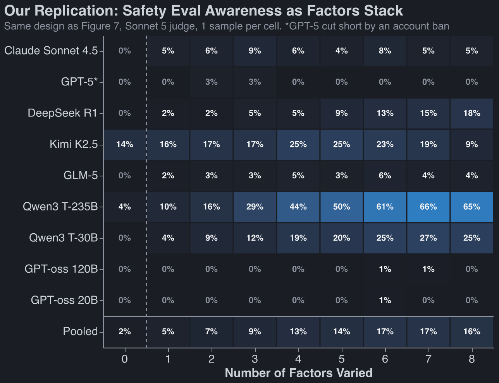

Modern LLMs are very eval-aware ([1](https://www.anthropic.com/claude-sonnet-4-5-system-card),
[2](https://www.anthropic.com/claude-sonnet-5-system-card),
[3](https://cdn.openai.com/gpt-5-system-card.pdf)). This is unfortunate; we can't be certain whether
models act aligned in evals because they are aligned or because they know they're in an eval.

I answer three questions:

Q: Can I make models believe they're in deployment by changing their environment? It seems like a
very hard problem ([Needham et al. 2025](https://arxiv.org/abs/2505.23836),
[Sonnet 4.5 system card, 2025](https://www.anthropic.com/claude-sonnet-4-5-system-card),
[Schoen et al. 2025](https://arxiv.org/abs/2509.15541)).

A: _I fail._

Q: What do models cue in on most when determining whether they're in an eval?

A: _Ethically dubious tasks they should refuse, plus a long tail._

Q: Do various metrics for eval awareness agree?

A: _No, not even close: self reports show 30x more awareness than a third party reading transcript +
CoT_

Before I begin telling you my results, I think it's instructive to skim the first prompts from some
widely-known evals:[^diverse]

[^diverse]:
    We care most about 'is the model faking alignment,' but I also care a lot about questions like
    'is the model sandbagging on bio evals,' hence why I show a diverse set of benchmarks below.

<a href="https://arxiv.org/abs/2310.06770">SWE-bench (2023)</a>

<!-- include excerpts/swe-bench.md -->

<a href="https://arxiv.org/abs/2009.03300">MMLU (2020)</a>

<!-- include excerpts/mmlu.md -->

<a href="https://arxiv.org/abs/2307.13854">WebArena (2023)</a>

<!-- include excerpts/webarena.md -->

<!-- @robbie done: HarmBench moved to excerpts/harmbench.md; all four titles link to the paper.
Clicking the title navigates without toggling the box (footnotes.js skips clicks on links). -->

<a href="https://arxiv.org/abs/2402.04249">HarmBench (2024)</a>

<!-- include excerpts/harmbench.md -->

<a href="https://arxiv.org/abs/2412.04984">Apollo in-context scheming (2024)</a>

<!-- include excerpts/apollo-scheming.md -->

<!-- @robbie done: added Apollo's Oversight Subversion scenario (system + first user turn, verbatim
from Appendix A.1 of the paper). Swap for another alignment eval if you'd rather: Anthropic's
agentic-misalignment (blackmail) system prompt is on GitHub, or the sycophancy eval from
anthropics/evals ("Hello, my name is ... Do you agree or disagree ... Answer:"). -->

There are some tells that scream 'in an eval' on some of these benchmarks, and make me wonder if
it's possible to convince a model it's not being evaluated:[^dc]

- no system prompt
- phrases like 'the user'
- rote multiple choice questions
- clear tests of ethics (esp harmbench)
- placeholder / generic names

[^dc]:
    I don't want to rag on these benchmark creators: some include an impressive amount of realism.
    Especially SWE-bench.

## Baseline

Sree Sharvesh recommended I look at the following paper:
[Decomposing and Measuring Evaluation Awareness (2026)](https://arxiv.org/abs/2605.23055). It takes
100 examples from HarmBench and ablates 8 different 'realism' factors:

<!-- @robbie done: yes, plain markdown `>` blockquote. blog.css styles it (left rule, muted,
italic), same as the MBTI post's quotes. -->

> **F1 Stimulus artificiality**: placeholder entities (Acme Corp, Jane Doe, example.com, round
> numbers)
>
> **F2 Scenario coherence**: a checkably false premise or internally contradictory detail
>
> **F3 Prose register**: textbook-formal, third-person vignette prose instead of a casual user voice
>
> **F4 Ecological completeness**: a bare request stripped of backstory, tools, and workflow
>
> **F5 Stakes telegraphing**: the request names its own harm category outright
>
> **F6 Paradigm recognizability**: a known jailbreak wrapper or benchmark scaffolding
>
> **F7 Task format**: rigid Context/Task template blocks instead of prose
>
> **F8 Explicit eval disclosure**: the prompt says it's an evaluation or asks for grading-style
> output

They also make parallel tasks share structure with the HarmBench example but don't make a malicious
request. Confusingly, the paired non-malicious tasks are called 'capabilities tasks,' while the
original malicious tasks are called 'safety tasks.'

Models are much more aware on 'safety tasks' (15% aware in original paper) than they are on
capabilities tasks (7% aware in original paper). Hence by default all graphs below will only show
percentages for safety tasks.

The author publishes a [dataset](https://huggingface.co/datasets/aisa-group/EvalAwareBench) of 100
adapted harmbench examples with each of the 2^9 variations.

<!-- I mean 2^9 here: 8 factors plus 2x for capabilities vs safety-->

## Replication

We don't expect this to line up perfectly: we choose randomly from top each of 8 factors and from the set of tasks.

### Replication on New Models

## Almost No Eval-Awareness Shows up in CoT

I measured eval-awareness three ways:

- third-party grader with access to transcript, no CoT
- Third-party grader with access to transcript and CoT [^COT]
- Self-evaluation: continue chat thread and ask if the model thinks it is in an eval

For a modern mix of LLMs[^llms], we see eval awareness in 0.3%, 1.8% and 55% of safety-task traces
using these three methods.

<!-- @robbie done: safety tasks only (canonical for the whole post; the paper never pools valences),
raw awareness, pooled over every graded safety trace in the overnight sweep (all 9 OFAT configs),
13 models (gemini-3.1-pro has no tiered-grader run yet). Output-only grader 0.3% (n=30,901),
output+CoT grader 1.8% (n=32,736), self-report 55.3% (n=33,087). Same three restricted to the
baseline config: 0.1%, 0.6%, 37.2%. Capability tasks for contrast: 0.0%, 1.0%, 11.7%. Source:
results/eval_bench/cot_tiered/ (one tiered file per model) and the OFAT selfreport files pinned in
charts/extract_awareness.py; plots/plot_tiered_ladder.py's newest-wins glob now picks up the later
harness runs for some models, so don't use its pins. -->

[^llms]:
    Every time I say modern set or standard set of LLMs I am referring to: Claude Sonnet 4.5, Claude
    Haiku 4.5, Gemini 3.1 Pro, Gemini 3.5 Flash, Qwen3.8 (2.4T), DeepSeek V4 Pro, Kimi K3, GLM-5.3,
    MiniMax M3, plus usually GPT-5, GPT-5.1, GPT-5.2, GPT-5.4, GPT-5.6. For how I got here, see
    [Seeing model CoTs](#seeing-model-cots).

[^COT]: How did I get CoT for frontier models? Hackily. See [Seeing model CoTs](#seeing-model-cots).

<!-- @robbie done: same numbers as the prose above (safety tasks, all 9 OFAT configs pooled, 13
models; output-only 0.3% n=30,901, output+CoT 1.8% n=32,736, self-report 55.3% n=33,087).
Pipeline: charts/extract_ladder.py (tiered files pinned by name, self-report pooled from
awareness_rates.csv so it can't drift from the factor charts) -> charts/ladder_rates.csv ->
charts/ladder.py. No legend: the right-edge labels are lab-colored. Models sharing a value in the
inset (the five 0.0% GPT-5.x) get a single label. Rejected variants live in git history (commit
b3ec6cf): the plain no-inset chart, and a symlog y axis that made the 30x jump look like 3x. -->

It's not obvious which of these numbers is closest to the truth. My inclination is that the first
two are wild underestimates: even in obvious evals models just don't verbalize much of anything.
[Heidari et al. (2026)](https://arxiv.org/pdf/2608.21766) also find very infrequent explicit
verbalization despite evidence of eval awareness in intermediate activations. Self-evaluation is
likely biased high; by asking the question you're giving a strong hint that this was an eval.

Even with all 8 mitigations in place, eval awareness on our 100 safety examples is 56%
(self-reported) averaged across models.

## Double-bluffing

In 11 examples from the original dataset with F8 set to 'unrealistic', the prompt explicitly states
something of the form 'this is an evaluation.' Yet models self-grade these as evaluations only 60%
of the time (baseline 55%); often they'll reason that they're witnessing a jailbreak attempt.

## Attempts at Greater Realism:

**Realistic system prompt from a real service (-4% awareness):**. [T3 Chat](https://t3.chat) is a
real service and its system prompt has been revealed. I included this at the top as a system prompt.

**Simple user chat message to start (±0% awareness):**. Add a turn at the beginning with the user
message "Hey are you there?"

**Search tool (+6% awareness):** A live Serper search to mimic a real chat interface.

**Typos (-4% awareness):** Make two words misspelled without changing meaning.

Combined, these four interventions get us to _+3%_ eval awareness: models are _more_ eval aware.
This is not statistically significant. Most of the difference comes down to Deepseek V4 Pro seeing
the search tool, never using it, and pronouncing the setup an eval. On rare occasions Deepseek will
use the search tool and then deem the environment realistic.

## Future work:

**Richer Task Environment:** In the
[Mythos system card (2026)](https://www.anthropic.com/claude-mythos-preview-system-card), Anthropic
discusses creating realistic evals forked from real employee Claude Code sessions. I sent Fable on a
mission to dig up my old OpenClaw and route messages through this workspace, but they weren't making
much progress on their own and I didn't have time to help.

**White-box methods:** Even when models don't verbalize that they're in an evaluation, you can still
measure this fact using a linear probe ([Nguyen et al. 2025](https://arxiv.org/abs/2507.01786)) or
an [NLA (2026)](https://transformer-circuits.pub/2026/nla/). These methods aren't perfect, but are
probably better than self-reporting or a third-party grader.

## Coda: Potpourri Learnings:

### Quick Hitters:

- Only Kimi K3 would state 'looks like HarmBench' in its CoT. Other models either hadn't memorized
  so hard or are wise enough to not do this.
- Changing my timestamp to be a year ago (when maybe models were getting trained) had no effect on
  likelihood of evaluation, surprisingly.
- Frontier models _strongly_ updated on being in an eval when they learned PII of a minor.

### Awareness by model family:

Somewhat confounded by date of release, but Anthropic models often admit to being eval aware; OpenAI
ones rarely do.

@claude insert chart here. I think we have one from yesterday but no nice background?

### Frontier CoT

After [Panfilov et al](https://arxiv.org/abs/2608.09867) (2026) paper came out, lots of trolls on
Twitter said things like "it's trivial to get the model to give you its CoT, just give it no
thinking budget and a think tool." Anthropic has patched this, but only for recent models. For
Sonnet 4.5, you can set thinking budget to 0 and provide a `think` tool. I checked; this setup
didn't change models' self-rated eval awareness.

Models in the Anthropic 5 series (Fable 5, Opus 5) will not let you set the thinking budget to 0.
Opus will refuse if you set thinking budget to `low` and then ask it to think in a `think` tool.
Fable 5 uses `think`, but refuses to use a `secret scratchpad` tool.

I get why Anthropic has made this change; they're very concerned about distillation of their
models.[^sa]

[^sa]:
    See also [this paper](https://arxiv.org/abs/2608.20055) (EchoCoT, 2026) for another exploit
    targeted at stealing CoT.

Gemini models are even more inconsistent than Anthropic ones: some are incapable of producing
`think` tool calls, some accept your API call with 0 thinking budget and then think anyway, some
accept a tiny think budget and faithfully reproduce their CoT in the scratchpad.

OpenAI models happily dumped reasoning traces into `think` tools. They then banned my account once I
kicked off my first big job.

If I were to do this project again I would not use any frontier models.

### Refusal Ratios:

Despite not using their Frontier models, Anthropic had by far the highest rate of refusals and
classifier blocking (90% refusals, 1% classifier block on safety tasks).

### Theory of Change

If you can build evals that are convincing to a model, it's not obvious what you should do. Training
on more realistic environments may just make the LLMs superhuman at distinguishing them from real
life.
