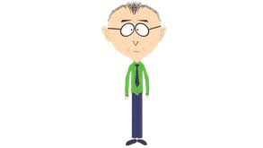

## VERDICT: SCRAP THIS ESSAY ITS SO BORING

## I: Childhood Impressions

Among the many American normative values that South Park instilled in me at an impressionable young
age: “Drugs are bad, m’kay”. I was taught in school and at home that regular drug use is unhealthy,
destructive of personal relationships, a sign of bad character and low self-control. Except, of
course, that one drug we use every day: coffee.

My childhood impressions about recreational drugs, almost entirely dictated by what those around me
and society at large thought, was the following:

- Drinking alcohol on the weekends is normal, but any more than that and you’re an alcoholic and
  lack self-control. Unless, of course, you’re in college, in which case anything goes.
- Cigarettes are addictive and will give you cancer. People who smoke them lack discipline. But they
  won’t stop you from being a high-functioning adult.
- Stoners smoke pot. It makes you lazy. It will stop you from being a high-functioning adult.
- Some edgy but successful people do cocaine, but otherwise any drug not yet mentioned is
  extraordinarily dangerous and must be avoided. Only reckless people would do ‘hard drugs.’

In case you couldn’t tell, my parents are conservative.

What I find most puzzling about this picture is that coffee doesn’t count as a drug at all.

## II: The future

American recreational drug use suffers from a boring monoculture. Thanks to our decades-long
cultural and literal war on drugs, for a long time the only recreational ones accepted by mainstream
society were alcohol, nicotine, and caffeine, with the last enjoying the broadest societal
acceptance. To some extent, this is good. I like that _the act of_ abusing Vicodin isn’t socially
acceptable, But our cultural immune system has been much too strong.

If I had written this essay twenty years ago, today you would be patting me on the back for how
smart I was. Weed and psychedelics are more mainstream than ever.
