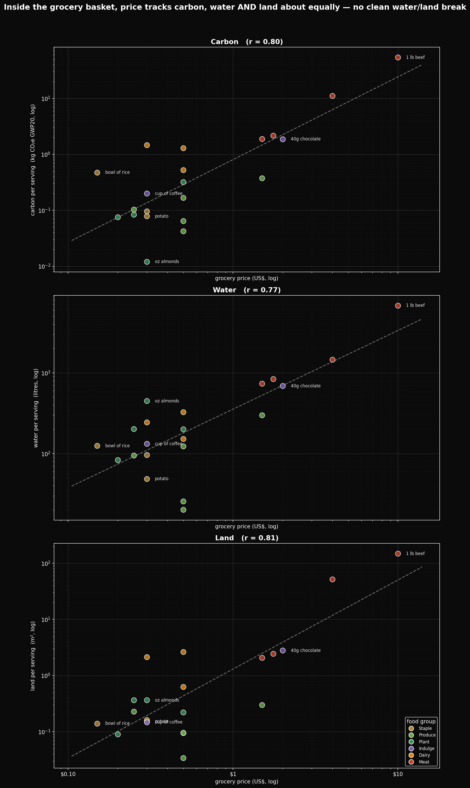
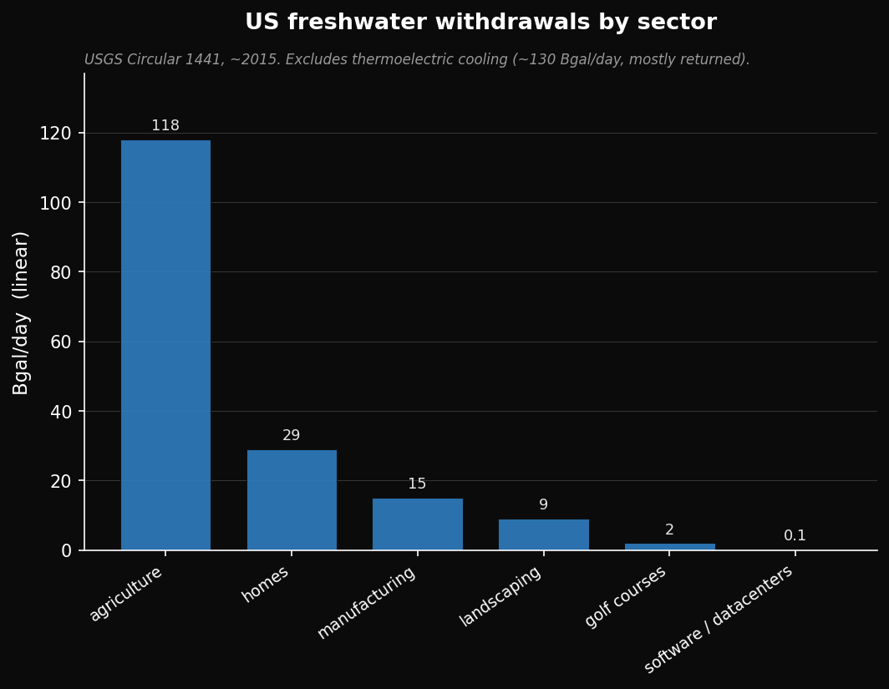
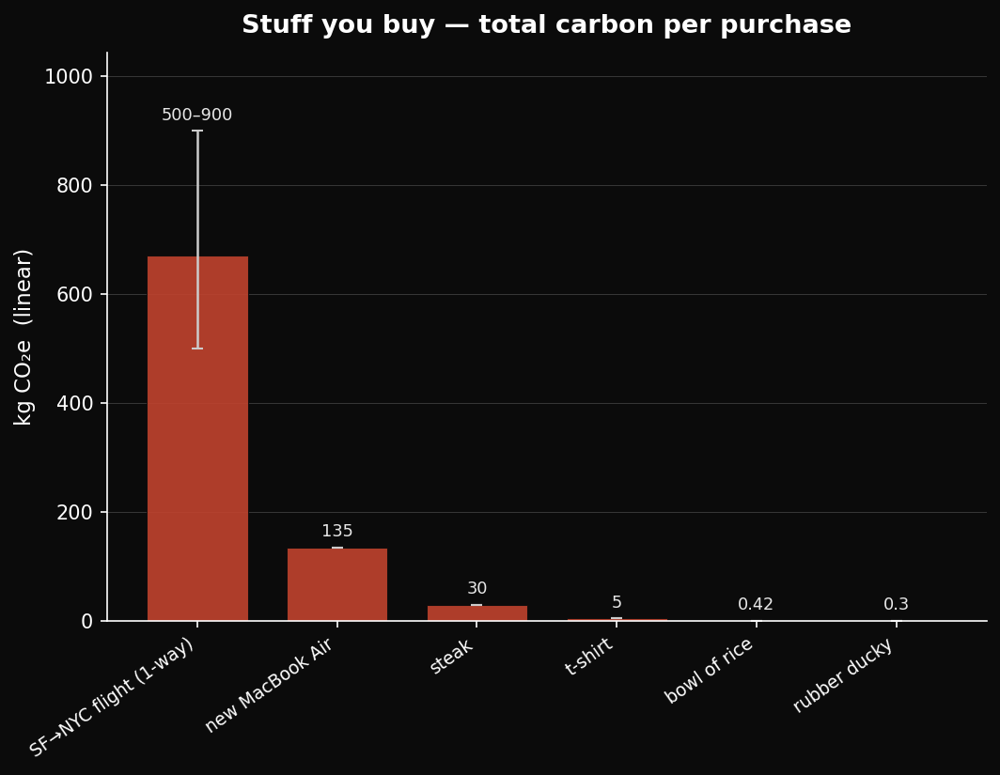

Many people before me have dunked on the plastic-straw Nazis. From a utilitarian perspective, using a paper straw is close to pointless. [^toxoplasma] 

[^toxoplasma]: My plausible explanations are innumeracy or costly signaling/symbolism (see [The Toxoplasma of Rage](https://slatestarcodex.com/2014/12/17/the-toxoplasma-of-rage/)).

I am wise enough to use plastic straws with reckless abandon; I know they don't
matter beyond their symbolic value. 
Do other consumption habits of meaningful impacts?

TLDR: These things might matter:
* Eating meat 
* Traveling long distances[^travel]
* Anything that costs a lot of money

A list of things I now feel confident are worth 0 mental energy:
* creating less trash, recycling, composting, buying fewer things
* eating organic
* eating local food
* any label that tries to convince me a product is ethical (aside from possible animal ones)?
* my energy usage / carbon footprint, outside of travel
* my water usage

In the post-singularity utopia, we will price externalities, and no one 
besides the externality-pricers will have to think about this. For now,
if you're going to think about anything, just let it be your food and travel.

## A Prelude On Methodology

### Probably Approximately Correct

Claude found basically all of the numbers for this article, and for 20% of numbers
it actually told me what I should care about. I *strongly* believe in the power
of working with approximately correct numbers - most of my conclusions don't change
unless Claude was wrong by several OOMs, which doesn't happen often.

### Global Warming, Discount Rates

In my inside view of the world, I care a very small amount about
reducing my carbon footprint. I think it's quite likely we get something
singularity-like in the next 20 years. In that time global warming won't do 
much harm. But out of epistemic humility, I still try to reduct my carbon footprint.

This post uses GWP20 C02e to model carbon footprint. The gist of it is:
how much warming will be caused over the next 20 years by emitting one ton of C02?
You can then put other things on the same scale: a ton of methane is ~80 C02e,
a flight from SF to NYC is ~2-3 tons C02e (much more than you'd expect from the ~1 ton of pure carbon emissions:
physicists think that atmospheric contrails caused by planes have a large warming effect).

It's convention to use GWP100. I am using GWP20 because I believe that
1) interest rates are real and your model of the world should account for them. 
The price of treasuries suggest that \$1 today is worth 39c in 2046 and ~.6c in 2126.
2) the singularity is nigh.

Reader beware: methane (from trash or cows) is ~3x less c02e when using GWP100.

## TLDR

Carbon costs correlate with dollar costs, r = 0.92.
Taken to it's logical extreme, this impies that you actually need to spend 
0 extra mental effort optimizing for the externalities of your decisions as 
a consumer. You're already optimizing for externalities by having a budget.

This sounds trite, but it would be quite profound to my past self:
I did spend mental cycles trying not to create trash, and it was a waste of energy.

The *glaring* exception here is animal welfare: you can subject 
hundreds of chickens to torture every year for not much money.
I've written up my thoughts on this subject previously, see
(link).

* 

## Creating Less Trash, Recycling, Composting

Each year Americans send about 243 million cubic yards of trash to landfill (we *generate*
roughly double that — ~487M yd³ — but about half is recycled, composted, or burned). Normal
landfills stack 50-100 feet deep. Each year we devote ~1,500 acres to new
landfill (at 100 ft deep). By contrast, 880 million US acres are used for agriculture.

After 100 years a landfill gets covered and become many things: a park, a 
golf course, a conservation area, a solar farm. It's actually very generous to
the anti-trash side to say that creating an acre of landfill is as bad as creating
100 acres of farmland: the farmland is more like to counterfactually be biodiverse nature,
and discount rates imply that one year of landfill in 2126 is $0.95^{100} = 0.6\%$ as bad as
one year of landfill in 2026.

Still, if we use that model, we find that the average American's annual landfill use is about
20 cubic feet, or $0.2\ \text{ft}^2$ of landfill area. It takes ~1,590 sq ft
to create a 1-lb steak, so your year of trash is $0.2 / 1590 \times 100 \approx 0.013$ steaks: about
1/80th of a steak, even after the 100x penalty.

The last argument one could make against using too much trash is that microplastics
are bad for our health. One has to 
argue from a place of epistemic humility (they could be bad!); no one has 
done a causal study showing they are. If you are worried about microplastics,
landfills aren't the thing you should be worred about anyway: plastic rugs,
cutting boards, and certain fish are much more scary.

Surprisingly, Claude told me the biggest reason to worry about recycling is emissions.
Almost *half* (~45%) of observed warming to date is from methane, and landfilled trash is the
#3 source in the US — ~14% of US human-caused methane.
Still, your annual landfilled-food-waste methane is equivalent to ~0.53 t CO2e, or about
1/5 of one SF↔NYC round-trip flight or ~10 steaks. If you do care, you should
put your energy into making sure you recycle your aluminum and cardboard, see appendix
(todo link appendix)

(Conclusiong pending but this section might just get scrapped or move to the end).

## Buying Local Food

Shipping food in a container on a cargo ship is basically free, economically and
from a carbon perspective. In many cases it's much *more* environmentally
friendly to just ship stuff.  As an extreme example, at its 1992 peak Saudi
Arabia pumped on the order of a *trillion* gallons of water a year out of
non-renewable fossil aquifers to grow wheat, whereas wheat grown in Illinois
typically requires ~0 irrigation. 

Some supermarkets will fly stuff in, which seems bad,
but I don't know any heuristics for telling what has been flown 
(and not trucked or cargo-shipped) besides "avoid sashimi-grade 
fish from afar and berries with a huge price tag." Apparently
even fresh asparagus is frequently flown? Your banana certainly
was not, even though it came from Ecuador, so distance is not 
a great proxy.

## Wasting Vegan Food 

All of your food carbon footprint is in meat/dairy. Pound for pound, a loaf of
bread is ~90× less bad than a steak (~1.4 vs ~120–200 kg CO₂e/kg at GWP20). I buy fresh loaves
and toss them when they're stale.

For my thoughts on animal welfare see __ [todo add link to substack].

## Quotidian Power Use

Tldr: you only need to worry about driving.

(All numbers approximate)
| item | kWh | CO₂e |
|---|---|---|
| one ChatGPT/Claude chat query | 0.0003 | 0.1 g |
| one lightbulb-hour (9W LED) | 0.009 | 3 g |
| one washer run (cold, machine only) | 0.5 | 0.2 kg |
| heating the water for a 5-min hot shower | 1.1 | 0.4 kg |
| one dryer run (electric) | 3 | 1.1 kg |
| one month of Claude Max (\$200) | 3 (chat) → tens (all-day agentic coding) | 1–11 kg |
| one Tesla mile | 0.25 | 93 g |
| one Ford F-150 mile (gas, 20 mpg) | 1.7[^fuel] | 0.44 kg |
| average American's daily lighting (per household) | 1.8 | 0.65 kg |
| average American's daily food | ill-defined | ~10 kg (GWP20; ~6.5 at GWP100) |
| average American's daily home use (excl. driving/food, per household) | 30 | 11 kg |
| average American's daily driving (per driver, 37 mi) | 52[^fuel] | 14 kg |

I wrote this section because I wanted to convince my mother to stop bothering me
about leaving on the lights. I was right, though by fewer OOMs than I would've
expected.[^bulbs]

[^fuel]: This is *fuel energy* — the chemical energy in the gasoline — not
electricity, so it isn't apples-to-apples with the EV rows on the kWh column (a
gallon of gas holds ~33.7 kWh). The CO₂e column *is* comparable across every row.

[^travel]: Cars and planes use a pretty similar amount of carbon per human mile traveled, but certainly not per human hour spent traveling.

[^bulbs]: Lighting is the one place the frugal instinct comes closest to
mattering, because LEDs are ~5–10× more efficient than the incandescents they
replaced — a "60W-equivalent" bulb draws only ~9W. A 2023 US federal standard
made it law: general-service bulbs must now emit at least 45 lumens per watt,
which effectively banned the old 60W incandescent.

## Quotidian Water Use

| item | water use |
| --- | --- |
| one chatGPT query | 0.0001 gal |
| one toilet flush (high-flush) | 3.5 gal |
| \$200 a month Claude plan, used fully | 8 gal |
| 5 min shower | 11 gal |
| one bowl of rice | 30 gal |
| one loaf of bread | 200 gal |
| one cotton to shirt | 700 gal |
| one steak | 1,800 gal |
| 1lb of almonds | 1,900 gal |

<!-- @claude: heads up — this chart contradicts the paragraph directly below. Across 21 foods, $ predicts water (r 0.77) and land (r 0.81) about as well as carbon (r 0.83); almonds is the ONLY real "wetter than its price" outlier, and only ~2x. The true "$ doesn't proxy water/land" effect is a *composition* effect (water/land live almost entirely in food, which is ~10% of spending), not a per-item break. Rewrite this para if you want prose+chart to agree — I left it alone per scope. -->

Here for the first time we do see a very clear break between
an item's economic cost and it's environmental cost. We should just
make farmers pay for the water they use, but we never will
for silly electoral college / lobbying reasons.

I don't feel guilty for eating a bag of almonds, but maybe I should?

Definitely don't feel guilty about taking a long shower.

| industry in US | water use |
| --- | --- |
| agriculture | 118 Bgal/day |
| homes | 29 Bgal/day |
| manufacturing | 15 Bgal/day |
| landscaping | 9 Bgal/day |
| golf courses | 2 Bgal/day |
| software / datacenters | 0.1 Bgal/day |

*Freshwater withdrawals, US, ~2015 (USGS Circular 1441); total ≈ 281 Bgal/day. Biggest omission: thermoelectric power-plant cooling (~130 Bgal/day, ~46%), withdrawn then mostly returned. Landscaping is the outdoor slice of "homes" plus commercial turf; datacenters' ~0.1 Bgal/day is direct on-site cooling (indirect water via their electricity is several× that — still a rounding error). See below on withdrawals vs. consumption.*

*US gallons; food/textile figures are total (virtual/lifecycle) water. Steak = 1 lb beef (~1,800 gal), matching the 1-lb steak used elsewhere — a ~½-lb portion is ~900 gal. Almonds: ~1,900 gal/lb is the full LCA footprint (~16,000 L/kg); the viral "~1 gal/almond" (~400 gal/lb) is a narrower blue-water figure. Toilet: ~3.5 gal is an old high-flush unit; modern US toilets are 1.6 gal (WaterSense 1.28). The t-shirt's ~700 gal is mostly rainfall on cotton, not tap water. Bread ≈ a ~500 g loaf. AI water is operational cooling — ~0.0001 gal/query (Altman's ~0.32 mL; the viral "~500 mL" figure is per *session*, not per query), and the \$200 plan "used fully" ≈ all-day agentic coding at ~30 kWh/mo.*

Agriculture is ~42% of US freshwater *withdrawals* (nearly all irrigation) and **~80–90% of *consumptive* use**; self-supplied industry is ~5% of withdrawals, and public supply (all homes + businesses) ~12%. Withdrawals vs. consumptive is the key distinction — most home and industrial water is returned to the source, whereas irrigation is mostly consumed.

## Organic foods

It's really complicated, but I think I could be convinced that organic
food creates more negative externalities than normal produce.

Here are Claude's most important reasons why organic might be worse:

- **It uses a lot more land.** Organic yields run ~20-25% lower, so growing the same
  amount of food takes ~25-33% more farmland.
- **Banning GMOs makes the land problem worse.** Organic prohibits GMOs. But GM crops
  *raise* yields (killing them drops US corn ~11%, soy ~5%, cotton ~19%), so a global GMO
  ban would need ~7.7M more acres cleared and emit ~0.9 Gt CO₂.
- **It is not pesticide-free.** Organic bans *synthetic* pesticides but allows a long list
  of "natural" ones: copper (a heavy metal that never degrades and builds up in soil),
  sulfur, pyrethrin (toxic to bees and fish), and until ~2007 rotenone (the one they use
  to give lab rats Parkinson's). "Natural" does no safety work here — ~1 in 9 organic
  samples still shows pesticide residue.
- **More tillage, more manure.** No synthetic herbicides means more plowing for weeds
  (erosion, diesel), and fertility often comes from manure (a pathogen and runoff vector).

I asked Claude for reasons why Organic farming is better, but it read the above
and came up with three bullets that show the opposite. Opus was feeling extra sycophantic today.

- **~4× fewer synthetic-pesticide residues** (11% of samples vs 46% for conventional). It
  also bans synthetic nitrogen fertilizer and cuts cadmium ~in half. Conventonal residues
  sit well below safety limits, so the personal health case is thin.
- **Lower farmworker exposure — real in aggregate, a rounding error at the margin, and not zero.**
  Conventional US farms spray ~1 billion lb of synthetic pesticides a year, and globally acute
  pesticide poisoning hits an estimated hundreds of millions of farmworkers a year (mostly poor-PPE,
  developing-world farms). But your slice is tiny — going fully organic prevents ~1 US farmworker
  poisoning per ~20–40k person-years of eating — and organic isn't exposure-free either (sulfur, its
  main fungicide, is the top reported cause of pesticide illness in California).
- **Higher biodiversity per acre (~+30% species), but probably a net loss per calorie.** Organic
  fields hold ~30% more species and ~50% more critters — but they need ~30% more land, and if that
  extra land would otherwise be wild (native habitat is ~2–5× richer than any cropland), high-yield
  conventional + spared wildland wins on *total* biodiversity. The per-acre gain likely cancels or
  reverses once you count the land.

<!-- @robbie: filled from POST_RESEARCH.md §8 (the "↳" answers there have all the sources: yield gap = Seufert 2012 / Ponisio 2015; GMO-ban land cost = Purdue/Taheripour 2016; copper/rotenone/pyrethrin = 7 CFR §205.601; glyphosate desiccation = Organic & Non-GMO Report; residues/cadmium = Barański 2014). Each list is <300 words. @robbie done. -->

## Most Labels On Consumables (eg no bycatch, FSC certified wood)

TLDR: Don't bother. Most of this section written by Claude.

Possibly Worthwhile:
* **Energy Star**: Its appliances saved ~520 billion kWh in 2020 (~400 Mt CO₂e,
the annual power of ~50M homes), and EPA reckons ~\$350 saved per \$1 it spent.

Probably Not Worthwhile:
* **Dolphin-safe tuna**: eastern-Pacific dolphin kills fell ~99% (132,000/yr →
~800). Caveats: that was mostly the 1990 *law*, and the nets it pushed boats
toward kill millions of sharks instead.  
* **FSC wood**: genuinely mixed — a
2024 *Nature* study found more wildlife in FSC forests, but Greenpeace quit
FSC in 2018, calling it greenwashing.

Definitely Pointless:
* **Rainforest Alliance**: the premium that reaches the farmer is under a penny per chocolate bar (<1% of the cocoa price).
* **Fairtrade**: a little more (~1–2¢/bar), but it goes to the co-op, not the farmer.
* **MSC "sustainable" seafood**: funded by logo fees on the very products it certifies, and it's rubber-stamped plenty of contested fisheries.
* **"No bycatch" / "natural" / "eco"**: unregulated marketing with no audit behind them.

### Cage free / pasture raised labels on eggs / chicken / beef etc

@ claude which of these labels are real?
@claude done — full breakdown + sources in POST_RESEARCH.md §9b. TLDR: trust the *certifier seals that
audit farms* (Animal Welfare Approved > Certified Humane / Global Animal Partnership steps / USDA Organic);
treat bare USDA word-claims (cage-free, free-range, grass-fed, "raised without antibiotics") as loose —
nobody inspects the farm, it's a signed affidavit, and USDA's own 2024 test found antibiotic residues in
~20% of "Raised Without Antibiotics" cattle. Outright meaningless: "natural," "no hormones" on poultry
(banned anyway), "farm fresh," "Angus," "vegetarian-fed." "Cage-free" just means indoors-in-a-barn.
Left the condensed prose for you to write.

## Charts

(Need to fix this one)

## Appendix

### Recycling

People will actually pay for recycled cardboard and aluminum, whereas recycled
plastic and glass is mostly only used because of mandates or to please consumers.

Here is a table showing how much co2e you can expect so save from 
recycling various things:

**Per ton, by material** (US, 2018; "thrown away" = sent to landfill):

| material | tons landfilled / yr | CO2e saved per ton recycled | total, if all of it were recycled |
| --- | --- | --- | --- |
| aluminum (cans) | 1.2M (of 2.7M all aluminum) | 9.1 t | 11 MMT (24 if all aluminum) |
| paper & cardboard | 17.2M | 3.5 t | 60 MMT |
| plastics | 27.0M | 1.0 t | 27 MMT (upper bound) |
| glass | 7.6M | 0.3 t | 2.3 MMT |

**Per item:**

| item | CO2e saved by recycling one |
| --- | --- |
| 1 cubic-foot cardboard box (hollow, single-wall) | 0.84 kg (9 Tesla-miles) |
| 1 aluminum can (12 oz) | 0.13 kg (1.4 Tesla-miles) |
| 1 glass soda bottle (12 oz) | 0.07 kg (0.7 Tesla-miles) |
| 1 PET soda bottle (2 L) | 0.06 kg (0.7 Tesla-miles) |

*Sources: EPA Facts & Figures 2018 (tonnage), EPA WARM v15 (per-ton CO2e). Per-item weights are assumed — can ≈13 g, box ≈225 g, glass bottle ≈200 g, PET 2 L ≈48 g — and are the least-certain inputs. These savings are almost all avoided CO2 (smelting/pulping energy), so GWP20 ≈ GWP100 here. "Plastics, if all recycled" is an upper bound: most of those 27M tons have no real recycling path.* 

### Buying Fewer Things

I don't have a strong opinion on whether or not it's bad to purchase things 
made from non-coercive sweatshop labor. This is a thorny question, but 
generally I think people would rather have a bad job than no job, and it's
not obvious to me what the counterfactual is for a laborer in a place like Vietnam.

It's certainly bad to buy things from coerced labor. I avoid Shein. Is there a way to 
do this scrupulously?

If your concern is emissions from more manufacture goods, it's worth having OOM estimates for
various items:

<!-- @robbie: filled in below. All figures are rough OOM lifecycle (cradle-to-grave) estimates; sources in the comment underneath. Sorted low→high so the order-of-magnitude jumps are obvious. -->

| item | ≈ lifetime CO2e | ≈ CO2e per dollar |
|---|---|---|
| rubber ducky | 0.3 kg | 0.1 kg/\$ |
| bowl of rice | 0.42 kg | 2.8 kg/\$ |
| t-shirt | 5 kg | 0.3 kg/\$ |
| steak | 30 kg | 2.4 kg/\$ |
| new MacBook Air | 135 kg | 0.12 kg/\$ |
| flight from SF to NYC (one-way) | 500–900 kg | 3 kg/\$ |

It turns out that dollars spent is a pretty good proxy for carbon cost.
I find this out mostly by accident.

<!--
Sourcing / reasoning for each (delete or keep as you like):
- bowl of rice: rice is ~4 kg CO2e/kg dry at GWP100 (Poore & Nemecek 2018 / OWID); flooded paddies are ~55% methane, so ~8.4 kg/kg at GWP20. A ~50 g bowl → ~0.42 kg. Unusually high for a grain because of the paddy methane.
- rubber ducky: ~40 g of PVC; plastics run ~3–6 kg CO2e/kg incl. manufacture → ~0.2–0.4 kg.
- t-shirt: cotton tee full lifecycle ~2–7 kg CO2e (Carbon Trust); using ~5 kg.
- steak: beef ~60 kg CO2e/kg at GWP100 (Poore & Nemecek, beef herd); ~49% is enteric methane, so ~119 kg/kg at GWP20. ~250 g steak → ~30 kg.
- new MacBook Air: 135 kg CO2e for the 13" M3, 256GB base config (Apple's official Product Environmental Report, Mar 2024). ~80% of that is manufacturing, so the footprint is paid up front whether or not you ever turn it on.
- flight SF→NYC: ~4,150 km one-way. ~0.4 t CO2 from fuel alone; roughly doubles to ~0.5–0.9 t CO2e once you include high-altitude (non-CO2 radiative forcing) effects. Round-trip ≈ 1+ tonne.

Prices assumed for the per-dollar column (consumer price you'd actually pay): rice ~\$0.15/bowl (grocery cost of ~50g dry from a 5lb bag), rubber ducky ~\$3, t-shirt ~\$15, steak ~\$12 (250g ribeye), MacBook Air ~\$1,100, flight ~\$200 one-way. All to ~1 sig fig.

Relative scale, if useful for your prose (GWP20): one steak (~30 kg) ≈ ~6 t-shirts ≈ ~70 bowls of rice; one round-trip flight (~1 t) ≈ ~7 MacBooks ≈ ~33 steaks.

Per-dollar punchline: the absolute and per-dollar columns rank almost oppositely. A MacBook is your biggest single hit in absolute terms but among the *cheapest* carbon per dollar (~0.12 kg/\$); cheap flooded-paddy rice and flights are the carbon-intense ways to spend. General rule: \$ spent on manufactured goods/electronics ≈ low carbon intensity; \$ spent on flights and animal/flooded-crop food ≈ high.
-->