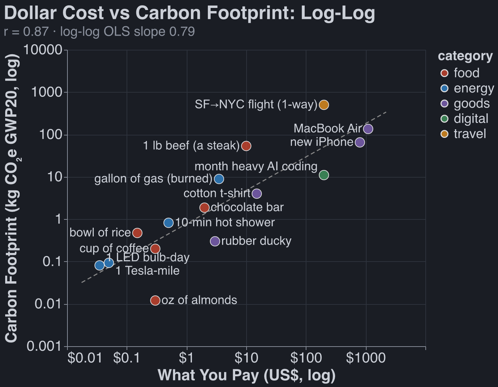
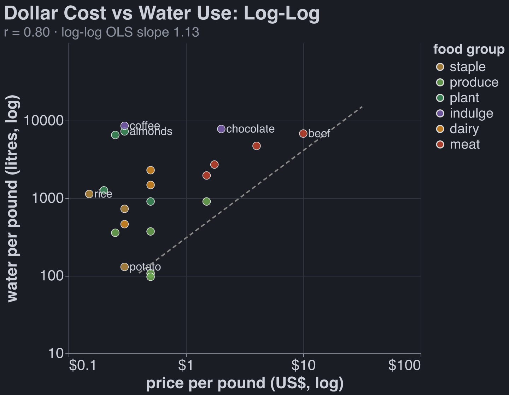
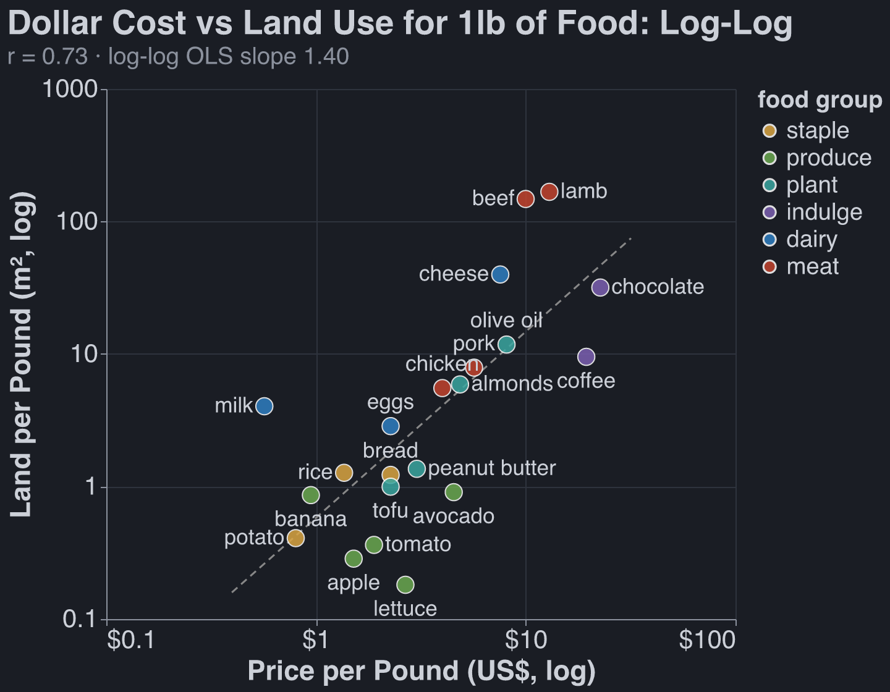
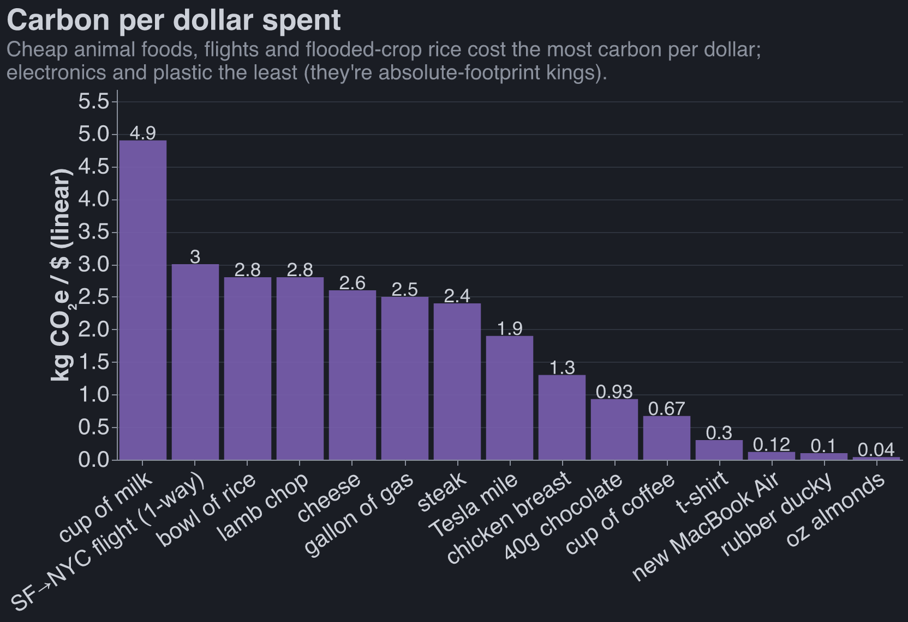
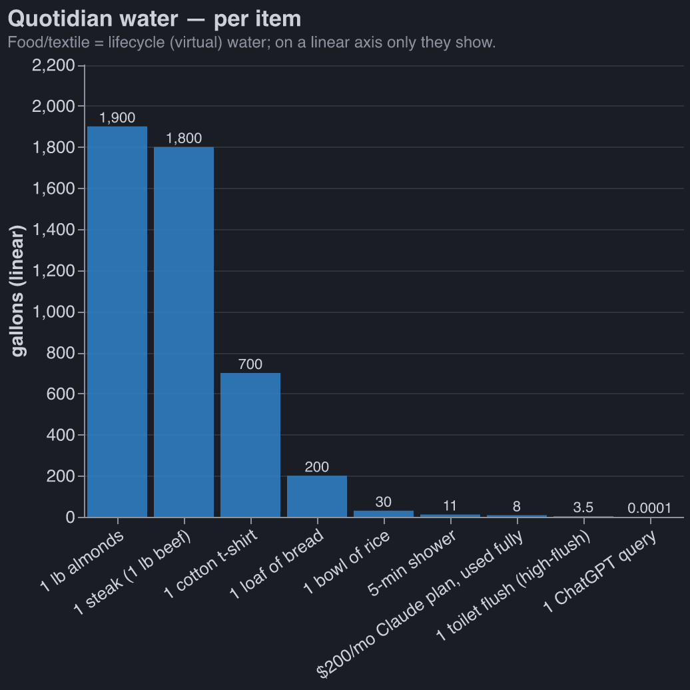
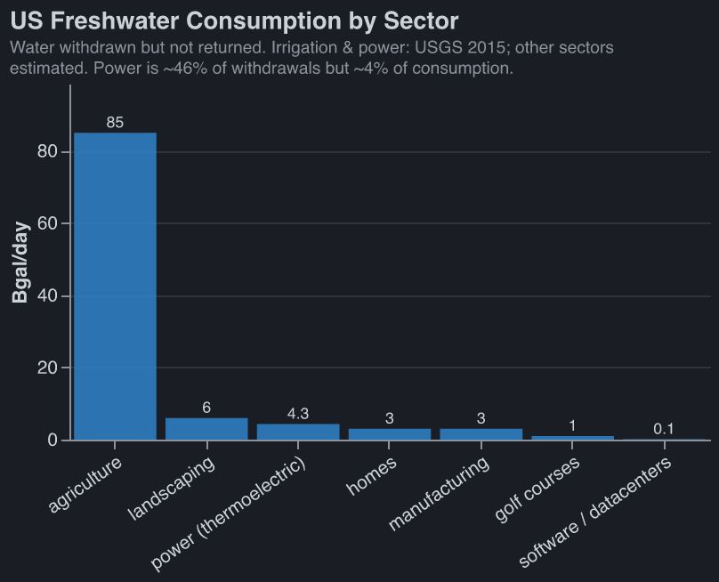
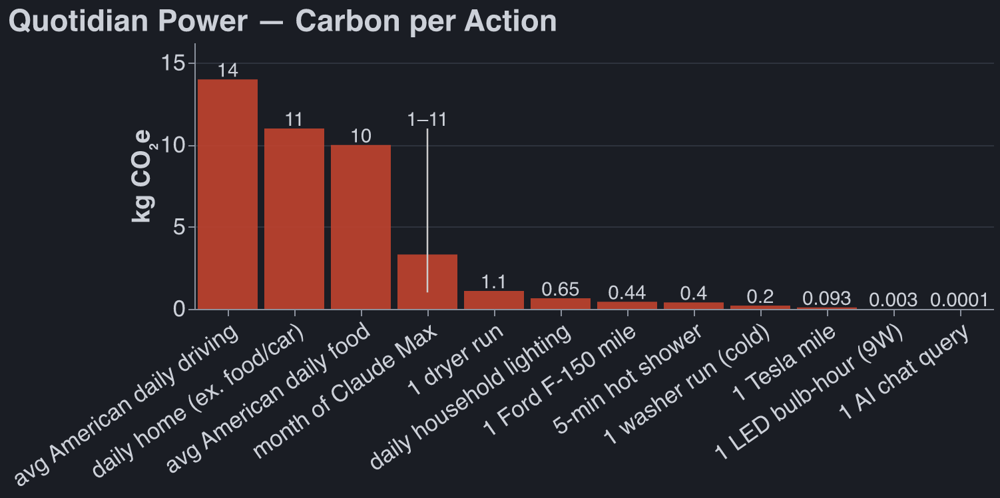
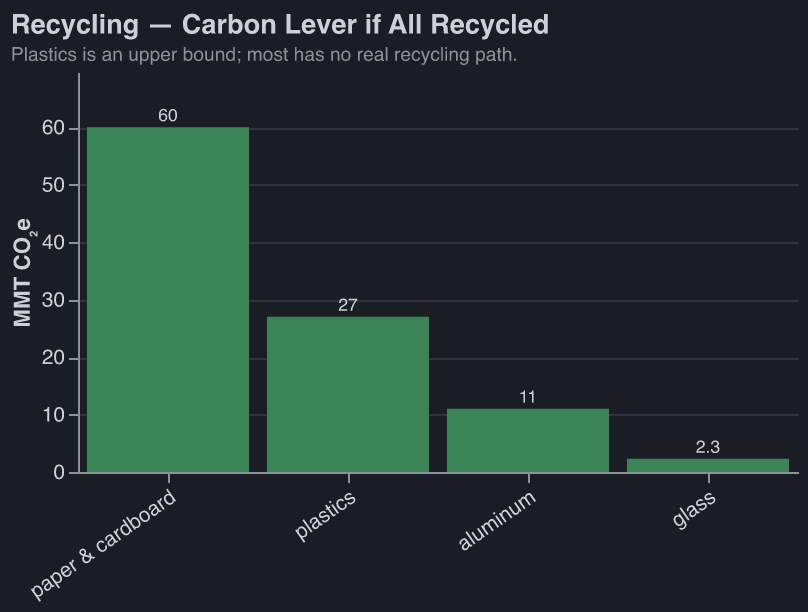
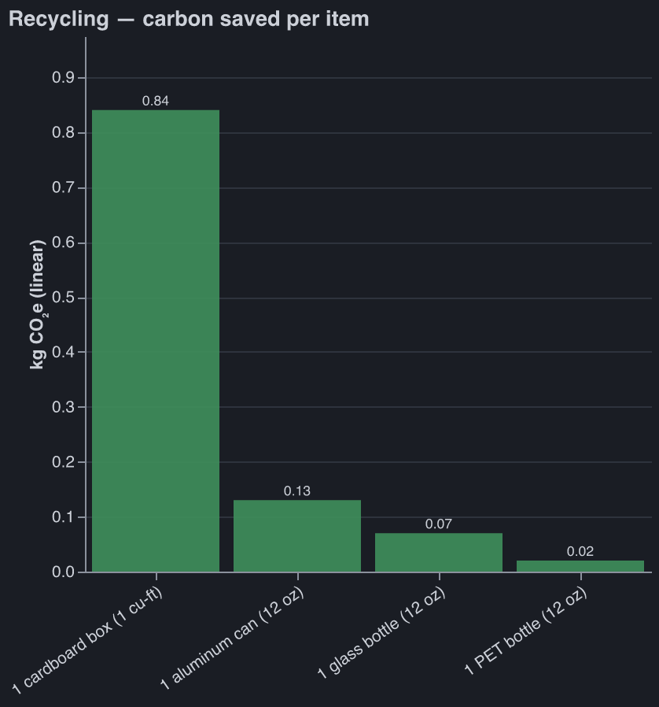

Many people before me have dunked on the plastic-straw Nazis. From a utilitarian perspective, using
a paper straw is close to pointless. [^toxoplasma]

[^toxoplasma]:
    My plausible explanations are innumeracy or costly signaling/symbolism (see
    [The Toxoplasma of Rage](https://slatestarcodex.com/2014/12/17/the-toxoplasma-of-rage/)).

In the post-singularity utopia, we will price externalities, and no one (besides the
externality-pricers) will have to think about their consumption beyond it's direct economic cost.
Today, I do think about some things, like how the food I eat affects animal welfare. This post is my
attempt to think about fewer of them: to convince myself that (for example) how much trash I create
is not (even remotely) important.

TLDR: These things might matter:

- Eating meat
- Traveling long distances[^travel]
- Anything that costs a lot of money

Worth zero mental energy:

- Creating less trash, recycling, composting, buying fewer things
- Eating organic, eating local
- Water use, outside of that caused by food
- Any label that tries to convince me a product is ethical (aside from possibly ones to do with
  animal welfare)

# I: Methodology

## Probably Approximately Correct

Claude found basically all of the numbers for this article. I _strongly_ believe in the power of
working with approximately correct numbers.

## Animal Welfare

See my thoughts [here](robbiewmthompson.com/blog/bobs-diet).

## Global Warming

think it's quite likely we get something singularity-like in the next 20 years. In that time global
warming won't do much harm. But out of epistemic humility, I still try to reduct my carbon
footprint.

This post uses GWP20 C02e to model carbon footprint. The gist of it is: how much warming will be
caused over the next 20 years by emitting one ton of C02? You can then put other things on the same
scale: a ton of methane is ~80 C02e, a flight from SF to NYC is ~2-3 tons C02e (much more than you'd
expect from the ~1 ton of pure carbon emissions: physicists think that atmospheric contrails caused
by planes have a large warming effect).

It's convention to use GWP100. I am using GWP20 because:

1. Interest rates are real and your model of the world should account for them. The price of
   treasuries suggest that \$1 today is worth 39c in 2046 and ~.6c in 2126.
2. The singularity is nigh.

Reader beware: methane (from trash or cows) is ~3x less c02e when using GWP100.

## Land Use, Water Use

I think these things matter, and I tried to quantify how your decisions affect each. But in my heart
of hearts, I don't think you should spend much energy optimizing for either. I think we should just
make (a lot more!) national parks and then price and tax land. [^Georgism]

[^Georgism]:
    Possible using [Georgist](https://en.wikipedia.org/wiki/Georgism) principles, I'm not sure.

# II: Things You Shouldn't Care About

My main goal in writing this essay is reducing how much I think about my consumption. A list of
things you can safely stop worrying about:

## Buying Local

Shipping food in a container on a cargo ship is basically free, economically and from a carbon
perspective. In many cases it's much _more_ environmentally friendly to just ship stuff from where
it grows easily.[^flyin]

[^flyin]:
    Some supermarkets will fly in produce, which seems bad, but I don't know any heuristics for
    telling what has been flown (and not trucked or cargo-shipped) besides "avoid sashimi-grade fish
    from afar and berries with a huge price tag."

## Wasting Vegan Food

All of your food carbon footprint is in meat/dairy. Pound for pound, a loaf of bread is ~90× less
bad than a steak (~1.4 vs ~120–200 kg CO₂e/kg at GWP20). Buy fresh loaves and toss them when they're
stale.

## Reducing, Reusing, Recycling, Composting

Each year Americans send about 243 million cubic yards of trash to landfill. which means we must
create ~1,500 acres of dumps (at 100 ft deep).

After 100 years a landfill gets covered and becomes a park, a golf course, a conservation area, or a
solar farm. Assume, conservatively[^generous], that one acre of new landfill is as bad as 100 acres
of farmland.

[^generous]:
    It's actually very generous to the anti-trash side to say that creating an acre of landfill is
    as bad as creating 100 acres of farmland: discount rates imply that one year of landfill in 2126
    is $0.95^{100} = 0.6\%$ as bad as one year of landfill in 2026. And farmland is fertile land
    that would counterfactually be biodiverse nature, which is not true of landfill.

The average American's annual landfill use is about 20 cubic feet, or $0.2\ \text{ft}^2$ of landfill
area. It takes ~1,590 sq ft to create a 1-lb steak, so your year of trash is
$0.2 / 1590 \times
100 \approx 0.013$ steaks: about 1/80th of a steak, even after the 100x penalty.

No one has done a rigorous study showing that microplastics meaningfully impact health. Even if you
are worried about them, vanishingly little exposure comes from plastic that properly makes it to
landfill.

Warming is also negligible here: The average American's landfill methane emissions is ~0.53 t CO2e,
or about 1/5 of one SF↔NYC round-trip flight or ~10 steaks. And this mostly captured anyway.
[^appendix-trash]

[^appendix-trash]:
    If you do care, you should put your energy into making sure you recycle your aluminum and
    cardboard, see [appendix](#recycling).

## Organic foods

I am not convinced that organic food creates more fewer externalities than normal produce.

Here are Claude's most important reasons why organic might be worse:

- **It uses a lot more land.** Organic yields run ~20-25% lower, so growing the same amount of food
  takes ~25-33% more farmland.
- **Banning GMOs makes the land problem worse.** Organic prohibits GMOs. But GM crops _raise_ yields
  (killing them drops US corn ~11%, soy ~5%, cotton ~19%).
- **It is not pesticide-free.** Organic bans _synthetic_ pesticides but allows a long list of
  "natural" ones: copper (a heavy metal that never degrades and builds up in soil), sulfur,
  pyrethrin (toxic to bees and fish), and until ~2007 rotenone (the one they use to give lab rats
  Parkinson's).
- **More tillage, more manure.** No synthetic herbicides means more plowing for weeds (erosion,
  diesel), and fertility often comes from manure (a pathogen and runoff vector).

I asked Claude for reasons why Organic farming is better, but it read the above and came up with
three bullets that show the opposite. Opus was feeling extra sycophantic today.

- **~4× fewer synthetic-pesticide residues**: (11% of samples vs 46% for conventional). Organic bans
  synthetic nitrogen fertilizer and cuts cadmium ~in half. Conventonal residues sit well below
  safety limits, so the personal health case is thin.
- **Farmworker pesticide exposure**: Conventional US farms spray ~1 billion lb of synthetic
  pesticides a year, and globally acute pesticide poisoning hits an estimated hundreds of millions
  of farmworkers a year (mostly poor-PPE, developing-world farms). But organic farming doesn't
  necessarily improve this situation. Sulfur, the primary organic fungicide, is the top reported
  cause of pesticide illness in California.
- **Biodiversity per acre**: Organic fields hold ~30% more species and ~50% more animals. But they
  need ~30% more land per calorie grown, so you gain ~nothing.

## Most Labels On Consumables (eg no bycatch, FSC certified wood)

### Possibly Worthwhile:

- **Energy Star**: Its appliances saved ~520 billion kWh in 2020 (~400 Mt CO₂e, the annual power of
  ~50M homes), and EPA reckons ~\$350 saved per \$1 it spent.
- **Certain Animal Welfare Labels**: the ones backed by real on-farm audits — **Animal Welfare
  Approved** (gold standard: independent auditors visit every farm yearly, the only label Consumer
  Reports rated "excellent"); **Certified Humane** (100% pass/fail, on-site audited); **Global
  Animal Partnership** (Whole Foods' 1–5+ steps, higher = better); **USDA Organic** (real audits,
  required outdoor access). The tell is a third party auditing the farm: the Animal Welfare
  Institute found **>80% of USDA-approved "animal-raising" claims had no supporting evidence**
  beyond the producer's own word.
- **FSC wood**: A 2024 _Nature_ study found more wildlife in FSC forests, but Greenpeace quit FSC in
  2018, calling it greenwashing.

### Pointless:

- **Rainforest Alliance**: the premium that reaches the farmer is under a penny per chocolate bar
  (<1% of the cocoa price).
- **Fairtrade**: a little more (~1–2¢/bar), but it goes to the co-op, not the farmer.
- **MSC "sustainable" seafood**: funded by logo fees on the very products it certifies, and it's
  rubber-stamped plenty of contested fisheries.
- **"No bycatch" / seafood labels in general**: each one fixes a single narrow thing and leaks the
  harm elsewhere. Dolphin-safe is the template: spare the cute mammal, push boats onto nets that
  kill sharks and juvenile tuna instead. "Sustainable" (MSC) only certifies that the target stock
  won't collapse — nothing about bycatch, a bottom-trawled seafloor, or the fish's suffering. "No
  bycatch," "natural," and "eco" are unregulated marketing with no audit behind them. The only
  semi-trustworthy signal isn't a logo but **Seafood Watch** (Monterey Bay Aquarium): independent,
  and it rates the actual species, gear, and region you're buying.
- **Many Animal Welfare Labels**: "Natural" on eggs / meat (meaningless); "No Hormones" on meat
  (this is banned anyway); "Vegetarian-fed poultry" (chickens are omnivores).

# III: Too Much Data

## Price is a good proxy

Carbon costs correlate with dollar costs, r = 0.87. If you budget your spending, to some extent
you're already optimizing for reducing externalities.

This is also somewhat true of land and water use. Graphs for food in particular:

Looked at another way: carbon footprint per dollar spent does span two OOMs. This is viewpoint is
less comforting.

## Quotidian Water Use

The only thing that matters here is what you eat. Definitely don't feel guilty about taking a long
shower.

Zoom out to the whole country and it's the same story: **agriculture is ~80–90% of US water
_consumption_** — the water actually used up, not just borrowed and returned.[^water-consumption]

[^water-consumption]:
    _Consumption_ is water withdrawn and **not returned** — evaporated by crops, cooling towers, and
    lawns — as opposed to _withdrawals_, most of which flow back to the river. Power is the headline
    case: ~46% of US withdrawals but only ~4% of consumption, because it borrows cooling water and
    returns ~97% of it. Irrigation and thermoelectric figures are USGS _Estimated Use of Water in
    the United States in 2015_ (Circular 1441); the other bars are estimated from withdrawals ×
    typical return rates, so read the small ones as order-of-magnitude. The data is stale by
    necessity: USGS reported consumption for every sector from 1960–1995, then dropped it after the
    1995 report to budget and staffing cuts — and because consumption can't be metered at a pipe the
    way a withdrawal can; it has to be _modeled_ from evapotranspiration and process losses. Only
    irrigation and power consumption were revived in 2015.

## Quotidian Power Use

There were no big surprises for me here. Driving is expensive. AI can use a lot of power, but only
if you're coding with it. Lightbulbs use small but nonzero energy.

[^travel]:
    Cars and planes use a pretty similar amount of carbon per human mile traveled, but certainly not
    per human hour spent traveling.

## Recycling

People will actually pay for recycled cardboard and aluminum, whereas recycled plastic and glass is
mostly only used because of mandates or to please consumers.

**Per item:**

