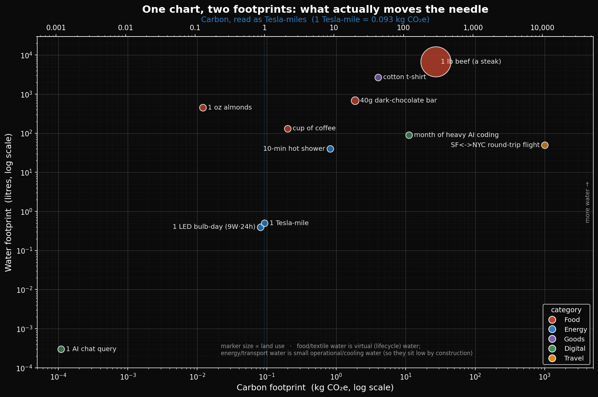

# Research: "Green virtue actions that don't matter" — the numbers

Research backing for `POST_DRAFT.md`. Method: 9 parallel web-research agents (one per bullet),
each followed by an **adversarial fact-checker** that independently re-derived every equivalence
and spot-checked the source figures live. Every number below survived that pass; where the
checker caught an error or an overstatement, I've folded the **correction** straight into the
math and called it out under **⚠️ Flags**.

The thesis (signaling > impact) mostly holds — but "negligible impact" is not the same claim as
"no reason to do it," and on several bullets the honest verdict is **mixed**, not a clean win.
Per your instruction, I've flagged every place the math cuts against you. **Two of your own
illustrative numbers were wrong** (lights by ~3,000×; the shower-savings figure in the brief by
~3.5×), and both errors run *in your favor* once corrected.

## Verdict at a glance

(Tables can't hard-wrap, so these rows are the only lines over ~95 chars.)

| # | Bullet | Verdict | The one-liner |
|---|--------|---------|---------------|
| 1 | Trash / recycling / compost | **Mixed** | Space thesis airtight; "recycling pointless" not (Al 95%; methane #3) |
| 2 | Buying less / sweatshops | **Supports** | Per-shirt ≈ a few car-miles; but repair *does* matter for electronics/cars |
| 3 | Local food | **Strong** | Transport ≈ 6% of food carbon; *what* you eat ≫ *where* it's from |
| 4 | Wasting vegan food | **Supports** | A tossed lettuce ≈ ⅔ mile driving; per kg beef is ~60–230× worse |
| 5 | Turning off lights | **Mixed** | Your "100 ft" is ~3,000× off — it's ~55 Tesla-miles. LEDs save the thesis |
| 6 | Using AI | **Mixed** | One person's $200 sub ≈ a few kWh/mo; agentic coding breaks "negligible" |
| 7 | Showers / toilets | **Strong** | A year of short showers ≈ <1 lb beef; ag = 80–90% of consumptive water |
| 8 | Organic | **Mixed** | Not pesticide-free (true), CCOF = USDA (true), but "meaningless" overshoots |
| 9 | Eco-labels | **Mixed** | Label-by-label. Energy Star is a real standout and breaks the blanket framing |

---

## 1. Creating less trash / sorting recycling / composting

**Verdict: MIXED.** The *space* argument is correct and the data knocks it flat. The leap to
"therefore recycling/composting is pointless" is the weak part — the real cases for those actions
were never about space.

**Equivalences (defensible):**

- A lifetime (79 yr) of one American's landfilled trash ≈ **59 cubic yards ≈ a cube ~12 ft on a
  side.** Recycle and compost literally nothing and it's still only a ~15-ft cube.
- That trash cube covers ~136 ft² of ground; the cropland footprint of one American's diet is
  ~1.17 acres ≈ 50,900 ft² ≈ **~370× as much land.** (And real landfills stack 50–100+ ft deep,
  shrinking the trash footprint another 5–10×.)
- **All US trash for the next 100 years** fits in one landfill 10 miles square × 255 ft deep
  (Lomborg) ≈ **0.003% of US land.** A full *millennium* of it, 300 ft deep, fits in a square
  ~40 mi/side ≈ **~0.25% of today's US cropland.**

**The math:**

- 146.1 Mt landfilled ÷ 327 M people = 894 lb/person/yr × 79 yr = 70,600 lb ÷ 1,200 lb/yd³
  = 58.8 yd³ = 1,588 ft³ → ∛ = 11.7 ft.
- Per-capita cropland: 382 M acres ÷ 327 M = 1.17 acres × 43,560 = 50,887 ft².
  Ratio 50,887 ÷ 136 = **374×.**
- Density note: 1,200 lb/yd³ is EPA's *low* end, which *maximizes* the volume — i.e. this
  steel-mans the "trash is bulky" objection. Modern large landfills run 1,700–2,000 lb/yd³.

**⚠️ Flags (this is where the thesis overshoots):**

- **Aluminum recycling is genuinely worth it on energy alone: ~95% saved** (186 GJ/t virgin vs
  8.3 GJ/t recycled). Recycling a can avoids real electricity and CO₂; the space argument says
  nothing about it.
- **Composting has a climate rationale independent of space:** landfilled organics decompose to
  methane, and MSW landfills are the **#3 US human-caused methane source (~14.4%, 2022).** Methane
  is ~28× CO₂ over 100 yr. "Composting is pointless" is the single weakest claim in the draft.
- Recycling value is **strongly material-dependent**: aluminum ≫ paper > glass/most plastics.
  Glass and many plastics often cost more to collect than they're worth — the thesis is strong
  *there*, weak for aluminum/paper. Don't blanket-conflate.
- Soften "cropland it takes to feed that person" → "the cropland footprint of one American's diet
  (roughly)" — the 1.17-acre figure is total US cropland ÷ population (includes exports, feed,
  biofuel). The 370× ratio survives even if you halve it (~185×).

**Sources:**

- [EPA — National Overview: Facts and Figures](https://www.epa.gov/facts-and-figures-about-materials-waste-and-recycling/national-overview-facts-and-figures-materials)
  — "292.4 million tons or 4.9 pounds per person per day"; "146.1 million tons of MSW were
  landfilled"; "32.1 percent recycling and composting rate."
- [EPA — Volume-to-Weight Conversion Factors (2016)](https://www.epa.gov/sites/default/files/2016-04/documents/volume_to_weight_conversion_factors_memorandum_04192016_508fnl.pdf)
  — compacted MSW 1,200–1,700 (small) / 1,700–2,000 (large) lb/yd³.
- [USDA NASS — 2022 Census of Ag Highlights](https://www.nass.usda.gov/Publications/Highlights/2024/Census22_HL_FarmsFarmland.pdf)
  — 382 M acres cropland; 880.1 M acres farmland.
- [Lomborg via Econlib — "Recycling"](https://www.econlib.org/library/Enc/Recycling.html)
  — "a ten-mile-square, 255-foot-deep landfill could contain all the trash produced in the United
  States over the next century."
- [Tierney/Wiseman, NYT 1996 (Williams mirror)](https://web.williams.edu/HistSci/curriculum/101/garbage.html)
  — 1,000 yr, 100 yards deep, "35 miles on each side."
- [International Aluminium Institute](https://international-aluminium.org/landing/aluminium-recycling-saves-95-of-the-energy-needed-for-primary-aluminium-production/)
  — 186 vs 8.3 GJ/t, "95.5% energy saving."
- [EPA LMOP — Landfill Gas](https://www.epa.gov/lmop/basic-information-about-landfill-gas)
  — "third-largest source... approximately 14.4 percent... in 2022."

  @claude can you dig on the Methane thing please? I don't know how bad methane actually is climate wise.
  @claude can you also plz dig on the aluminum thing? Do trash plants not also look for aluminum? 
  @claude finally can you plz look into your points on glass and plastic being net energy sinks, and paper and aluminum not being so? Quantify that, what % of my carbon footprint is saved by recylcing these things? How many plane flights per American per year?

**↳ Methane — how bad is it?** A heavyweight in aggregate, a small lever as *your
compost bin*. IPCC AR6: methane caused ~0.5 °C of the ~1.1 °C warming so far —
**~45% of net observed warming** (CO₂ ~0.8 °C) — and it's ~11–12% of US GHGs. Potency:
**GWP100 ≈ 27, GWP20 ≈ 80** (short-lived, ~12 yr, but punchy — report both; GWP20 is the
fair lead for a short-lived landfill pulse). But your scraps are small: one American's
landfilled food waste ≈ ~6.6 kg CH₄ ≈ **0.18 t CO₂e/yr at GWP100 (~1.1% of a ~16 t
footprint) → 0.53 t at GWP20 (~3.3%)** ≈ 1,900–5,700 Tesla-miles ≈ ⅕–½ of one
transcontinental flight. So methane is genuinely scary at the macro level (the real levers
are gas-system leaks + livestock, not your bin), and composting is a real but ~1–3% personal
lever — and *wasting less* food beats *composting* it (the upstream farming dwarfs the
landfill gas). Sources: [IPCC AR6 GWP](https://ghginstitute.org/ipcc-ar6-methane-gwp-tables/);
[IPCC AR6 SPM](https://www.ipcc.ch/report/ar6/wg1/chapter/summary-for-policymakers/) (0.5 °C);
[EPA food-waste methane](https://www.epa.gov/land-research/quantifying-methane-emissions-landfilled-food-waste).

**↳ Aluminum — do trash plants catch it anyway?** Mostly no. Recycling MRFs only process your
**blue bin** — their eddy-current separators never see your garbage. The trash stream is ~50%
landfill (zero metal recovery) + ~12% waste-to-energy; only the WtE slice claws cans back
(~21–23% of input aluminum from bottom ash). So **nationally your sort decision controls a
can's fate most of the time** — and only ~45% of US cans get recycled; the rest are landfilled
and lost. (Deposit/"bottle-bill" states do far better regardless of curbside.)

**↳ Recycling carbon by material — is glass/plastic a "net energy sink"?** "Net sink" is
**wrong on carbon** — per EPA's WARM model every common material still net-saves vs landfill.
But the spread is enormous (t CO₂e saved per ton recycled):

| Material | t CO₂e/ton | note |
|---|---|---|
| **Aluminum cans** | **9.1** | ~1.6 Tesla-mi saved *per can* |
| Mixed paper | 3.7 | |
| Cardboard | 3.4 | |
| Steel cans | 1.8 | |
| PET (#1) | 1.2 | |
| HDPE (#2) | 0.9 | |
| **Glass** | **0.3** | ~30× less than aluminum |

The "sink" intuition is really about *marginal collection economics*, not lifecycle carbon:
glass is heavy (diesel hauling erodes it; many programs landfill it or use it as cover) and
most plastics get downcycled or have no buyer (US plastics recycling ≈ 9%). **What % of your
footprint?** EPA credits all US recycling+composting (strictly, all four MSW practices
combined) with ~193 MMT CO₂e/yr ÷ 327 M ≈ **0.59 t/person ≈ 3.7% of a 16 t footprint ≈ 6,300
Tesla-miles ≈ ~one round-trip SF↔NYC flight.** So **one cross-country flight erases your entire
year of recycling** — and glass is only ~0.5% of that benefit (~30 Tesla-mi/person/yr, a
rounding error). Verdict: aluminum cans are genuinely high-leverage, paper/cardboard worth it,
glass and most plastic near-worthless on carbon (and often money-losing to collect) — but none
is an actual energy sink. Sources: [EPA WARM v15](https://www.epa.gov/sites/default/files/2019-10/documents/warm_v15_management_practices_updated_10-08-2019.pdf);
[EPA aluminum data](https://www.epa.gov/facts-and-figures-about-materials-waste-and-recycling/aluminum-material-specific-data);
[EPA National Overview](https://www.epa.gov/facts-and-figures-about-materials-waste-and-recycling/national-overview-facts-and-figures-materials).
*(Tesla-mile here = 0.25 kWh × 0.373 kg/kWh grid = 93 g CO₂e; a wall-to-wheel basis would cut
the mile counts ~15%.)*

---

## 1b. Microplastics & human health

**Verdict: MIXED — "the evidence is thin" is fair; "negligible" slightly overshoots; but it
doesn't change your conclusion.** As of 2026 there is *no* established causal human-health harm
from microplastics — it's hazard-plus-exposure without quantified risk, exactly the "epistemic
humility" regime your draft names. So "thin" is honest. But one strong 2024 study (NEJM, below)
plus a rising body burden make "negligible" a hair too confident — the honest word is
*unquantified, plausibly nonzero*. The clincher that rescues your draft: even if microplastics
turn out to be bad, **cutting your personal trash barely touches your own exposure** (it's
food/water/air, not your landfill), so this was never a real reason to fret over trash regardless
of how the science lands.

**The defensible findings:**

- **Body burden: real, and rising.** MNPs are now reproducibly found in human blood, placenta,
  breast milk, stool, arteries, testes and brain. A Feb-2025 *Nature Medicine* study measured
  **~3,345–4,917 µg/g in frontal-cortex tissue** (polyethylene dominant), brain > liver/kidney, and
  **2024 samples higher than 2016.** *Exposure is not in doubt — it's the harm that's unproven.*
- **Causal harm: not established.** Multiple 2025 systematic reviews land on the same line: "no
  causal relationships have been proven to date." Reproductive/digestive/respiratory harm is rated
  *moderate-quality, "suspected"* — the mechanisms (oxidative stress, inflammation, endocrine
  disruption) are plausible but the human causal link is unproven, and **no dose-response threshold
  exists**, so WHO/regulators can't set a "safe level." This is hazard, not quantified risk.
- **The one serious warning shot — NEJM 2024 (Marfella).** In 257 carotid-endarterectomy patients,
  those with MNPs detected in plaque (58.4%) had a **4.53× hazard (95% CI 2.00–10.27)** of
  heart-attack/stroke/death over ~34 months (20.0% vs 7.5% events). Single strongest "they might
  actually be bad" datapoint — but the authors say outright "**our results do not prove
  causality**": observational, can't exclude residual lab contamination or confounders (diet,
  water, socioeconomics unmeasured), narrow population (already-diseased arteries). A real signal,
  not proof.

**The "credit card a week" stat — mostly debunked:**

- The viral **"~5 g (one credit card) of plastic per week"** traces to a 2019 WWF report and is a
  **gross overestimate.** Full Fact's check of the inhalation version found the true rate ~150,000×
  lower (you'd inhale 5 g in ~3,000 years, not a week). The *mass* people actually take in is far
  below a credit card — don't use this number.
- Defensible **particle-count** figures instead: Cox 2019 estimates **39,000–52,000 ingested
  particles/yr** (74,000–121,000 with inhalation). Mohamed Nor 2021 models adult intake at ~883
  particles/day and **lifetime tissue accumulation to age 70 of only ~40.7 *nanograms*** (1–10 µm
  fraction) — i.e. the *retained* mass over a whole life is a rounding error next to "5 g/week."

**Dose & the lead comparison (your draft leans on this — it holds up):**

- **Lead = established, quantified, causal.** WHO: "there is no level of exposure to lead that is
  known to be without harmful effects"; **>3.5 million deaths/yr (2023),** mostly cardiovascular.
  The Lancet Planetary Health model attributes **~5.5 M CVD deaths and 765 M lost child-IQ points
  (2019)** to lead; documented harm down to **3.5 µg/dL** blood.
- **Microplastics = hazard with ~zero quantified attributable burden.** No analogous death count,
  no IQ-point figure, no established blood threshold. So your "worry about lead first" ordering is
  **correct on current evidence:** one toxin carries a multi-million-death ledger, the other a
  single strong association study and a stack of plausible mechanisms.

**⚠️ Flags (where "negligible" overshoots — and where it's fine):**

- **"Negligible" is slightly too strong; "unquantified" is the honest word.** The NEJM HR of 4.5
  isn't nothing, body burden is climbing, and "no proven harm yet" in a field this young ≠ "no
  harm." Epistemic humility cuts *both* ways — you can't fully rule meaningful harm out either.
  Prefer "we can't yet quantify the risk" to "negligible."
- **The brain "spoon of plastic" headline is contested — don't repeat it.** The ~7 g/"plastic
  spoon" framing extrapolates the µg/g concentrations; *Nature* later ran a formal "Challenges"
  critique and an Author Correction, and the dementia association is associative only (atrophied,
  diseased brains may simply clear less — possible reverse causation). Cite the *finding*, flag the
  *spin*.
- **Decisive for this post: cutting your *trash* does ~nothing for your *exposure*.** Intake is
  dominated by food, drinking water, and indoor air/synthetic textiles — not your landfill
  behavior. The one big *personal* lever is **bottled vs tap water** (Cox: +90,000 vs +4,000
  particles/yr; a Jan-2024 PNAS study found **~240,000 nanoplastic particles per liter** of bottled
  water), plus not heat-microwaving food in plastic and ventilating indoor air. So microplastic
  health is a reason to **drink tap and stop microwaving in plastic** — *not* a reason to obsess
  over your trash can. On the action your post is actually about (trash), "don't worry" is right
  *regardless* of how the health science resolves.

**Sources:**

- [Marfella et al. 2024, NEJM (PMC mirror)](https://pmc.ncbi.nlm.nih.gov/articles/PMC11009876/)
  — "hazard ratio, 4.53; 95% CI, 2.00 to 10.27"; 257 patients, 58.4% MNP-positive, 33.7-mo
  follow-up; "our results do not prove causality."
- [Rapid systematic review, 2024/25 (PMC11697325)](https://www.ncbi.nlm.nih.gov/pmc/articles/PMC11697325/)
  — digestive/reproductive/respiratory harm "suspected," moderate-quality; causality not
  established; "no causal relationships have been proven to date."
- [The Scientist — MNPs build up in organs, esp. brain (Nihart/Campen 2025)](https://www.the-scientist.com/microplastics-build-up-in-human-organs-especially-the-brain-72541)
  — frontal cortex ~3,345–4,917 µg/g; higher in 2024 vs 2016 and in dementia brains (associative).
- [Nature — "Challenges in studying microplastics in human brain" (critique)](https://www.nature.com/articles/s41591-025-04045-3)
  — the formal caution to read alongside the brain study; the "spoon" figure is contested.
- [Full Fact — you do not inhale a credit card of plastic a week](https://fullfact.org/health/credit-card-microplastic-week/)
  — traces the 5 g/week claim to a 2019 WWF report; inhalation version overstated ~150,000×.
- [Cox et al. 2019, Env. Sci. & Tech. — Human Consumption of Microplastics](https://pubs.acs.org/doi/10.1021/acs.est.9b01517)
  — 39,000–52,000 ingested particles/yr (74,000–121,000 w/ inhalation); bottled +90,000 vs tap
  +4,000.
- [Mohamed Nor et al. 2021 — Lifetime Accumulation of Microplastic (PMC8154366)](https://pmc.ncbi.nlm.nih.gov/articles/PMC8154366/)
  — adults ~883 particles/day; lifetime accumulation to age 70 ≈ 40.7 ng (1–10 µm).
- [WHO — Lead poisoning fact sheet](https://www.who.int/news-room/fact-sheets/detail/lead-poisoning-and-health)
  — "no level of exposure to lead that is known to be without harmful effects"; >3.5 M deaths/yr
  (2023); harm at 3.5 µg/dL.
- [Larsen & Sánchez-Triana 2023, Lancet Planetary Health — global lead burden](https://www.thelancet.com/journals/lanplh/article/PIIS2542-5196(23)00166-3/fulltext)
  — ~5.5 M cardiovascular deaths and 765 M lost child-IQ points attributable to lead (2019).
- [NIH Research Matters — plastic particles in bottled water (Qian et al. 2024, PNAS)](https://www.nih.gov/news-events/nih-research-matters/plastic-particles-bottled-water)
  — "about 240,000 tiny pieces of plastic" per liter; ~90% nanoplastics.

---

## 2. Buying less / repairing instead of replacing / not printing

**Verdict: SUPPORTS — for a t-shirt.** Per-shirt impact is a rounding error and the
GiveWell-arbitrage argument is sound. But this bullet over-generalizes from a shirt to *all*
durable goods, and the sweatshop literature is more contested than a one-liner implies.

**Equivalences (defensible):**

- The entire production carbon of one cotton t-shirt (**~2–7 kg CO₂e**) ≈ **driving a gas car
  5–18 miles.** The whole moral drama of one shirt = one short errand.
- Skipping a ~$20 "ethical/repair" premium and giving it to the Against Malaria Foundation
  ≈ **1/275th of a life saved.** Do it 275 times → one child's malaria death prevented — an
  outcome no amount of shirt-mending can produce.
- The scary "**2,700 litres per shirt**" ≈ 45 eight-minute showers — but ~1,500 L is irrigation in
  cotton regions and the rest is rainfall + pollution-dilution. **Not buying the shirt delivers
  none of that water to a thirsty person.** This is the landfill fallacy wearing a cotton shirt.

**The math:**

- CO₂→miles: 2 kg (cradle-to-gate, conservative) to 7 kg (cradle-to-grave) ÷ 0.4 kg/mi
  (EPA avg car) = 5–17.5 mi.
- GiveWell arbitrage: $20 ÷ $5,500/life (AMF) = 0.0036 = 1/275. $300/yr greener-wardrobe premium
  × 40 yr ÷ $5,500 ≈ **2.2 lives** over an adult life.
- Sweatshop wage: Bangladesh $0.13/hr × 70 hr/wk × 52 = $473/yr.

**⚠️ Flags:**

- **Repair-vs-replace genuinely matters for high-embodied-energy goods** — smartphone ~70 kg CO₂e,
  laptop ~200–300 kg, car ~5–10 *tonnes*. The t-shirt is the single weakest case for "repair is
  pointless"; do **not** apply shirt math to electronics or cars.
- **The "sweatshops win" finding is contested.** Powell & Skarbek (libertarian Independent
  Institute) measure *wages vs national average income*, and the flattering results ("doubles
  income," "3–7×") **all assume a 70-hour week** and a *per-capita* denominator. It says nothing
  about Rana Plaza (1,134 dead), forced overtime, or locked exits. "Above local average wage"
  ≠ "safe/fair/net-good." Foreground the 70-hr assumption if you use the numbers.
  - *Fact-checker catch:* don't use **Bangladesh** as the "above-average job" poster child — that
    pairs the Table-1 *average* wage ($0.13) with the *protested-sweatshop-wage* 9-of-11 finding
    (two different datasets). The clean support is the general apparel-at-70-hrs figure, not
    Bangladesh specifically.
- **The scary 6–8 kg carbon figures are cradle-to-*grave*, dominated by laundering** (your
  electricity, ~37% of lifecycle), not the factory. "Buying less" only avoids the ~1.4–4 kg
  production share; "repair to wear longer" slightly *increases* lifetime laundry CO₂ — a small
  irony against repair-always-wins. Attribute the use-phase number to a use-phase LCA, not the
  manufacturing-only paper.
- **Aggregate ≠ marginal:** apparel is ~2–8% of global GHG and the US landfills ~11 Mt of textiles
  /yr. The thesis is valid only for *your marginal choice*; the material footprint folds into
  bullet 1.
- GiveWell's $4,000–$5,500/life are GiveWell's own *modeled* estimates (Sept 2025) — order of
  magnitude carries the argument, the precise dollar doesn't.

**Sources:**

- [GiveWell — Top Charities](https://www.givewell.org/charities/top-charities)
  — AMF "$5,500 per life saved"; Malaria Consortium "$4,000."
- [Powell & Skarbek (2004/2006)](https://www.independent.org/wp-content/uploads/article/2004/09/53_sweatshop.pdf)
  — "In 9 of the 11 countries, the reported sweatshop wages equal or exceed average income,
  doubling it in Cambodia, Haiti, Nicaragua, and Honduras (at 70 hours)"; Bangladesh $0.13/hr.
- [WWF — Impact of a Cotton T-shirt](https://www.worldwildlife.org/magazine/issues/spring-2013/articles/the-impact-of-a-cotton-t-shirt)
  — 2,700 L (1,500 L blue).
- Cotton LCA: cradle-to-gate ~1.37 kg CO₂e; literature cradle-to-grave ~5.4–8.5 kg (attribute the
  use-phase to a use-phase LCA, *not* a manufacturing-only paper).
- [EPA — Typical Passenger Vehicle](https://www.epa.gov/greenvehicles/greenhouse-gas-emissions-typical-passenger-vehicle)
  — "about 400 grams of CO2 per mile."

  @claude Ok 2-8% of GHG on clothes is actually quite surprising and impressive... people don't think about that enough? Like what % is food?
  also compare electronics (eg a new macbook) to plane flights... that sounds quite interesting... also surprisingly large!

**↳ Clothing vs food, and MacBook vs flights.** Heads-up — **the "fashion = 10%, more than
aviation + shipping" stat is debunked hype** (UNEP rounded a contested Quantis ~8% up to 10%).
The defensible apparel figure is **~1.8% of global GHG** (production-only, Apparel Impact
Institute) to **~4%** (full lifecycle, McKinsey). **Food is ~26%** (Poore & Nemecek) — so **food
is ~6–15× clothing**, and even the debunked 10% is less than half of food. So buying fewer
clothes is a *weak* lever; eating less beef is a strong one. (So the surprise cuts the other
way: clothing is *smaller* than the headline, not bigger.)

On gadgets — Apple's own reports put a device's **manufacturing at 69–82% of its lifecycle
carbon** (using it barely matters vs buying it): 16″ MacBook Pro ~193 kg embodied, 14″ ~166 kg,
MacBook Air ~109 kg, iPhone ~53 kg. But one **SF↔NYC round-trip economy flight ≈ ~1 t CO₂e**, ≈
the **embodied carbon of ~5 new 16″ MacBook Pros** (≈6 14″, ≈9 Airs, ≈19 iPhones). So "keep your
laptop longer" is real (manufacturing dominates the lifecycle) — but **one transcontinental trip
swamps ~5 new laptops.** The big discretionary lever here is flying, not gadget longevity.
*(Flight range 0.6–1.3 t CO₂e; the laptop figure is embodied carbon vs the flight's whole-trip
carbon — same currency, both CO₂e.)* Sources: [OWID food 26%](https://ourworldindata.org/food-ghg-emissions);
[Apparel Impact Institute 1.8%](https://www.esgdive.com/news/overproduction-polyester-use-causing-fashion-industry-emissions-to-rise-aii/756790/);
[Ecotextile — fashion's fake stats](https://www.ecotextile.com/2024020931673/features/fashion-s-fake-ghg-emission-claims.html);
[Apple 16″ MBP PER](https://www.apple.com/environment/pdf/products/notebooks/MacBook_Pro_16-inch_PER_Oct2024.pdf).

---

## 3. Buying local food

**Verdict: STRONGLY SUPPORTS.** This is your cleanest bullet. Your "do it for freshness/in-season,
not carbon" framing is exactly right — just don't say "zero," and sharpen the last-mile claim.

**Equivalences (defensible):**

- Buying **100% local cuts at most ~5%** of a US household's food carbon (~0.4 t CO₂e/yr). You
  match a whole year of localism by swapping **~4.5 kg of beef for chicken** (each kg-swap saves
  ~90 kg CO₂e).
- Sea-shipping a kilo of avocados Mexico→UK adds only **0.21 kg CO₂e**; *air*-freighting the same
  kilo adds ~10 kg — about the entire farm-to-fork footprint of a whole kilo of chicken. Air
  freight is the one real exception — but it's only **0.16% of food-miles.**
- Your **10-mile round-trip grocery drive emits ~4 kg CO₂** ≈ 0.4 kg per kilo of groceries hauled
  — **~2× the entire ocean crossing** of those avocados. Your car, not the container ship, is the
  long pole.

**The math:**

- 0.05 × 8,100 kg/yr household footprint = 405 kg/yr. Beef→chicken saves 99.48 − 9.87 = 89.61
  kg/kg. 405 ÷ 89.61 = **4.5 kg.**
- Air avocado: 0.21 × 50 ≈ 10 kg; vs chicken production 9.87 kg → roughly equal.
- Drive: 0.4 kg/mi × 10 mi = 4 kg ÷ 10 kg haul = 0.4 kg/kg; ÷ 0.21 = ~1.9×.

**⚠️ Flags:**

- **Fact-checker catch — "4–5 beef dinners" overstated the ease by ~4×.** The math is kg-for-kg:
  it's **~4.5 *kilograms*** of beef. A dinner serving is ~0.25–0.5 kg, so it's really
  **~9–18 meals**. Say "~4.5 kg" or disclose the portion. (Thesis survives regardless — OWID's own
  bar is "<1 day/week of beef+dairy," ~52 days/yr.)
- **Don't say "zero."** 5% of 8.1 t/yr is ~0.4 t/yr — small vs diet, **not nothing.** The honest
  word is "swamped by what you eat."
- **Sharpen "most transport cost is last-mile."** Producer→retail final delivery is only ~4% of
  the lifecycle (about a *third* of the 11% total transport), not a majority. The defensible
  claim: road/trucking ≈ 3.9% of food-system emissions vs air 0.02% — "intercontinental shipping
  isn't where the carbon is."
- Air-freighted perishables (berries, asparagus, green beans, out-of-season) are a **genuine**
  exception — keep that concession.
- Vintage note: the 83/11/4 household split is Weber & Matthews 2008 (built on late-90s data) but
  is corroborated by Poore & Nemecek 2018 — cite both.

**Sources:**

- [Our World in Data — Food choice vs eating local (Ritchie)](https://ourworldindata.org/food-choice-vs-eating-local)
  — transport "only 6%"; "more than 80%" production+land; beef transport 0.5%; "maximum
  reduction... would be 5%"; "<1 day per week... reduces GHG more than buying all your food from
  local sources"; air "0.16% of food miles," "50 times more CO2eq than a boat."
- [OWID — Environmental Impacts of Food](https://ourworldindata.org/environmental-impacts-of-food)
  — avocados Mexico→UK "0.21kg CO2eq."
- [OWID data insight — food-mile transport modes](https://ourworldindata.org/data-insights/most-carbon-emissions-from-food-miles-are-produced-by-trucks-on-the-road)
  — Road 3.9%, Aviation 0.02%.
- [Weber & Matthews 2008, ES&T](https://pubs.acs.org/doi/10.1021/es702969f)
  — production 83%, transport 11%, final delivery 4% of 8.1 t CO₂e/yr.
- [OWID/Poore & Nemecek — GHG per kg](https://ourworldindata.org/grapher/ghg-per-kg-poore)
  — beef herd 99.48, poultry 9.87 kg CO₂e/kg.

  @claude: 
  1) beef to chicken is bad comparison... probably we should just focus on beef to vegetable? Though idc that you fix this.
  2) what food actually does get transported via air?

**↳ What actually flies (and beef→veg).** Air freight is ~0.16% of food-miles but ~50× dirtier
than sea per tonne-km, so for the few foods that fly, transport can exceed production. The list
is short and specific — **highly perishable + high value + out-of-season:** asparagus (Peru),
green beans / mangetout / snap peas (Kenya, Egypt), out-of-season soft berries
(blueberries/raspberries/blackberries), fresh-cut herbs, some premium tropical lines
(mango/papaya), and sashimi-grade tuna / fresh fish. **Everything else goes by sea or road**
(bananas, citrus, apples, grapes, standard avocados, potatoes) — which is why "food miles"
averages ~6% of footprint. Concretely, flown asparagus runs ~5–6 kg CO₂e/kg on the US route
(~10× cleaner than beef) to ~11–15 kg/kg long-haul to Europe (~4–5× cleaner) vs ~0.9 kg/kg local
in-season — so for *these items*, "buy local/in-season" is a real ~45-Tesla-mile/kg win (the one
clean exception). Catch: it's rarely labeled, so you can't reliably tell at the shelf.

On the swap (your point 1): yes, **beef→vegetable** is the cleaner restatement — saves ~595
Tesla-mi/kg vs ~540 for beef→chicken — but ~90% of the win is just dropping the beef; the
chicken-vs-veg residual is small. Source: [OWID — food transport by mode](https://ourworldindata.org/food-transport-by-mode)
(0.16%, 50×, "asparagus, green beans, berries").

---

## 4. Wasting (vegan) food

**Verdict: SUPPORTS** (per-item). Tossing a plant item is genuinely trivial. The one honest hedge
is the per-item vs aggregate distinction.

**Equivalences (defensible):**

- Tossing a whole head of lettuce ≈ **0.27 kg CO₂e ≈ driving ~0.66 mile (~3,500 ft).**
- Per kg, wasting **beef does ~60–230× the climate damage** of wasting vegetables — one wasted
  kilo of beef ≈ throwing out **~375 heads of lettuce.**
- You'd have to waste **~47 heads of lettuce every day for a year** (~8.7 tonnes of veg) just to
  match the CO₂ one American's car emits in a year.
- By **land**, the gap is even sharper: meat needs **~860–1,100× the land** per kg of vegetables.
  (Consider leading with this — it's the strongest version.)

**The math:**

- Lettuce: 0.5 kg × 0.53 kg CO₂e/kg = 0.265 kg ÷ 0.4 kg/mi = 0.66 mi × 5,280 = 3,498 ft.
- Per-kg carbon ratio: 99.48 (beef herd) ÷ 0.53 (veg) = 188×; headline beef 60 ÷ 0.98 (legumes)
  = 61×; 99.48 ÷ 0.43 (root veg) = 231× → **60–230× range.**
- Annual car (4.6 t) ÷ 0.53 = 8,679 kg veg ÷ 0.5 kg/head = 17,358 heads ÷ 365 = 47.6/day.
- Land: 326 (beef) ÷ 0.38 (veg) = 858×; 370 (lamb) ÷ 0.33 (root) = 1,121×.

**⚠️ Flags:**

- **Aggregate food waste is NOT negligible — ~8–10% of global GHG** (~5× aviation). But that total
  is dominated by wasted *animal* products + supply-chain losses + landfill methane, **not** an
  individual tossing plant scraps. Keep the per-item vs aggregate distinction explicit or a
  commenter will weaponize the 8–10%.
- **Your gut "a few hundred feet" is a bit low.** A whole head of lettuce ≈ ~3,500 ft; an apple
  ≈ ~1,000 ft. Honest framing: "up to about half a mile of driving." "A few hundred feet" only
  fits a single small item (one carrot).
- The **190× headline uses beef-*herd* (99.48, the highest value).** Note it inline or use the
  60–230× range to pre-empt a "cherry-pick" rebuttal.
- Production-only figures exclude end-of-life; landfilled food adds methane (~0.5 kg CO₂e/kg) that
  can ~double a plant item's footprint — still trivial (~1.3 mi for a lettuce), and **composting
  erases it.** Concede in one clause.

**Sources:**

- [OWID/Poore & Nemecek — GHG per kg](https://ourworldindata.org/grapher/ghg-per-kg-poore)
  — beef herd 99.48, other veg 0.53, root veg 0.43, apples 0.43 kg CO₂e/kg.
- [OWID/Poore & Nemecek — Land use per kg](https://ourworldindata.org/grapher/land-use-per-kg-poore)
  — beef herd 326.21, lamb 369.81, other veg 0.38 m²/kg.
- [EPA — Typical Passenger Vehicle](https://www.epa.gov/greenvehicles/greenhouse-gas-emissions-typical-passenger-vehicle)
  — 400 g/mi; 4.6 t/yr.
- [UNFCCC — Food loss and waste 8–10% of global GHG](https://unfccc.int/news/food-loss-and-waste-account-for-8-10-of-annual-global-greenhouse-gas-emissions-cost-usd-1-trillion)
  *(corrected URL — the agent's first link 404'd)*.

---
@claude any plants that aren't a rounding error or that come close to matching, say, beef or chicken, or any axis?

**↳ Plant foods that rival meat.** Yes — a small "indulgence crop" cluster genuinely does, on
different axes:

| Food | Carbon (kg CO₂e/kg) | Water (L/kg) |
|---|---|---|
| Beef (herd) | 99 | 15,400 |
| **Dark chocolate** | **47** | **17,200** |
| **Coffee (roasted)** | **29** | **~18,900** |
| Chicken | 10 | 4,300 |
| **Almonds** | 0.4 | **~13,000–16,000** |
| Olive oil | ~2.5 | 14,400 |
| Rice | 4.5 | 2,500 |
| Avocado | ~2 | ~1,300 |
| Lettuce / peas / tofu | ~0.5–3 | <300 |

On **carbon**, dark chocolate (47) beats lamb, cheese, pork and poultry — only beef-herd is
higher; coffee (29) beats cheese/pork/poultry. On **water**, coffee, chocolate and almonds all
rival or beat beef per kg. So **a vegan with a chocolate/coffee/almond habit isn't automatically
low-footprint.** The caveat that pulls back toward your thesis: these are eaten in **tiny
masses** — a 40 g chocolate bar ≈ 1.9 kg CO₂e, a cup of coffee ≈ 132 L water — so per-serving and
per-year they stay well below your meat (per-kg parity ≠ per-diet parity). Two sharpeners: (1)
almonds' water is mostly **blue (irrigation)** water in dry California — the scarcity-relevant
kind — whereas beef's is ~94% green (rain), so almonds' *irrigation* impact actually *exceeds*
beef's; (2) **avocado is overhyped** (~1,300 L/kg, ~2 kg CO₂e/kg — closer to a rounding error).
Confirmed negligible on every axis: lettuce, peas, tofu, roots, most fruit/grain. Sources:
[OWID GHG/kg](https://ourworldindata.org/grapher/ghg-per-kg-poore);
[Mekonnen & Hoekstra water footprints](https://www.waterfootprint.org/resources/Mekonnen-Hoekstra-2011-WaterFootprintCrops.pdf).

## 5. Turning off your lights

**Verdict: MIXED — and your example is wrong.** The directional thesis holds for an LED home, but
your illustrative number is off by ~3,000× and, with old incandescents, lighting is *not*
negligible.

**Equivalences (defensible):**

- Leaving **ten old 60W incandescents on for a day = 14.4 kWh ≈ driving a Tesla ~55 miles** —
  **NOT 100 feet.** Your gut figure is off by **~3,000× (≈3.5 orders of magnitude).**
- **Driving 100 feet in a Tesla costs ~4.7 Wh** — equal to one 60W bulb for **~5 minutes**, or one
  9W LED for **~32 minutes.**
- Swap to **LEDs (~9W): ten bulbs for a day = ~2 kWh ≈ 8 Tesla-miles**, and lighting drops to
  **~6% of home electricity** vs 19% for AC and a ~30% bump from charging *one* EV (EV charging
  alone ≈ **5× all your lights combined**).

**The math:**

- 10 × 60 W × 24 h = 14.4 kWh ÷ 0.25 kWh/mi = 57.6 mi (×5,280 = 304,128 ft). 304,128 ÷ 100
  = **3,041×.**
- 100 ft = 0.0189 mi × 0.25 = 4.73 Wh ÷ 60 W = 4.7 min; ÷ 9 W = 31.6 min.
- 10 × 9 W LED × 24 h = 2.16 kWh ÷ 0.25 = 8.6 mi (LED uses 15% of incandescent energy).
- EV: 12,000 mi/yr ÷ 3.5 mi/kWh = 3,429 kWh/yr ÷ 10,791 (home) = 32%; ÷ 6% lighting = **5.3×.**

**⚠️ Flags:**

- **Fix the example prominently** — this is your strongest, fully-verified finding, but it
  currently *undercuts* you as written.
- **With incandescents, lighting is not trivial:** 14.4 kWh is ~half an average home's ~30 kWh/day.
  In 2015 (pre-LED), lighting was ~10% of home electricity. The thesis only became true *after* the
  LED transition.
  - *Fact-checker catch:* the research draft contained a self-contradiction — "14.4 kWh is more
    than a home's total daily use." It's **~half (48.7%)**, not more. Use "~half the house."
- **"Nobody uses 60W incandescents" is now literally true by law** — DOE's 45 lm/W standard hit
  full enforcement **Aug 1, 2023**; new 60W incandescents can't be sold. Using one as the baseline
  overstates lighting energy.
- Soften "EV doubles household electricity" → it adds **~32%** (up to ~40% for high-mileage), not a
  doubling (doubling only holds for ~3,000–4,000 kWh/yr homes). The "EV ≫ lighting" point stands
  regardless.
- Tesla real-world is 0.25–0.30 kWh/mi (driving conditions, not charging losses — the EPA Wh/mi
  already bakes those in); shrinks the mileage ~15–20% but no order-of-magnitude change.

**Sources:**

- [EIA FAQ — lighting share](https://www.eia.gov/tools/faqs/faq.php?id=99&t=3)
  — "about 6% (81 billion kWh)" (2020); "1,105 kWh... about 10%" (2015).
- [EIA — Electricity use in homes](https://www.eia.gov/energyexplained/use-of-energy/electricity-use-in-homes.php)
  — AC 19%, space heat 12%, water heat 12% (2020).
- [EIA FAQ — home electricity](https://www.eia.gov/tools/faqs/faq.php?id=97&t=3)
  — 10,791 kWh/yr (2022).
- [InsideEVs — 2024 Model 3 EPA consumption](https://insideevs.com/news/719013/2024-tesla-model3-epa-range-consumption/)
  — 259 Wh/mi (3.9 mi/kWh).
- DOE 45 lm/W general-service-lamp standard, full enforcement Aug 1, 2023 (CNBC / DOE / Utility
  Dive).
  
  @claude:
  1) are teslas way more energy efficient than gas cars? Like assume you're powering your tesla with pure natural gas power, how many mpgs are you getting?
  2) 45 lm/W standard - that means that '60W equivalent' bulbs use how much power now? How much has lighting gone down in % terms and in raw efficiency per lumen?
  3) For a normal bulb I would use, what is the wattage, and then knowing that, 5 bulbs on for a day is how many miles in a tesla / in a ford f150?

**↳ (1) Tesla vs gas, even on pure fossil power.** Yes — and the margin survives the worst-case
grid. Run a Tesla on **100% natural-gas electricity**: 0.25 kWh/mi at the wheel ÷ 0.875
(charging+grid losses) ÷ 0.525 (combined-cycle plant efficiency) = **~0.54 kWh of primary gas/mi
→ ~62 mpg-equivalent** (range 57–67) vs a real ~25-mpg gas car = **~2.5×** (and that's
*conservative* — it ignores gasoline's own refining/transport losses, which push it to ~3×). The
reason is pure thermodynamics: a power plant + electric motor beats a ~20–25%-efficient
combustion engine. "EVs are just coal cars" is wrong even on an all-gas grid (it only shrinks
toward ~1.5× on a coal-heavy one).

**↳ (2) Lumens — what a "60W-equivalent" draws now.** Incandescent ~15 lm/W → LED ~80–100 lm/W
(best 120–150), a ~6× efficacy jump. DOE's 45 lm/W backstop (effective July 2022) legally kills
incandescent (~15) and halogen (~20). A "60W-equivalent" (≈800 lumens) LED draws **~9W — an 85%
wattage cut** for the same light. (The 2028 standard tightens to >120 lm/W.)

**↳ (3) Five bulbs for a day.** Five 9W LEDs running 24/7 = 45W × 24h = **1.08 kWh/day ≈ 4.3
Tesla-miles** ≈ 2.2 F-150 Lightning miles ≈ ~0.7 gas-F-150 miles (the last on a
gasoline-chemical-energy basis — apples-to-oranges, since that's raw fuel heat vs electricity).
Real homes run lights ~3–5h/day, not 24h, so the realistic figure is ~5× smaller (~1 mile/day).
**Honest framing:** the *technology* wins are huge and real (LED −85%, EV 2.5×) — not virtue
theater — but the *behavioral* action (flipping LEDs off) is tiny precisely **because the LED
already won 85% of the fight.** Sources: [EIA NGCC efficiency](https://www.eia.gov/todayinenergy/detail.php?id=60984);
[DOE 45 lm/W rule](https://www.federalregister.gov/documents/2022/05/09/2022-09477/energy-conservation-program-energy-conservation-standards-for-general-service-lamps);
fueleconomy.gov (Tesla Model 3 / F-150 Lightning).

---

## 6. Using AI

**Verdict: MIXED.** For a typical user — even a heavy *chat* user on a $200 Max plan — a month of
AI is trivial. The honest exception, which you should flag not bury, is the all-day
**agentic-coding** power user (i.e. exactly the person who buys the $200 plan).

**Equivalences (defensible):**

- A heavy month of **chat** on a $200 Claude Max plan (~300 prompts/day) ≈ **~3 kWh ≈ 0.3% of a
  home's ~900 kWh/month ≈ 12 Tesla-miles** ≈ about a third of one day's average US driving.
- **One 10-minute hot shower (~2.2 kWh to heat the water) ≈ ~6,500 AI queries** (0.34 Wh each) —
  one shower outweighs a *typical* person's entire month of AI.
- One query (~0.3 Wh) ≈ a 1,200 W microwave for **~1 second.**
- **CONTRARY CASE:** an all-day Claude Code power user is plausibly **low-to-mid tens of kWh/month**
  — a few percent of a home's electricity, tens-to-low-hundreds of Tesla-miles. **This is the
  regime where "negligible" breaks down.**

**The math:**

- Per query: 1,500 W/H100 × 0.70 × 1 s = 1,050 J = **0.29 Wh** (Epoch); Altman's 0.34 Wh
  corroborates.
- Heavy chat: 300 × 0.34 Wh × 30 = 3.06 kWh ÷ 900 = 0.34%; ÷ 0.25 kWh/mi = 12 mi.
- Shower: 20 gal × 3.785 = 75.7 kg water, ΔT 25 K, Q = 75.7 × 4.186 × 25 = 7,922 kJ = 2.2 kWh
  ÷ 0.34 Wh = ~6,500 queries.
- Long context: a 100k-token turn ≈ 40 Wh ≈ **133× a chat query** — this is why agentic coding
  dominates any heavy estimate.

**⚠️ Flags:**

- **Per-query energy is genuinely contested — use a range (0.3–3 Wh).** The current best estimates
  (~0.3 Wh, Epoch + Altman) are ~10× below the older, still-cited 3 Wh figure. Name the 3 Wh figure
  so you can't be accused of picking the lowest number.
- **$200 Max is exactly what agentic power users buy → the example you chose is the *weakest* case
  for the thesis.** A 100k-token Claude Code turn is ~100× a chat query, and heavy coders run Opus
  (larger/higher energy than the GPT-4o-class numbers Epoch measured).
- **But the heavy ceiling is bounded:** the $200 plan has a hard rate cap (~220k tokens/5 hr) and
  prompt caching makes re-read context far cheaper than naive tokens×energy. So the realistic
  all-day ceiling is **low tens of kWh/month**, not the 150–240 kWh a naive calc gives (that's
  physically unreachable for one account). Present it as an order-of-magnitude band, not a point
  estimate.
- *Fact-checker catches:* "less than a hot shower" holds for the *typical* month (0.5 kWh) but
  **not** the 3 kWh heavy-chat month (3 > 2.2) — scope it to the typical user, or say "a hot shower
  or two." Use **~900 kWh/mo** (EIA = 899), not 875. Epoch's 10k-token figure is **2.4 Wh**, not
  2.5.
- **Macro ≠ micro:** the thesis is right for *one person*, but don't stretch it to "AI energy
  doesn't matter" — aggregate data-center demand growth is a real grid issue.
- Don't double-count PUE: Epoch's 1,500 W/H100 already includes data-center overhead. Per-query
  *water* is tiny (~0.000085 gal); aggregate cooling water in drought regions is a separate,
  legitimate concern.

**Sources:**

- [Epoch AI — How much energy does ChatGPT use?](https://epoch.ai/gradient-updates/how-much-energy-does-chatgpt-use)
  — "around 0.3 watt-hours"; 100k tokens "almost 40 watt-hours."
- [Sam Altman — The Gentle Singularity](https://blog.samaltman.com/the-gentle-singularity)
  — "0.34 watt-hours... about 0.000085 gallons of water."
- [EIA FAQ — home electricity](https://www.eia.gov/tools/faqs/faq.php?id=97&t=3)
  — 10,791 kWh/yr ≈ 899 kWh/mo.
- [Uptime Institute 2024 — PUE](https://journal.uptimeinstitute.com/large-data-centers-are-mostly-more-efficient-analysis-confirms/)
  — industry avg PUE 1.56.
- [Morph — Claude Code usage limits](https://www.morphllm.com/claude-code-usage-limits)
  — Max 20x "~220,000 (200–800+ prompts)" per 5-hr window (use as a ceiling).

  @claude: plz make the low tens of KwH per month estimate way more concrete, assuming I actually am doing agentic coding.
  Then compare this to water usage of a shower, and to energy usage of miles in a tesla (this should be the fungible unit for energy generally)

**↳ Concrete agentic-coding energy.** **Headline: a month of all-day heavy agentic coding on the
$200 Max plan ≈ ~30 kWh ≈ ~14 hot showers ≈ ~120 Tesla-miles ≈ ~3% of a US home's electricity.**
(~1 kWh/day; wide band ~15–60 kWh/mo.) Bottom-up: a big agentic turn carries ~50–150k tokens of
context, and Epoch puts a 100k-token query at ~40 Wh (vs 0.3 Wh for a chat message) — but the
naive "re-pay that on every tool-call" math (150–240 kWh/mo) is **physically unreachable**,
because (a) prompt caching prefills the big context ~once and re-reads it at ~0.1×, and (b) the
Max plan's rate cap (~220k tokens / 5-hr window) hard-limits daily throughput. Anchoring at
Epoch's ~0.3 Wh/response, scaled ~2–3× for Opus being bigger than the GPT-4o-class basis →
**~30 kWh/mo** (≈10× a heavy *chat* user's ~3 kWh).

**The honest flag — this is the post's weakest "AI is negligible" spot.** ~14 showers/month is the
*same order of magnitude as the short-shower virtue you dunk on in bullet 7* — you can't call one
trivial and the other not; they're cousins. The thesis still survives on the bigger lever: even
all-day coding is **~4 Tesla-miles/day** vs the ~37 miles/day the average American drives (~11%),
and it's *productive paid work*, not a moral indulgence. But the error bars are genuinely ±4×
(Opus's true size and the real caching offset are both undisclosed by Anthropic). Sources:
[Epoch AI](https://epoch.ai/gradient-updates/how-much-energy-does-chatgpt-use);
[EIA home electricity](https://www.eia.gov/tools/faqs/faq.php?id=97&t=3); rate cap ~220k tok/5hr
is a *community* estimate (TokenMix/TrueFoundry), **not** an Anthropic-published figure.

---

## 7. Shorter showers / low-flush toilets

**Verdict: STRONGLY SUPPORTS** — and the data makes it stronger than the brief assumed (your
brief's own savings figure was ~3.5× too high).

**Equivalences (defensible):**

- A full **year of 2-minutes-shorter showers saves ~1,500 gallons** — roughly the embedded water
  in a **single 1-lb steak**, or ~2 cotton t-shirts. Twelve months of daily virtue ≈ one steak you
  didn't eat.
- Skipping **one quarter-pound beef burger (~450 gal)** saves more water than **~3.5 months** of
  shorter showers.
- **Eliminating *every* shower in the US** (~3.5 Bgal/day) would offset only **~3% of what
  irrigation alone withdraws.** Agriculture out-uses all US home indoor water by **~7 to 1.**

**The math:**

- 2 min × 2.1 gpm = 4.2 gal/shower × 365 = 1,533 gal/yr. ÷ 1,800 gal/lb beef = 0.85 lb. ÷ 713
  gal/shirt = 2.1 shirts.
- Quarter-pounder: 0.25 × 1,800 = 450 gal ÷ 4.2 = 107 days.
- All US showers: 52.1 gpcd × 335 M × 0.20 = 3.49 Bgal/day ÷ 118 Bgal/day irrigation = 2.96%.

**⚠️ Flags:**

- **Lead with *consumptive* use, not the withdrawals pie chart.** Thermoelectric's 41% of
  withdrawals is mostly cooling water returned to the river — quoting it as "use" overstates power.
  The clean figure: **agriculture = 80–90% of US *consumptive* water use** (USDA ERS). Residential
  indoor water is also mostly returned to treatment, so its true consumptive footprint is even
  smaller — another point in your favor.
- **The brief's "15 gal/day → 5,500 gal/yr" was wrong.** At the measured 2.1 gpm, 2 min = 4.2
  gal/day → ~1,533 gal/yr per person. Correcting it makes the "negligible" case *stronger.*
- **Legitimate counterargument (flag it):** in arid-West drought (California, Colorado River,
  Arizona), local residential cuts have real **local** allocation value even though they're trivial
  nationally. When a specific reservoir is the binding constraint, your shower competes with your
  neighbor's, not with Iowa corn. This is a "where the water is" argument, not "how much."
- **Outdoor/lawn watering (~30% of residential, far higher in the West) is a bigger consumptive
  lever than showers** — lawns evaporate water that doesn't return. If you want the "pick a better
  action" angle, ripping out a lawn beats timing showers.
- *Fact-checker catches:* (a) **EQ to fix** — one coffee (37 gal) = **~18 min** of a 2.1 gpm
  showerhead (not 9; the "9" is *days* of 2-min-shorter showers). (b) **Almonds: pick one** —
  ~1.1 gal/almond *or* ~1,900 gal/lb, never both (they're inconsistent by ~4–5×). (c) Virtual-water
  figures are global averages including rain ("green water") — order-of-magnitude, not precise.

**Sources:**

- [USGS Circular 1441 — Water Use 2015](https://pubs.usgs.gov/publication/cir1441)
  — total freshwater 281 Bgal/d.
- [USGS — Irrigation Water Use](https://www.usgs.gov/mission-areas/water-resources/science/irrigation-water-use)
  — "118,000 Mgal/d... 42 percent of total freshwater withdrawals."
- [USDA ERS — Irrigation & Water Use](https://www.ers.usda.gov/topics/farm-practices-management/irrigation-water-use)
  — "agriculture accounts for 80-90 percent of the Nation's consumptive water use."
- [EPA WaterSense — How We Use Water](https://www.epa.gov/watersense/how-we-use-water)
  — ">300 gallons per day... 70 percent indoors... outdoor 30 percent."
- [WRF REU2016 (DeOreo)](https://www.circleofblue.org/wp-content/uploads/2016/04/WRF_REU2016.pdf)
  — 52.1 gpcd indoor; shower 15.8 gal, 7.8 min, 2.1 gpm.
- [FoodPrint — Water Footprint of Food](https://foodprint.org/issues/the-water-footprint-of-food/)
  — beef "1,800 gallons" per lb.

---

## 8. Organic foods

**Verdict: MIXED.** You're right on the facts ("organic" is *not* pesticide-free; base CCOF = USDA
organic) and wrong on the verdict ("largely meaningless" overshoots).

**Equivalences (defensible):**

- **Same dinner plate, more dirt:** at ~25% lower organic yields, **3 conventional acres' worth of
  food takes ~4 organic acres** — that 4th acre is a pure "organic land tax," roughly **+33% land**
  for the identical amount of food (+24% on the more generous meta-analysis).
- **"Organic" ≠ pesticide-free:** ~**1 in 9 organic crop samples (11%)** still shows detectable
  pesticide residue — before counting the copper and sulfur organic farms spray by the kilogram.
  (Conventional is ~1 in 2, so organic is ~4× cleaner on residues, not infinitely cleaner.)
- **Natural ≠ harmless:** organic's signature fungicide, **copper**, is a persistent heavy metal
  that never breaks down — vineyard soils have banked 200+ kg/ha from decades of use.

**The math:**

- Land tax: 3 ÷ (1 − 0.25) = 4 organic acres → +33%. Sensitivity (Ponisio 19.2%): 1 ÷ 0.808
  = +24%.
- Residue: 1 ÷ 0.11 = ~1 in 9; 1 ÷ 0.46 = ~1 in 2; 46 ÷ 11 = 4.2× ("four times higher," per the
  paper).

**⚠️ Flags:**

- **"Largely meaningless" overshoots — soften it.** Organic *does* carry measurable content: ~4×
  fewer detectable synthetic-pesticide residues (46%→11%), bans GMOs and synthetic N fertilizer,
  ~48% lower cadmium. That's not nothing.
- **You're correct that base CCOF ≈ USDA organic** — CCOF is a USDA-accredited certifier applying
  the identical federal NOP standard; the base seal isn't stricter (its add-on programs like
  transitional/Non-GMO are separate labels).
- *Fact-checker catch on the CFR cite:* sulfur, lime sulfur, insecticidal soaps, horticultural oils
  are permitted **as insecticides under §205.601(e)**; **fixed coppers are under §205.601(i)
  (fungicide)**; copper sulfate under (e) is *restricted* to aquatic-rice shrimp control. The "not
  pesticide-free" conclusion is solid — just get the subsection right. Pyrethrins/spinosad/Bt/neem
  are allowed as *nonsynthetic* substances.
- **"Detectable ≠ unsafe":** conventional residues are typically well below regulatory tolerance, so
  the consumer-*health* delta is small. Your strongest case is environmental/utilitarian, not
  personal-health.
- Caveats on the contrarian numbers: the **>200 kg/ha copper** is a legacy/general-vineyard estimate
  (decades of historically higher doses), not organic-specific; the **6→4 kg/ha** EU limit is a
  7-yr average (cite Reg (EU) 2018/1981, not the secondary page); the **48% lower Cd** has a wide CI
  crossing zero. Cite **CCOF.org/AMS**, not the weak DeliveryRank source.

**Sources:**

- [7 CFR §205.601 (Cornell LII)](https://www.law.cornell.edu/cfr/text/7/205.601)
  — copper sulfate, fixed coppers, elemental sulfur, lime sulfur, insecticidal soaps, horticultural
  oils.
- [USDA AMS — The National List](https://www.ams.usda.gov/rules-regulations/organic/national-list)
  — pyrethrins/spinosad/Bt/neem as nonsynthetic-allowed.
- [Barański et al. 2014, Br. J. Nutrition (PMC4141693)](https://pmc.ncbi.nlm.nih.gov/articles/PMC4141693/)
  — "four times higher in conventional crops (46%)... than in organic (11%)"; "48% lower Cd"; 343
  publications.
- [Seufert et al. 2012, Nature](https://www.nature.com/articles/nature11069)
  — organic yields ~25% lower (13% best-practice; abstract gives 5/13/34% range).
- [Ponisio et al. 2015, Proc. R. Soc. B (PMC4286047)](https://pmc.ncbi.nlm.nih.gov/articles/PMC4286047/)
  — "19.2% lower... 8 ± 5% (rotations), 9 ± 4% (polyculture)."

  @ claude I think I just want one long list of bad things that you're allowed to do while farming organically, like copper.
  Is there any way we can quantify how much the land use is from 'not organic'?
  Sorry can you or can you not use GMOs if you're USDA organic? Is that really costly in land use?
  And fianlly: my mother keeps trying to scare me with stories about spraying tons of glyphostphate on organic wheat and
  sugar fields for dessication. Is this real?

**@robbie — done; all four answered below.**

**↳ (1) The "bad stuff you're allowed to spray/do while organic" list.** Organic ≠ pesticide-free;
it means *no synthetic* pesticides — but a specific list of synthetics is allowed (7 CFR §205.601),
plus every "natural" one unless explicitly banned (§205.602). The surprising ones:

- **Copper** (hydroxide / oxychloride / fixed coppers / sulfate) — the signature organic fungicide,
  a **heavy metal that never degrades**; accumulates in soil, toxic to earthworms and aquatic life.
  The rule itself says use it "in a manner that minimizes accumulation." Vineyard soils have banked
  200+ kg/ha over decades (legacy estimate, not organic-specific).
- **Sulfur & lime sulfur** — sprayed by the kilogram; skin/eye/respiratory irritant.
- **Pyrethrin** (chrysanthemum extract) — a broad-spectrum nerve agent, **highly toxic to bees and
  fish**. Irony: the synthetic synergist (PBO) that makes it potent isn't organic-allowed, so
  organic pyrethrin is *weaker* → more spray passes.
- **Bt** (*Bacillus thuringiensis*) — the **exact same insecticidal toxin Bt-GMO corn/cotton express
  in their own tissue.** Organic *sprays* Bt but *bans* the GMO that grows it. Same molecule,
  opposite verdict.
- **Spinosad** (bacterial fermentation) — toxic to bees while wet. Plus **neem/azadirachtin,
  horticultural & mineral oils, insecticidal soaps, hydrogen peroxide, kaolin clay** — all allowed.
- **Rotenone** — the classic "scary natural pesticide": a botanical insecticide **used in labs to
  *induce* Parkinson's in rats**, and epidemiologically linked to Parkinson's in farmers. Was
  organic-approved for decades — but all US food-crop registrations were voluntarily cancelled
  2006–07 (only fish-kill "piscicide" use remains). So write it as "allowed until ~2007," past tense.
- **Not a substance — a practice:** with no synthetic herbicides, organic leans on **tillage** for
  weeds (more soil disturbance, erosion, diesel passes) and on **manure** for fertility (a real
  pathogen/runoff vector). "Natural" is doing no work here — the axis is toxicity and dose, not
  synthetic-vs-natural.

**↳ (2) Quantifying the land cost of "not conventional."** Organic yields run **~19–25% lower**
(Ponisio 19.2%; Seufert ~25%, ~13% best-case). Flip it: matching the same output needs **~+24–33%
more land** ("3 conventional acres ≈ 4 organic"). At national scale, US cropland is ~382M acres, so
an all-organic switch is roughly **+90–125M acres** to hold output flat — on the order of the entire
cropland of several Midwest states — before counting the extra land the manure/rotation eats. This
4th-acre "organic land tax" is the strongest environmental knock on organic and lands squarely on
your land axis.

**↳ (3) GMOs: hard no — and the ban is *itself* a land cost.** USDA organic prohibits "**excluded
methods**" (genetic engineering) outright (7 CFR §205.105): no GMO seed, no GMO feed, no GMO
ingredient. The counterintuitive part that *helps* your thesis: **banning GMOs raises land use, not
lowers it.** A Purdue model of eliminating US GMOs found yields drop — corn **−11.2%**, soy
**−5.2%**, cotton **−18.6%** — and a *global* GMO ban would need **+3.1M hectares (~7.7M acres)** of
new cropland to replace the lost output, emitting **~0.92 Gt CO₂** from the land conversion. So
organic's two flagship rules (no-synthetics, no-GMO) *both* push in the land-hungry direction.
"More natural" and "less land" are in direct tension.

**↳ (4) Your mother's glyphosate story — real practice, wrong crop.** Pre-harvest **glyphosate
desiccation is 100% real**: conventional growers (esp. northern US/Canada) spray Roundup on
**wheat, oats, barley, lentils, chickpeas** ~1–2 weeks pre-harvest to kill and dry the crop evenly —
which is exactly why conventional oats/wheat carry the food supply's *highest* glyphosate residues.
**But it is flatly prohibited on organic** — glyphosate is a synthetic herbicide, and organic bans
all of them. So she has it backwards: glyphosate desiccation is a reason to buy **organic** grain
(to *avoid* it), not something done *to* organic grain. (Sugar has its own glyphosate angle — ~95%
of US sugar beets are Roundup-Ready GMO sprayed with glyphosate *in-season* — but that's conventional
too; organic sugar bans both the GMO and the herbicide.) Even Kellogg's/General Mills have been
pressured to phase pre-harvest glyphosate out of their *conventional* supply chains by ~2025.

**Sources (new):**

- [7 CFR §205.601 — allowed synthetics (eCFR)](https://www.ecfr.gov/current/title-7/subtitle-B/chapter-I/subchapter-M/part-205/subpart-G/section-205.601)
  — copper "must be used in a manner that minimizes accumulation"; copper sulfate rate limits.
- [USDA AMS — Excluded Methods (GMO prohibition)](https://www.ams.usda.gov/rules-regulations/organic/petitioned-substances/excluded-methods)
  — GE/GMO prohibited; traditional breeding/fermentation excluded from the ban.
- [Purdue / Taheripour et al. 2016 — impacts of a global GMO ban](https://www.purdue.edu/newsroom/archive/releases/2016/Q4/model-predicts-elimination-of-gmo-crops-would-cause-hike-in-greenhouse-gas-emissions.html)
  — corn −11.2%, soy −5.2%, cotton −18.6%; +3.1M ha cropland; +0.92 Gt CO₂.
- [EPA rotenone RED / NOSB 2012](https://www.ams.usda.gov/sites/default/files/media/Rotenone%20recommendation%202012.pdf)
  — US food-use registrations voluntarily cancelled 2006–07, piscicide only.
- [Tanner et al. 2011, Environ. Health Perspect. — rotenone & Parkinson's](https://ehp.niehs.nih.gov/1002839)
  — farm rotenone use associated with Parkinson's disease.
- [Days are numbered for pre-harvest glyphosate (Organic & Non-GMO Report)](https://non-gmoreport.com/articles/days-are-numbered-for-pre-harvest-use-of-glyphosate/)
  — desiccation on conventional wheat/oats; organic prohibits glyphosate.

**↳ Fermi: farmworker exposure & biodiversity (both quantified, since the article bullets were hand-wavy).**

*Farmworker exposure — real aggregate, negligible per shopper, not zero.*
- Conventional US ag applies **~1 billion lb of synthetic pesticide active ingredient/yr** (~2.5
  lb/acre; EPA/USGS) — organic applies none of it. That's the tangible thing organic removes.
- Global acute-poisoning burden is genuinely large but the headline number is soft: the most-cited
  estimate is **~385M cases/yr, ~11k deaths (~44% of farmers)** — but that paper (Boedeker 2020) was
  **RETRACTED** over methodology, so it's order-of-magnitude only. US farmworker acute illness is
  better-bounded and far smaller: EPA has estimated **~10–20k physician-diagnosed cases/yr** across
  ~2.4M US farmworkers (likely undercounted).
- **Per-consumer marginal:** ~15k US illnesses/yr ÷ ~330M people ≈ 4.5×10⁻⁵/person/yr from producing
  your food; going 100% organic removes maybe ⅔ (it keeps sulfur/copper/pyrethrin) → ~3×10⁻⁵/yr
  prevented ≈ **~0.002–0.003 poisonings over an 80-yr lifetime**, i.e. **~1 prevented US farmworker
  poisoning per ~20–40k person-years of all-organic eating.** Negligible individually — same as every
  other bullet in this post.
- **Not exposure-free:** organic workers still handle sulfur, copper, pyrethrin — and **sulfur is
  consistently the single most-reported cause of pesticide illness in California agriculture.** It's a
  swap toward lower-acute-tox materials, not to zero.

*Biodiversity — wins per acre, likely loses per calorie.*
- Per acre, organic fields hold **~+30% species richness and ~+50% abundance** (Tuck 2014; Bengtsson
  2005), and the edge is *bigger* in intensively-farmed landscapes.
- But organic needs **~+30% land** for the same output. Land-sparing Fermi (fixed output): conventional
  farms area A and leaves 0.3A wild; organic farms 1.3A, no wild. Score biodiversity as density×area
  (organic-farmland density = 1.3, conventional = 1.0, **wild land ≈ 2–5× cropland**):
  - Organic total ≈ 1.3 × 1.3A = **1.69A**
  - Conventional + spared wild ≈ 1.0A + 0.3A×(2–5) = **1.6–2.5A**
- So once the extra land is counted, organic's per-acre win is **cancelled to net-negative** unless
  wild land is barely richer than cropland (it usually isn't). This is the land-sparing vs
  land-sharing result — per-acre yes, per-calorie/whole-system no. It belongs on the *worse* side of
  the ledger, not the better.

*Sources (new):*
- [EPA Pesticides Industry Sales & Usage / USGS Pesticide National Synthesis](https://www.epa.gov/pesticides)
  — US ag pesticide use ~0.9–1.1B lb AI/yr.
- [Boedeker et al. 2020, BMC Public Health — **RETRACTED** ~385M poisonings/yr](https://pmc.ncbi.nlm.nih.gov/articles/PMC7720593/)
  — retraction noted; order-of-magnitude only.
- [Tuck et al. 2014, J. Applied Ecology — organic ~+30% species richness](https://besjournals.onlinelibrary.wiley.com/doi/abs/10.1111/1365-2664.12219)
  — effect larger in intensive landscapes.
- [Bengtsson et al. 2005 — +30% richness, +50% abundance](https://www.researchgate.net/publication/228008559_The_effects_of_organic_agriculture_on_biodiversity_and_abundance_A_meta-analysis)

---

## 9. Eco-labels / stickers (no-bycatch, FSC, MSC, dolphin-safe, …)

**Verdict: MIXED — it's label-by-label, and "most are rubbish" is too broad.** Energy Star is a
genuine standout that *breaks* your blanket framing; the seafood/food labels range from contested
to weak.

**Equivalences (defensible):**

- **The one sticker that clearly works:** Energy Star's 2020 savings of **520 billion kWh ≈ the
  entire annual electricity of ~50 million US homes** (more than a third of all US households).
- Energy Star is a **~350-to-1 lever**: EPA says every $1 it spent returned ~$350 in energy savings
  — buying the labeled fridge isn't the negligible action; the federal program is one of the
  highest-ROI green interventions on the books.
- **"Dolphin-safe" is the rare label with a body count behind it:** dolphin kills in the
  eastern-Pacific tuna fishery fell **~99%, from ~132,000/yr (1986) to ~820 (2018)** — but the same
  shift to FAD fishing helps kill the **>1 million sharks** taken as tuna bycatch each year. It
  saves the cute species and is silent on the rest.
- **The "better" food label barely moves money:** Fairtrade's cocoa premium ($240/tonne) ≈ **~1–2
  cents per 100g bar** (and it goes to the *co-op*, not the individual farmer); Rainforest
  Alliance's $70/tonne is under a cent.

**The math:**

- Energy Star: 520 B kWh ÷ 10,500 kWh/home = 49.5 M home-years; ÷ 131 M US households = 38% ("more
  than a third").
- Dolphin: (132,000 − 819) ÷ 132,000 = **99.4%.**
- Fairtrade: $240/tonne = $0.24/kg × ~0.05–0.07 kg cocoa/bar = ~1.2–1.7¢/bar; RA $70/tonne ≈ a
  third of that.

**⚠️ Flags:**

- **Biggest contrary finding for your *overall* thesis:** Energy Star credibly moves **400 million
  metric tons of CO₂e/year** (2020). If even one common "green sticker" does that, "all eco-labels
  are utilitarianly negligible" fails. Treat it as the exception that breaks the rule.
- *But be precise about who measured it:* product **certification** is third-party tested (since
  2011); the 520 B kWh / 400 Mt / $350:1 **impact** figures are EPA's own self-reported estimates,
  not an independent audit.
- **Dolphin-safe causation:** the 99% drop is driven mainly by the 1990 DPCIA *law* + binding IATTC
  regime — the consumer sticker rode alongside regulation. And by pushing fleets to FAD sets it may
  *raise* shark/turtle/juvenile-tuna bycatch — a partial, contested win, not a clean one.
  (*Fact-checker:* attribute ">1 M sharks/yr" to Wikipedia/EJF, not Southern Fried Science; it's a
  conservative floor — true global shark bycatch is tens of millions/yr.)
- **MSC and the food labels are where "rubbish" is closest to fair:** MSC has a structural conflict
  of interest (funded by 0.5%-of-wholesale logo fees) and a WWF-flagged pattern of certifying
  contested fisheries; Fair Trade / Rainforest Alliance show mixed-to-weak evidence money reaches
  farmers (RA's cocoa differential is <1% of world price).
- **FSC is genuinely mixed:** a peer-reviewed Nature 2024 study found more wildlife in FSC
  concessions (note: WWF/WCS-supported), *and* Greenpeace quit FSC in 2018 over greenwashing. Real
  evidence on both sides.
- **"No-bycatch" as a generic sticker** isn't a single regulated standard — closer to a marketing
  claim unless tied to a specific scheme. Don't imply it carries Energy-Star-grade verification.
- *Fact-checker:* update Fairtrade cocoa premium $200 → **$240/tonne** (raised Oct 2019); ratio vs
  RA is ~3.4×, not 2.9×. Conclusion ("barely moves money") unchanged.

**Sources:**

- [Energy Star — Impacts](https://www.energystar.gov/about/impacts)
  — "520 billion kilowatt-hours... $42 billion... 400 million metric tons" (2020); "nearly $350 in
  energy cost savings" per $1.
- [Dolphin safe label — Wikipedia/IATTC/EJF](https://en.wikipedia.org/wiki/Dolphin_safe_label)
  — "132,000 in 1986 to 819... in 2018"; ">1 million sharks die each year as bycatch."
- [FSC benefits large mammals — Nature 2024](https://www.nature.com/articles/s41586-024-07257-8)
  — higher mammal encounter rates in FSC concessions (WWF/WCS-supported).
- [Greenpeace — "FSC greenwashing"](https://www.greenpeace.org/international/press-release/46802/certification-schemes-such-as-fsc-are-greenwashing-forest-destruction/).
- [SeafoodSource — leaked WWF report on MSC](https://www.seafoodsource.com/news/environment-sustainability/leaked-wwf-report-levels-harsh-criticism-of-msc)
  — 0.5% logo fee, "conflict" critique.
- Fairtrade cocoa premium $240/tonne (raised Oct 2019); Rainforest Alliance $70/tonne.

@claude: Sorry for fairtrade cocoa and rainforest alliance, how does the money flow, and does it get gummed up anywhere in silly orgs?

**↳ How the cocoa premium flows (and where it leaks).** On a typical bar the "ethical" premium is
**~1–2 cents**, and the slice reaching an individual farmer as cash is **well under one cent.**
The money goes to the **co-operative, not the farmer:** Fairtrade pays a ~$2,400/tonne price floor
+ a **~$240/tonne premium**, and the co-op votes on how to split it (only from Oct 2026 must ≥40%
be paid as member cash, in Ghana / Côte d'Ivoire). Rainforest Alliance (merged with UTZ, 2018)
instead pays a small **~$70/tonne "Sustainability Differential"** as cash to the farmer. Per 100g
dark bar (~70g cocoa): Fairtrade premium ≈ **1.7¢** (≈0.7¢ reaching a farmer as cash); RA ≈ **0.5¢.**

**Where it gets gummed up:** (1) co-op governance / elite capture (premium spent collectively;
weak governance and ghost members skim it); (2) **FLOCERT audit fees** (~€396/day) come out of the
premium; (3) **mass balance** — an "RA Certified" bar can contain *uncertified* cocoa as long as an
equal tonnage was bought certified somewhere (origin-matching even lets a Ghana certificate attach
to Ivorian non-certified beans), so the farmer on the wrapper may get nothing; (4) **licensee/label
fees + NGO admin**; (5) **scale** — the premium is dwarfed by price swings (cocoa ran $2,400 →
$12,931 in Dec 2024 → ~$4,000–5,000 now), and the $2,400 floor is currently *non-binding* (below
market), so today only the premium adds anything. **Counterweight (cuts against "it's pointless"):**
the premium does fund real community goods (schools, water, inputs), and Fairtrade's panel data
shows Ivorian cocoa-household income +85% over 2016/17–2020/21 — but that's confounded by the price
spike, and the Cocoa Barometer's bottom line stands: <10% income lift, with 73–90% of those
households still below a living-income benchmark. Sources:
[Fairtrade min price/premium](https://www.fairtrade.net/en/get-involved/news/new-fairtrade-minimum-price-for-cocoa-in-non-regulated-markets.html);
[RA Sustainability Differential](https://www.rainforest-alliance.org/business/certification/cocoa-sustainability-differential/);
[RA mass balance](https://www.rainforest-alliance.org/business/certification/what-is-mass-balance-sourcing/);
[2022 Cocoa Barometer](https://www.freedomunited.org/2022-cocoa-barometer/).

---

## 9b. Cage-free / pasture-raised / grass-fed — animal-welfare labels (eggs, chicken, beef)

*(Answers the `@ claude which of these labels are real?` TODO in FINAL_POST.md → "Cage free / pasture raised" stub. Deep-research run, 20 sources, 25 claims adversarially verified 3-vote, 23 confirmed / 2 refuted.)*

**Verdict: it's a hierarchy, and the split is "who checks the farm."** The one fact that
organizes everything: for the *default* USDA/FSIS route, nobody visits the farm. The producer
writes a description of what they do plus a **signed affidavit**, FSIS reads the paperwork once at
label-approval time, and that's it — **no government on-farm inspection, no mandatory independent
audit.** Everything that's actually trustworthy is trustworthy because a *third party physically
audits the farm* (AGW, Certified Humane, GAP, USDA Organic/PVP). Everything meaningless is either
unregulated marketing or a claim that's true of every product anyway.

**The trust ladder (most → least):**

- **TIER 1 — real on-site audits, meaningful welfare guarantees:**
  - **Certified Animal Welfare Approved by AGW** — the gold standard. Independent trained auditors
    visit **every farm at least once a year**; ISO/IEC 17065 accredited; **the only label Consumer
    Reports ever rated "excellent."** Requires continuous pasture access for beef cattle. (It's also
    free to farmers, which is why it's rare — tiny, genuinely high-welfare operations.)
  - **Certified Humane** — 100%-compliance pass/fail, on-site audited. Its egg tiers carry real
    space rules (e.g. pasture-raised = 108 sq ft outdoor/hen).
  - **Global Animal Partnership (GAP) steps** — third-party audited **tiered** system, Step 1 → 5+
    (higher = closer to a natural environment: 1 = no cages/crates, 4 = pasture-centered, 5+ =
    whole life on one farm). This is the Whole Foods label. The *step number* is a verified signal.
  - **USDA Organic** — real AMS on-site auditing; bans added hormones + routine antibiotics,
    requires outdoor access. (Weakness: the poultry "porch counts as outdoors" loophole; the
    stronger Organic Livestock & Poultry rule was vacated.)
  - **American Grassfed Association** — third-party-certified grass-fed, the audited version of the
    grass-fed claim.

- **WEAK third-party ("humanewashing"):**
  - **American Humane Certified** — passes farms at an **85% score**, and imposes **no outdoor-access
    requirement for beef** (feedlots allowed). It's a certification, but a soft one — don't lump it
    with AGW/Certified Humane.

- **TIER 2 — USDA-defined but verified by affidavit only (weak by default unless also 3rd-party certified):**
  - **Grass-fed / 100% grass-fed** — real FSIS definition (forage only after weaning, never
    feedlot-confined), but the formal AMS standard was **withdrawn in 2016**, so it's now a
    paperwork-verified guideline. **"Grass-finished" ≠ "grass-fed"** — grass-finished animals *may
    be fed grain.**
  - **Free-range (poultry)** — requires "access to the outside," but with **no minimum time or
    space** — can be a small door onto a small porch.
  - **Cage-free (eggs)** — guarantees only **indoors in a barn, no cages, no outdoor access.** This
    is the big gap vs. what shoppers picture (hens outside). A cage-free shed can hold tens of
    thousands of birds.
  - **Raised without antibiotics** — defined, but the default paperwork route is demonstrably leaky:
    a **2024 USDA/FSIS study found antibiotic residues in ~20% of cattle sold as "Raised Without
    Antibiotics."**
  - **No hormones administered (beef)** — this one *is* a real, documentation-verified differentiator,
    because hormones **are** legal in beef cattle. (Contrast poultry below.)
  - **Pasture-raised** — ⚠️ **no federal definition at all.** Anyone can print it. Only meaningful
    when backed by a third-party cert (Certified Humane / AGW).

- **MEANINGLESS / marketing-only:**
  - **"Natural"** (meat & poultry) — refers *only* to no artificial ingredients + minimal
    processing. **Says nothing about how the animal lived.** Zero welfare content.
  - **"Natural" on eggs** — literally **every egg qualifies** ("nothing added").
  - **"No hormones" / "no hormones added" on poultry, pork, goat, veal** — hormones are **federally
    banned** in these species, so the claim distinguishes no one; FSIS only allows it with a
    disclaimer like *"Federal regulations prohibit the use of hormones."* Same story for **"hormone-free"
    on eggs** — banned in laying hens, true of every carton.
  - **"Farm fresh" / "naturally raised" on eggs** — unregulated marketing, no USDA/FDA standard.
  - **"Angus" / "Certified Angus Beef"** — a **breed + marbling-grade** claim. Zero welfare, zero
    grass-fed meaning.
  - **"Vegetarian-fed"** (poultry) — not a welfare positive; hens are natural omnivores, so an
    all-veg diet is a marketing choice, not a benefit to the bird.

**The one structural stat for the post:** the Animal Welfare Institute reviewed USDA's own
label-approval records and found **>80% of approved animal-raising claims were backed by no
supporting evidence** beyond a brief producer statement. As of the **Aug 2024 FSIS guideline**
(FSIS-GD-2024-0006), USDA *"strongly encourages"* third-party certification but **still does not
require it.** So the reliable heuristic for a shopper is blunt: **trust the certifier seals that
audit farms (AGW > Certified Humane / GAP / Organic), treat bare USDA word-claims as loose, and
ignore "natural," "no hormones," "farm fresh," "Angus," and "vegetarian-fed" entirely.**

**⚠️ Flags / don't-overstate (things the adversarial pass actually killed):**

- **Refuted 3-0:** the claim that AGW requires pasture for the animal's **entire life** and is the
  **only** label auditing slaughter. AGW is the strongest, but don't write "entire life / only one."
- **Refuted 3-0:** the claim that **USDA Organic has no slaughter audit or traceability.** It does
  have AMS auditing — don't say otherwise.
- Consumer Reports' "only excellent = AGW" rating is a **mid/late-2010s** snapshot (still the best
  supported ranking, but date it).
- **Not researched / genuinely open** (don't assert): whether **"air-chilled" poultry** is a
  defined/verified claim (looks like a quality/marketing term, not welfare), and what
  **omega-3 / DHA-enriched egg** claims actually guarantee or how they're verified.

**Sources:**

- [USDA/FSIS — "Meat & Poultry Labeling Terms"](https://www.fsis.usda.gov/food-safety/safe-food-handling-and-preparation/food-safety-basics/meat-and-poultry-labeling-terms)
  — "natural" = ingredients/processing only; hormone rules by species; the required no-hormones disclaimer.
- [FSIS — Raising Claims Guidance (2021)](https://www.fsis.usda.gov/sites/default/files/media_file/2021-02/RaisingClaims.pdf)
  — affidavit substantiation route; grass-fed vs grass-finished; PVP on-site audit language.
- [FSIS-GD-2024-0006 (Aug 28 2024)](https://www.fsis.usda.gov/sites/default/files/media_file/documents/FSIS-GD-2024-0006.pdf)
  + [USDA press release](https://www.usda.gov/about-usda/news/press-releases/2024/08/28/usda-releases-updated-guideline-strengthen-substantiation-animal-raising-and-environment-related)
  — "strongly encourages" (not requires) third-party cert; the ~20% antibiotic-residue finding in "Raised Without Antibiotics" cattle.
- [Residue study — J. Agric. Food Chem. 2024](https://pubs.acs.org/doi/10.1021/acs.jafc.4c07440) — 196 cattle / 84 establishments / 34 states, 180+ drugs screened.
- [USDA — "Eggstra, Eggstra, Learn All About Them"](https://www.usda.gov/about-usda/news/blog/eggstra-eggstra-learn-all-about-them) — "Natural… all eggs meet this"; cage-free = barn, free-range/pasture = outdoor access.
- [Consumer Reports — egg carton labels explained](https://www.consumerreports.org/health/food-labeling/egg-carton-labels-explained-a1022347027/) + [Consumer Reports — Animal Welfare Approved](https://www.consumerreports.org/food-labels/seals-and-claims/animal-welfare-approved) — AGW = only "excellent."
- [A Greener World — Animal Welfare Approved](https://agreenerworld.org/certifications/animal-welfare-approved/) — every farm audited ≥1×/yr, ISO/IEC 17065.
- [Certified Humane — standards comparison chart](https://certifiedhumane.org/wp-content/uploads/2014/01/Comp.Standards.Comparison.Chart_.wappendix.11.26.13.pdf) (2013, competitor-published but corroborated) — 100% pass/fail vs American Humane's 85%.
- [Global Animal Partnership](https://globalanimalpartnership.org/) — the 1–5+ step tiers.
- [ASPCA — Meat, Eggs & Dairy Label Guide](https://www.aspca.org/shopwithyourheart/consumer-resources/meat-eggs-and-dairy-label-guide) — the three "meaningful" certs (AGW, Certified Humane, GAP).
- [Animal Welfare Institute — "USDA does little to deter deception" (Fall 2022)](https://awionline.org/awi-quarterly/fall-2022/animal-welfare-label-claims-usda-does-little-deter-deception) + [AWI — "USDA fails to verify food-label claims"](https://awionline.org/press-releases/usda-fails-verify-food-label-claims) — the >80%-no-evidence finding.
- [Civil Eats — "Are some animal-welfare labels humanewashing?" (2021)](https://civileats.com/2021/01/19/are-some-animal-welfare-labels-humanewashing/) — American Humane Certified critique.

---

## Cross-cutting notes for the post

1. **The framing that survives all nine bullets:** the gap is between *negligible impact* and *no
   reason to act*. Your draft sometimes slides from the former to the latter (recycling,
   composting, organic). The defensible spine is: "for an individual's marginal choice, the
   carbon/water/land delta is swamped by a handful of bigger levers (diet, driving, home heating)
   — so the action is mostly *symbolic*, and that's fine, just be honest about it."

2. **Three bullets are clean wins** (local food, vegan-waste, water) — strongly supported, low
   risk.

3. **Three are genuinely mixed and need softening to survive a hostile reader** (trash, organic,
   eco-labels) — the conventional wisdom is partly right (aluminum/methane; organic does ban
   synthetics; Energy Star works).

4. **Two contain your own wrong numbers** (lights ~3,000× too low; the brief's shower savings ~3.5×
   too high) — both correct *in your favor*, so fixing them strengthens the post.

5. **The "discount rate / post-singularity" move on landfills is a *values* claim, not a numbers
   claim** — the research can't adjudicate it. Keep it clearly labeled as a philosophical aside,
   not something the EPA data supports.

6. **Recurring honest hedge across bullets:** "global average / aggregate" figures (food waste
   8–10%, apparel 2–8% of GHG, virtual water) describe *the system*, not *your marginal choice*.
   State that distinction explicitly each time or commenters will use the aggregate to refute the
   marginal claim.

@claude
   ## final charts

   Maybe a thing we want is some log-scale chart with energy use and water use as x and y axes, and various things as datapoints on the chart:
   * a lightbulb-day
   * a tesla-mile
   * a cotton t shirt
   * a steak
   * a plane flight
   * ... I'm sure I'm missing things

   Maybe something similar for water / land use? 

   Maybe we also pick the worst offender in each of energy use / water use / land use and compare, eg n lightbulb day is one flight from SF to NYC
   and n full trashbags in the landfill is the same land use as one cotton t shirt
   and n chatGPT queries is one cotton t shirt

**↳ Done — rendered.** `charts/footprint_chart.py` → `charts/footprint_energy_water.png` (and
`.svg`). It's a log-log scatter: **x = carbon (kg CO₂e), y = water (litres)**, marker size ∝ land
use, with a second top axis reading x in Tesla-miles (your fungible energy unit, 1 mi = 0.093 kg
CO₂e). I made carbon the universal x-axis instead of raw "energy" because it's the one currency I
have for *every* item (a steak has no clean kWh, but it has a carbon number); energy items convert
in via the grid factor. Re-run: `python3 charts/footprint_chart.py`.

The chart's payoff is the **axis-independence**: almonds sit high-water / low-carbon, a flight is
extreme-carbon / ~no-water, beef is high on both, a t-shirt is mid-carbon / high-water, and AI
queries / Tesla-miles / bulb-days huddle in the bottom-left as true rounding errors.

**Datapoint table (per natural unit; all verified):**

| Item | Carbon (kg CO₂e) | Water (L) | Land (m²) |
|---|---|---|---|
| 1 AI chat query | 0.00011 | 0.0003 | ~0 |
| 1 LED bulb-day (9W·24h) | 0.081 | ~0.4 | ~0 |
| 1 Tesla-mile | 0.093 | ~0.5 | ~0 |
| 1 oz almonds | 0.012 | 454 | 0.36 |
| cup of coffee (7g) | 0.20 | 132 | 0.15 |
| 10-min hot shower | 0.82 | 64 | — |
| 40g dark-chocolate bar | 1.87 | 688 | 2.8 |
| cotton t-shirt | ~4 | 2,700 | — |
| month of heavy AI coding | ~11 | ~57 | — |
| 1 lb beef (a steak) | 27 | 6,800 | 148 |
| SF↔NYC round-trip flight | ~1,000 | ~50* | ~0 |

\*Energy/transport items show small *operational* water; food/textile water is *virtual*
(lifecycle) water — the chart footnote flags this. Beef and the flight could each anchor a
"worst-offender" axis.

**Worst-offender punchlines (the "n X = one Y" lines you wanted), all verified:**
- **Carbon:** one SF↔NYC round-trip flight (~1 t CO₂e) ≈ **leaving a 9W LED on for ~32 years**, ≈
  **~37 lbs of beef**, ≈ **~5 new MacBook Pros**, ≈ **~10,000 Tesla-miles**.
- **Carbon, the AI line you asked for:** **~36,000 AI chat queries ≈ one cotton t-shirt** (4 kg ÷
  0.00011 kg). A whole *month* of heavy agentic coding (~11 kg) ≈ **~3 cotton t-shirts.**
- **Water:** one 1-lb steak ≈ the water of **~100 ten-minute showers** (6,800 L ÷ 64 L); one
  cotton t-shirt ≈ **~42 showers**; one ounce of almonds ≈ **~7 showers**.
- **Land** (your trashbag line): I don't have a defensible cotton-t-shirt *land* figure (cotton
  land use wasn't in the core dataset), so I left that specific comparison out rather than invent
  it. Beef anchors the land axis instead: 1 lb beef ≈ **148 m²**, vs a 40g chocolate bar's 2.8 m²
  and a cup of coffee's 0.15 m².

If you want, I can swap the x-axis to literal kWh-energy (drops the food items, which have no clean
energy number), add a second **land** chart, or restyle for the blog's palette.

---

## Recycling: tonnage + per-item CO2e (filled per @claude request)

Answers "total tonnage in CO2e and in tons" + the per-item table. "Thrown away" = landfilled.

**By material (US, 2018 — EPA Facts & Figures):**

| material | generated | recycled | landfilled | CO2e saved/ton (WARM v15) | aggregate if all landfilled recycled |
| --- | --- | --- | --- | --- | --- |
| Aluminum (all) | 3.9 Mt | 0.67 Mt | 2.66 Mt | 9.1 t | 24.2 MMT |
| ⤷ cans/containers only | 1.9 Mt | ~0.67 Mt | ~1.2 Mt | 9.1 t | ~11 MMT |
| Glass | 12.25 Mt | 3.06 Mt | 7.55 Mt | 0.3 t | 2.3 MMT |
| Paper & paperboard | 67.4 Mt | ~46 Mt | 17.2 Mt | ~3.5 t (corrugated 3.4 / mixed 3.7) | ~60 MMT |
| Plastics (all) | 35.7 Mt | 3.09 Mt | 27.0 Mt | ~1.0 t (PET 1.2 / HDPE 0.9) | ~27 MMT (upper bound) |

For "not recycled" instead of "landfilled," add combustion: Al +0.56, glass +1.64, paper +4.2, plastics +5.62 Mt.

**Per item** (kg CO2e = per-ton × grams × 0.0011; 1 short ton = 907,185 g; Tesla-mi at 0.093 kg/mi):

| item | weight (assumed) | CO2e saved | Tesla-miles |
| --- | --- | --- | --- |
| 1 cu-ft cardboard box, hollow single-wall | ~225 g (200–250) | ~0.84 kg | ~9.0 |
| 1 aluminum can, 12 oz | ~13 g (13–15) | ~0.13 kg | ~1.4 |
| 1 glass soda bottle, 12 oz | ~200 g (150–220) | ~0.07 kg | ~0.7 |
| 1 PET soda bottle, 2 L | ~48 g | ~0.06 kg | ~0.7 |
| ⤷ PET 20 oz single-serve | ~24 g | ~0.03 kg | ~0.35 |

**Complicates "aluminum is king":** it's king only *per kg* (9.1 — ~3× paper, ~9× plastic, ~30× glass). Flips on the other axes:
- *Per item*, a cardboard box (~0.84 kg) beats a can (~0.13 kg) ~6× — a heavy box out-saves a light can.
- *In aggregate*, paper (~60 MMT) is the biggest single lever (~2.5× all aluminum) because the landfilled tonnage is so much larger.
- "Only aluminum recycles without mandates" is too strong: corrugated cardboard recycles at **96.5%**, market-driven (old corrugated is a valuable traded commodity). The genuinely mandate-dependent materials are glass and most plastics — matches the appendix prose.

**Caveats / soft spots:**
- Item weights are the least-certain inputs: cans light-weighted to ~13 g now, box depends on single- vs double-wall, "soda bottle" PET is 2 L (~48 g) vs 20 oz (~24 g), glass 150–220 g.
- "Aluminum, all" (2.66 Mt) overcounts the recyclable opportunity (foil/durables aren't curbside); honest figure is containers (~1.2 Mt → ~11 MMT).
- Plastics aggregate (~27 MMT) is an upper bound — most of that tonnage is film/mixed resin with no recycling path; realistically only PET/HDPE bottles (a few Mt).
- Per-ton factors are WARM v15 (GWP100). The PDF wouldn't parse, so these are anchored on the v15 values already in this doc, which match the canonical published figures. They're CO2-dominated (avoided smelting/pulping), so GWP20 ≈ GWP100 — consistent with the post's GWP20 framing. Treat per-ton as ±10–20%; rank order is robust.
- EPA material breakdown is 2018 (latest at this granularity).

**Sources:** EPA Facts & Figures material pages (aluminum / glass / paper / plastics, 2018); EPA WARM v15 (per-ton GHG); Aluminum Association 2021 Can LCA toolkit (~13 g can); industry packaging sources (box ~200–250 g; PET 2 L ~48 g; glass 12 oz ~190–200 g).

#@robbie done — also dropped the two summary tables into FINAL_POST.md → Appendix → Recycling.
