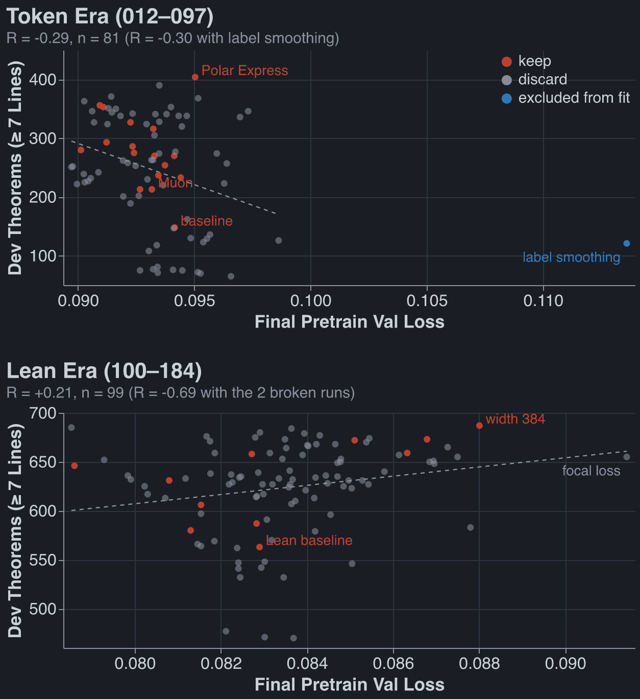
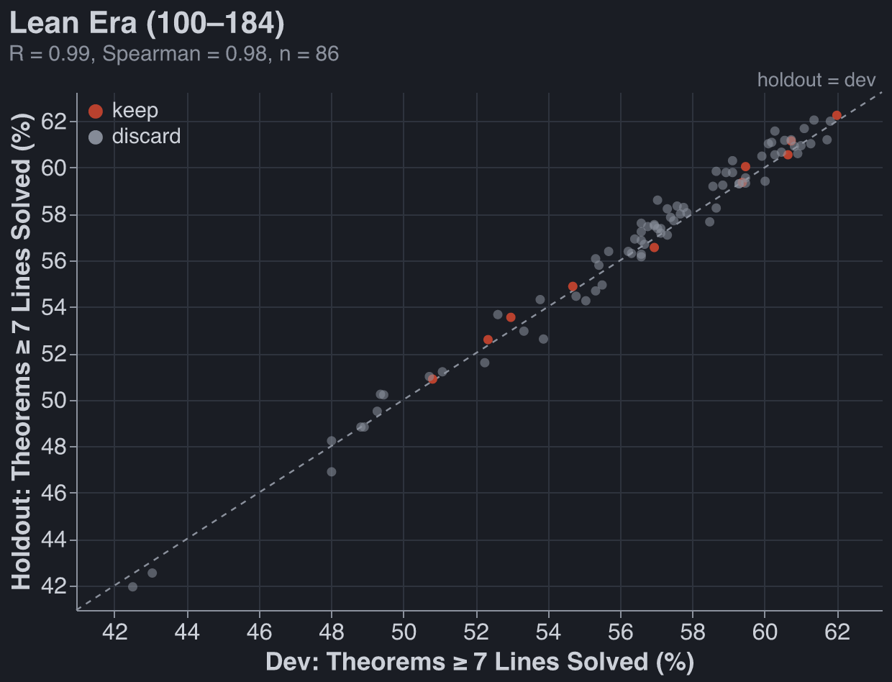
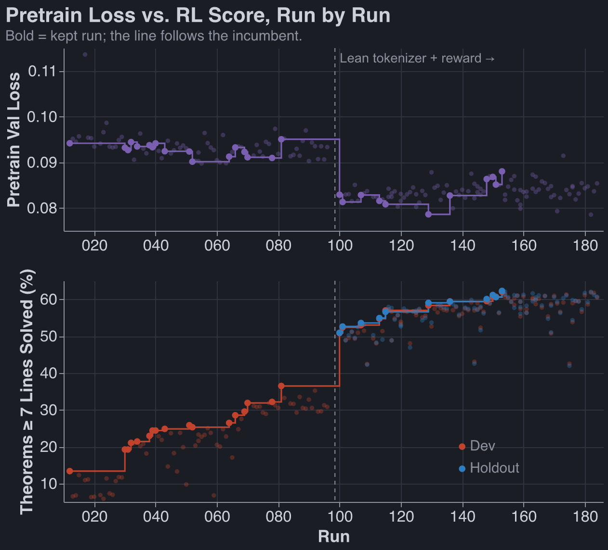
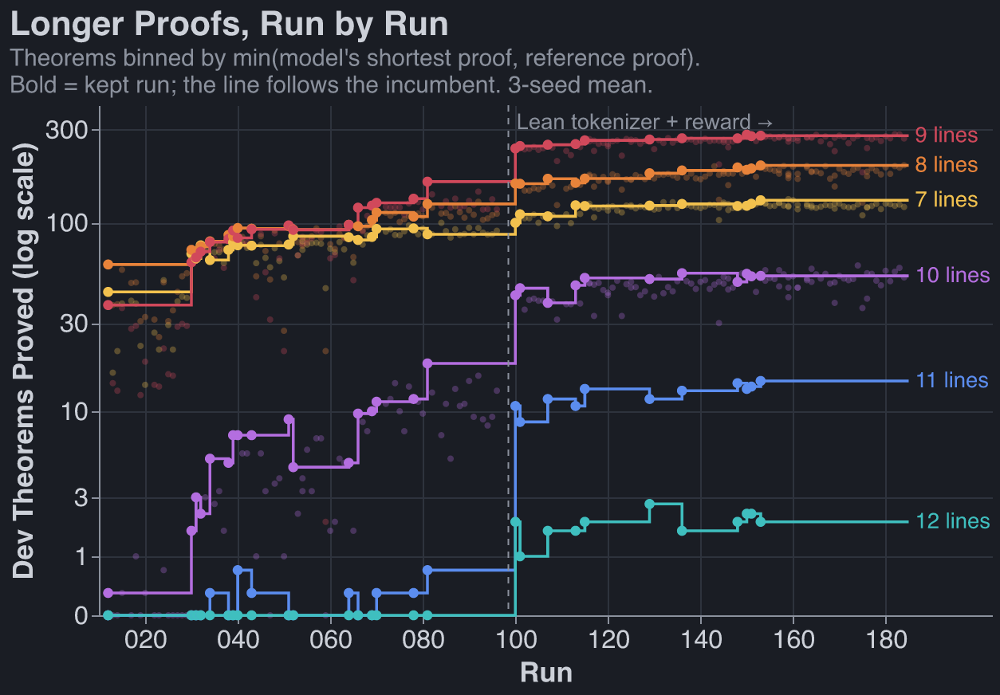
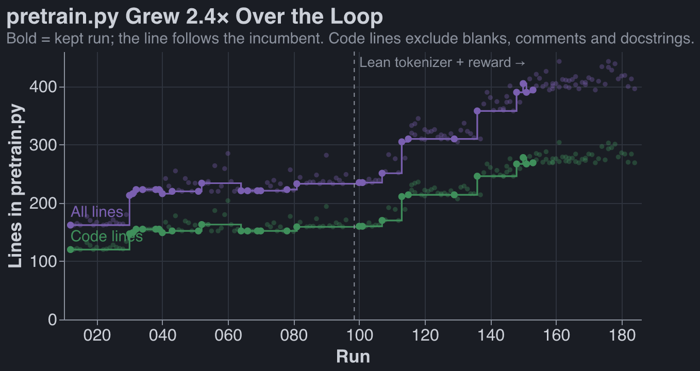

For context, see [previous work](https://robbiewmthompson.com/blog/natural-deduction-takehome/).

## Summary

I set up auto research to determine what pretraining setup would lead to the best RL performance on
our natural deduction task.

The only optimizations agents made to the pretrain that I was confident worked before checking the
held-out set were:

1. Lean tokenizer
2. Muon optimizer

Leon's new RL recipe does _much_ better on recipe 39 I sent him than on recipe 1 (~2x more proofs).
And held-out performance correlates _very_ strongly with validation performance. These update me
against p-hacking and make me more inclined to accept Fable's crazy experiments.

If you made me ship a pretrain implementation to the core of the repo today, I would probably ask
Claude to simplify what I have a fair amount, run it again, and if performances drop <10% just use
that.

## Mistakes Made:

1. It took me far too long to realize that the agents thought speedups were out of bounds (and thus
   they were training tiny models). Torch.compile didn't even work. Claude is somehow struggling
   _mightily_ to get this to work right now, it's still not done, which I feel bad about.
2. In general, I spent way too many tokens letting autoresearch spin without validating its outputs.

## Methodology:

1. Freeze training data to Dan's set (155k pretrain examples, 1.5k RL proofs for expert iteration,
   1.1k proofs not trained on and used to decide whether run is kept, 1.2k proofs held out until
   after runs finish)
2. Advance based on pass@64 on the eval set.
3. Freeze RL methodology (very vanilla expert iteration)
4. Freeze GPU budget: 300s of pretrain, ~2,100 seconds of RL (both of these numbers got increased).
5. Parameter cap of 10m. Almost never got hit because pretrain time was the limiting factor

## The Winning Model

Run `153-claude` (`lean-width384`, commit `debc89b`). Code:
`code/experiments/current/autoresearch/pretrain.py` at that commit; full config in
`results/153-claude_lean-width384/params.json`.

```
score           = 687 dev-transfer theorems solved at >= 7 lines (3-seed mean; seeds 0/1/2 = 676/700/685 of 1,108)
holdout         = 733 of 1,177 (732/737/729), scored offline after the loop

# ---- architecture (decoder-only transformer, the fork's GPT with swapped blocks)
total params    = 9,557,760 handed to RL (cap 10,000,000)
                  + 1,875,584 in the MTP module, trained during pretraining only and then thrown away
                  per block 1,579,136 = qkv 443,520 + attn out 147,840 + fc1 492,800 + fc2 491,904 + 4 LayerNorms 3,072
                  token embedding 41,088 + output head 41,088 (untied, 107 x 384) + final LayerNorm 768
layers          = 6
d_model         = 384
heads           = 8 heads x 48 dims
q, k, v         = one fused Linear(384 -> 1152) with bias, split into Q/K/V; plain multi-head attention
                  (k and v have 8 heads too, no GQA/MQA)
attn out        = Linear(384 -> 384) with bias
MLP             = Linear(384 -> 1280) -> GELU -> Linear(1280 -> 384), with biases
                  (3.33x, not the usual 4x: 4x = 1536 would push the model to 10.6M, over the cap)
norm            = Peri-LN: LayerNorm on each branch input (pre-LN) AND on each branch output,
                  x = x + LN(attn(LN(x))); x = x + LN(mlp(LN(x))); final LayerNorm before the head
attention       = 4 ALiBi + 4 NoPE heads in every block. No RoPE, no learned position embedding.
                  Logit bias -slope_h * (query_pos - key_pos): heads 1-4 slopes 1/4, 1/16, 1/64, 1/256;
                  heads 5-8 slope 0 (causal mask only)
max context     = 1024
dropout         = 0

# ---- pretraining objective
loss            = next-token cross-entropy on proof tokens only (prompt = theorem statement, context only)
                  + 0.3 x multi-token-prediction loss (DeepSeek-V3 style, depth 1):
                  one extra Peri-LN block reads [LN(trunk state at t); LN(embedding of token t+1)]
                  through a Linear(768 -> 384) and predicts token t+2 through the shared ln_f + head
data            = 154,990 cap-6 proofs (2-6 lines, ~31k per length), first 1,024 held out for val loss
augmentation    = random start offset on the hypothesis-name tokens (n1.. -> nK..), per record per step
batching        = token budget: 18,432 padded tokens per step. Each epoch shuffle, stable-sort by length,
                  cut into runs with count x max_len <= 18,432 (33-921 records, mean ~136), shuffle the runs
budget          = 300 s wall-clock on one A40 (construction included), ~4,500 steps (4,540/4,479/4,489),
                  ~4.0 epochs, no torch.compile
precision       = bf16 autocast, fp32 params and optimizer state

# ---- optimizer
split           = Muon on 30 matrices: per block Q, K, V, attn out, fc1, fc2 (x6), the output head,
                  and the MTP module's 5 matrices. AdamW on the token embedding, all biases, all LayerNorms
Muon            = lr 0.01, Nesterov momentum 0.95, 5 Polar Express iterations in bf16 (per-iteration
                  quintic coefficients, as in modded-nanogpt), Q/K/V orthogonalized separately,
                  update scaled by sqrt(max(rows, cols) / 384) so every matrix gets the same element RMS,
                  decoupled weight decay 0.1 (per-step shrink lr x 0.1 = 1e-3 at peak, 10x AdamW's)
AdamW           = lr 1e-3, betas (0.9, 0.95), weight decay 0.1, eps default
grad clip       = 1.0 global norm
schedule        = 200-step linear warmup, then cosine over wall-clock fraction (not steps) down to 0.3 x peak;
                  Muon lr follows the same multiplier
init            = embedding + head normal(0, 0.02); every 2D block matrix orthogonal with
                  gain 0.02 x sqrt(max(rows, cols)) (element std 0.02); biases 0; LayerNorm gain 1, bias 0

# ---- tokenizer (Dan's lean_seq, fork commit 51604b3, fixed across the ablations)
format          = Lean 4 tactic proof on one line, `;` between tactics, one symbol per token
vocab           = 107 = <pad> <eos> + 11 formula symbols ( ) ¬ ∧ ∨ → P Q R S False
                  + 6 statement symbols (theorem t : Prop := by) + 16 tactic symbols
                  (have exact ; fun => ⟨ ⟩ , .1 .2 .elim Or.inl Or.inr Or.elim Classical.byContradiction hh)
                  + h1..h8 premise names + n1..n64 hypothesis names
names           = n-names numbered by first appearance in the proof, plus the random start offset above
example         = theorem t ( P Q R S : Prop ) ( h1 : F1 ) ... : C := by
                  have n1 : F1 := h1 ; have n7 : ( P → R ) := ( fun ( n3 : P ) => by have n4 : Q := n1 n3 ; exact n4 ) ; exact n7 <eos>

# ---- pretraining diagnostics (seeds 0/1/2)
final val loss  = 0.088 / 0.087 / 0.089 (main next-token term only)
held-out greedy = 0.968 / 0.967 / 0.968 (cap-6 held-out proofs, greedy decode, verified)

# ---- fixed downstream RL (frozen harness, same for every run)
RL              = 4 rounds of expert iteration: 1,500 targets per round from a 4,495-theorem pool (7-14 lines),
                  32 samples each at T=0.8, keep Lean 4 AND nd_verify passes (<= 4 proofs per theorem),
                  fine-tune 600 steps, batch 128, AdamW lr 3e-4, verified proofs weighted 4x
                  and mixed with 20,000 pretraining records
seed-0 RL curve = targets solved 766 -> 1,022 -> 1,111 -> 1,157 over rounds 1-4
eval            = 1,108 dev-transfer theorems (7-14 lines), 64 samples each at T=0.8, pass = Lean 4 AND nd_verify
```

How it got here: every kept Lean-protocol change, each 3-seed mean vs the previous incumbent.

| run        | change                                            | score |
| ---------- | ------------------------------------------------- | ----- |
| 100-claude | Lean re-baseline: RoPE, 5 blocks, d 256, Muon     | 563   |
| 101-claude | 6 blocks instead of 5                             | 580   |
| 107-claude | Peri-LN                                           | 587   |
| 113-fable  | ALiBi on all 8 heads replaces RoPE                | 606   |
| 115-fable  | 4 ALiBi + 4 NoPE heads                            | 631   |
| 129-claude | cosine floor 0.1 -> 0.3 of peak lr                | 646   |
| 136-fable  | MTP auxiliary loss (weight 0.3, pretraining only) | 658   |
| 148-fable  | token-budget length-sorted batches                | 659   |
| 151-claude | d_model 256 -> 320                                | 672   |
| 153-claude | d_model 320 -> 384, MLP held at 1280              | 687   |

Not in the winner: 150-fable's bigram embedding table also kept (673), landing two minutes after 151
and briefly replacing it at HEAD, but 153 was built on 151 and overwrote it. The exact table (107² x
384 = 4.4M params) does not fit under the cap at width 384; 155-claude re-added it low-rank (11,449
x 32 table + 32 -> 384 projection) and scored 668 vs 687, with round-1 targets solved down 43% (419
vs 736). Full-rank vs low-rank and width are confounded there.

## Findings

### Does Pretrain Loss Correlate With RL Theorems Learned?

A: Not really. You would expect a negative sign below:

- Token era: $r = -0.29$, Spearman $\rho = -0.24$ ($n = 81$)
- Lean era: $r = +0.21$, Spearman $\rho = +0.29$ ($n = 99$)

Outliers excluded: label smoothing (017) in the token era, and in the Lean era the two broken runs
(166-fable2, 162-fable) that are off the chart.



### Validation Theorems Solved vs Held-Out Theorems Solved

- Token era: not scored on holdout yet
- Lean era: $r = 0.99$, Spearman $\rho = 0.98$ ($n = 86$)



### Pretrain Loss, RL Theorems



Progress on longer theorems:



Length here is the shorter of two proofs of each theorem: the model's shortest verified proof (with
uncited lines pruned) and the deterministically-generated reference proof.[^bank][^globalmin]

[^bank]:
    The dev pool has 1,108 theorems. By reference-proof length: 150 of 7 lines, 152 of 8, 477 of 9,
    219 of 10, 49 of 11, 54 of 12, 5 of 13 and 2 of 14. The reference length is only an upper bound:
    the incumbent (153) finds a shorter proof than the reference for about 27% of the theorems it
    solves, and a longer one for about 7%.

[^globalmin]:
    The min is taken per run. We neglect the global-min analysis in the chart, which would fix each
    theorem's length as the shortest proof found by any run (311 of the 1,108 theorems beat their
    reference that way). If we had done global min, the incumbent's counts would change by +3% at 7
    lines, +18% at 8, −17% at 9, −14% at 10, −18% at 11 and 0% at 12. Earlier runs move further down
    at the long end (Polar Express, 081: −55% at 10 lines), so the chart slightly understates the
    progress on long proofs.

## Potpourri

### LoC over time



The model is one file, `pretrain.py`, the only file agents edit. It builds on frozen modules from
Dan's fork (the base `GPT` and `Block` classes, the tokenizer, the loss), so this counts what the
loop added on top, not the whole model.

### Why Does the Lean Tokenizer Work so much Better?

I suspect it has a lot to do with depth invariance. Stealing Dan's unary-| hypothesis:

In the ND world, if the model is in a depth-three box, it has to write something like

```
N13 | | | P : AS ;
N14 | | | (QvP) : ORI2 N13 ;
```

Whereas in the Lean world depth is not marked by bars but by parens:

```
( fun ( n14 : P ) => by
    have n15 : (Q ∨ P) := Or.inr n14 ;
    exact n15 )
```

There are more parens wrapped around this `fun`, but locally we don't care about them.

### How Do We Deal With Relative References and Getting Past 7 Lines?

We number statements, eg:

```
N1 (PvQ) : PR ;
  N2 | P : AS ;
  N3 | (QvP) : ORI2 N2 ;
  N4 | Q : AS ;
  N5 | (QvP) : ORI1 N4 ;
N6 (QvP) : ORE N1 N2 N3 N4 N5 ; QED
```

We then add a random offset so that the model sees more than six 'name' tokens:

```
-- ND, offset +11
N12 (PvQ) : PR ;
  N13 | P : AS ;
  N14 | (QvP) : ORI2 N13 ;
  N15 | Q : AS ;
  N16 | (QvP) : ORI1 N15 ;
N17 (QvP) : ORE N12 N13 N14 N15 N16 ; QED

-- Lean, offset +11
have n12 : (P ∨ Q) := h1 ;
have n13 : (Q ∨ P) := Or.elim n12
    ( fun ( n14 : P ) => by
        have n15 : (Q ∨ P) := Or.inr n14 ;
        exact n15 )
    ( fun ( n16 : Q ) => by
        have n17 : (Q ∨ P) := Or.inl n16 ;
        exact n17 ) ;
exact n13
```

In practice offset is random 0-64. I did not ablate this.

## Longer Summary of Results (Claude Written)

Top 10 single-change jumps. Metric: dev theorems solved at length $\geq 7$, mean of seeds 0/1/2.
Delta is vs the incumbent the run was compared against. Protocol changes are excluded.

| #   | Run | Δ       | Score   | What changed                                          | Notes                                                                        |
| --- | --- | ------- | ------- | ----------------------------------------------------- | ---------------------------------------------------------------------------- |
| 1   | 030 | **+65** | 148→213 | **Muon** for hidden matrices (was AdamW)              | Every seed up (+117/+21/+57); val loss ~flat. The one clearly real jump.     |
| 2   | 081 | **+48** | 356→404 | **Polar Express** Newton-Schulz coefficients in Muon  | Pretraining indistinguishable; RL went further. Every seed up.               |
| 3   | 115 | +26     | 606→631 | Hybrid heads: ALiBi on 4 heads, NoPE on 4             | Fixed 113's bad RL start (round-1 parse failures 30–64% → 18–25%).           |
| 4   | 070 | +25     | 327→353 | Muon weight decay 3× → 10×                            | RL better from round 1; no sharpness failure.                                |
| 5   | 066 | +23     | 293→316 | Batch 256 → 128 (2× optimizer steps, same wall-clock) | Val loss didn't drop. "Steps turn into score."                               |
| 6   | 032 | +19     | 213→233 | AdamW finish for last 20% of pretraining              | **Later removed (040) at an exact tie.**                                     |
| 7   | 113 | +19     | 587→606 | ALiBi replaces RoPE                                   | ~+30% pretraining steps; own mechanism refuted. Probably partly a speed win. |
| 8   | 038 | +17     | 237→254 | AdamW finish shortened to 10%                         | Same AdamW-finish line.                                                      |
| 9   | 101 | +16     | 563→580 | 5 → 6 layers (Lean protocol)                          | −17% steps, still up on every seed.                                          |
| 10  | 039 | +16     | 254→270 | AdamW finish shortened to 5%                          | Same AdamW-finish line.                                                      |

Just below the cutoff: 129 (LR floor 0.1 → 0.3, +15), 153 (width 384, +15), 150 (bigram table, +14),
151 (width 320, +14).

Protocol jumps (not comparable, not ideas): 000 → 012 (56 → 148, 600 s → 1200 s harness and 3-seed
bar); 081 → 100 (404 → 563, Lean tokenizer + Lean ∧ nd_verify reward + 2400 s).

Noise: pooled one-seed sd is 41.6 (token era) and 44.7 (Lean era), so the SE of a difference of two
3-seed means is ~36. Only Muon (~1.8 SE) and Polar Express (~1.3 SE) clear it. Ranks 6, 8 and 10
(+52 combined) came from the AdamW finish, which 040 then deleted at a tie. Keeps are selected for
being high, so kept deltas overstate true effects. 153 (687) has held for 30+ runs (154–184), many
of which scored 670–685.

By era: token era 148 → 404 (2.7×), almost all from the Muon family. Lean era 563 → 687 (+22%), from
architecture and position encoding, plus spending 148's token-batching speed on width.
