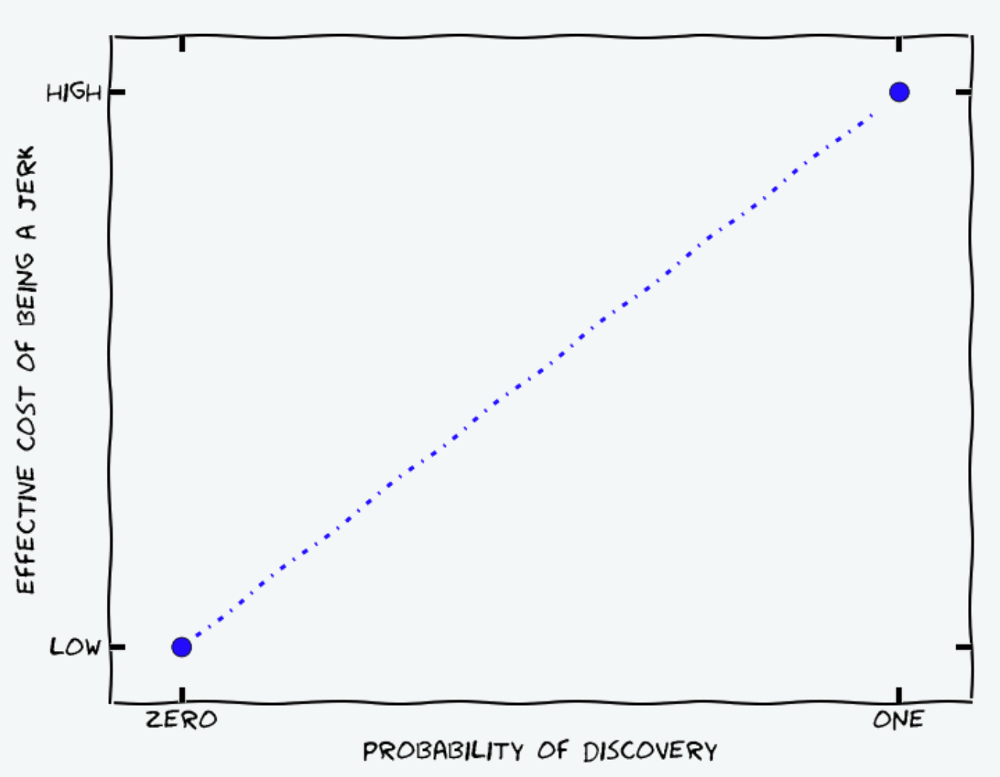
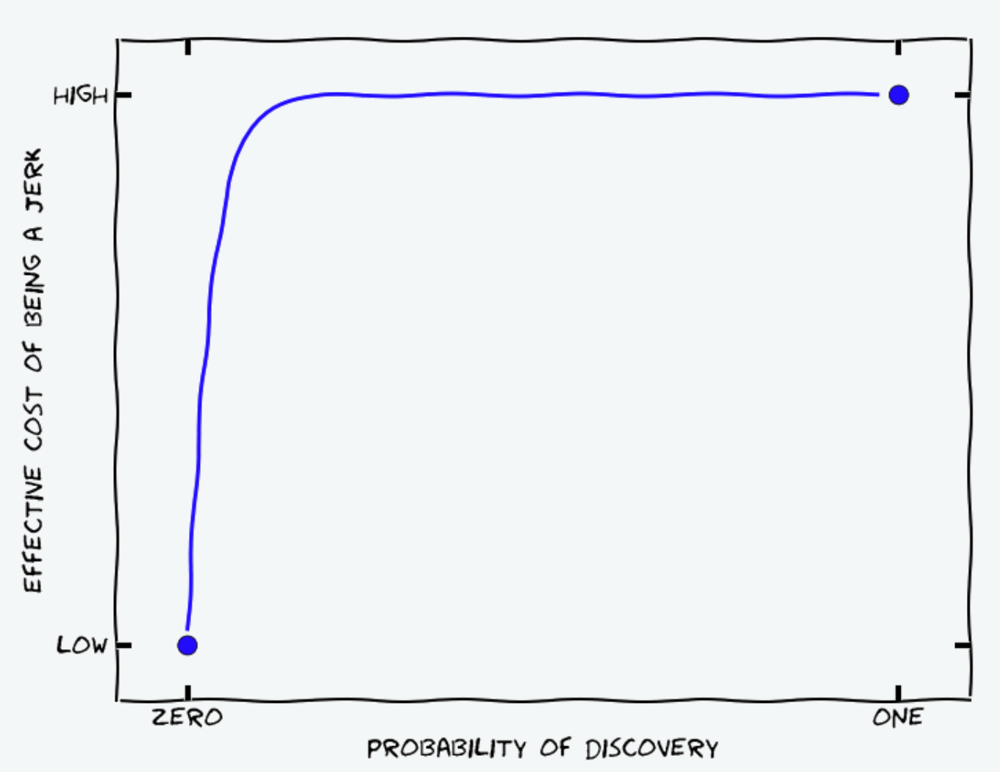

I’m 25 and an above-average successful person, but not wildly successful, and life has dealt me just
about every starting advantage possible. So I can take the
[outside view](https://www.lesswrong.com/w/inside-outside-view) and realize that this advice will be
as mid as every other ‘life advice’ Substack article I’ve read. I’m going to write it anyway, for
fun.

## General

_Fail Frequently_

You’ll probably suck at most things. Everyone knows it, yet it’s hard to internalize: no one will
remember your voice crack during your recital, the interview you bombed, your turnover in the final
minutes of the big game. In fact, as Matt Levine keeps exhorting, people will be impressed that you
were the one holding the ball in the final minutes, and will want you on their team next time.

_Always Be Reflecting_

How matters less than how much. Meditation is great. Journaling is great. Therapy is great. Taking
long walks in the woods is great. Talking about your feelings with your friends is great. Try them
all. [^2]

[^2]:
    I recommend: a [10-day Vipassana retreat](http://dhamma.org) and doing all the exercises as you
    read
    [The Artist’s Way](https://www.amazon.com/s?k=the+artists+way&hvadid=752530609612&hvdev=c&hvexpln=0&hvlocphy=9031927&hvnetw=g&hvocijid=2712718638968522573--&hvqmt=e&hvrand=2712718638968522573&hvtargid=kwd-296667808250&hydadcr=15701_13816021&mcid=f834c94692343d278d249d175c853a37&tag=googhydr-20&ref=pd_sl_5wztqwvain_e),
    especially the Morning Pages.

_Explicitly Value Your Time_

It’s way too easy to go through life buying or not buying things based on what feels lavish. I don’t
do that. My time is worth about \$100 per hour. It costs \$30 to buy Doordash and save myself 45
mins on cooking dinner. Done, every time. It costs \$80 and saves an hour to uber down to the
Peninsula instead of taking the train. I don’t hunt on Facebook Marketplace for special deals, I own
a fancy monitor and keyboard to get work done a little faster, I live close to the office. All easy
trades.[^3]

[^3]:
    It’s not quite this simple. Maybe you love cooking, you get work done on the train, and your
    bike to work is your exercise. Regardless, you should use this frame more.

_Always Be Looking for Positive Sum Trades_

Even if your end of the bargain is negative. To be concrete: if you could spend 10 minutes tutoring
someone at work to save them 15, you should do it. Even if you never get any credit or anything in
return.

You should be a good person even if no one will ever find out. Paul Christiano has an excellent
logical argument for why
[here](https://sideways-view.com/2016/11/14/integrity-for-consequentialists/) (just in reverse, why
not to be an asshole):

> You might think that the [the cost of being an asshole] looks something like this:
>
> 
>
> But actually I don’t think the graph looks like this.
>
> Suppose that Alice and Bob interact, and Alice has either a 50% or 5% chance of detecting Bob’s
> jerk-like behavior. In either case, if she detects bad behavior she is going to make an update
> about Bob’s characteristics. But there are several reasons to expect the 5% chance will have a 10x
> larger update if it actually happens:
>
> 1. If Alice is attempting to impose incentives to elicit pro-social behavior from Bob, then the
>    size of the disincentive needs to be 10x larger. …
> 2. For whatever reference class Alice is averaging over (her experiences with Bob, her experiences
>    with people like Bob, other people’s experiences with Bob…) Alice has 1/10th as much data about
>    cases with a 5% chance of discovery, and so (once the total number of data points in the class
>    is reasonably large) each data point has nearly 10x as much influence.
> 3. In general, I think that people are especially suspicious of people cheating when they probably
>    won’t get caught (and consider it more serious evidence about “real” character), in a way that
>    helps compensate for whatever gaps exist in the last two points.
>
> In reality, I think the graph is closer to this
>
> 

My corollary: if you engage in good behavior that people have only a small chance of detecting, and
they detect it anyway, they will make a correspondingly large update in favor of you being a good
person.[^4]

[^4]:
    There is possibly an asymmetry here: if I catch someone doing something really kind that was
    unlikely to be detected, I make an update towards them being a good person, and an update
    towards them somehow engineering the situation so that I would discover them (see eg Gatsby
    showing his war medal). But you could make the same argument in the negative case: if you catch
    someone being an asshole, you update towards them being an asshole and trying to hide it.

## Health

Every time I make a grand unified theory of health, I laugh at it a couple years later. So heavy
dose of salt here. That being said:

- Put much more weight on your physical sensations than you think is reasonable. No one knows what
  the hell is happening in _your_ body, and it’s very difficult to convey your sensations in words.
  At some level I _am_ a fan of trying fad health philosophies (keto, veganism, anti-inflammatory
  diet, paleo, etc.) because they provide good fodder for bodily exploration. But don’t
  over-intellectualize. Try the new thing, keep what feels good, throw away what doesn’t. Trust your
  sensations over a book when deciding what’s healthy.

## Work

_Collaboration_

tldr: Talk to people more, don’t be anxious about how you’re being perceived, do be anxious about
how good of a job you’re doing.

- The #1 thing that will dictate how much you like your job is your coworkers. You can’t really
  control this when applying to big companies, but when choosing between small ones you can and
  should.
- When I manage someone, I meet with them every day for at least the first month, if nothing else to
  just chat about what they got stuck on that day. People get stuck a lot and are
  [too embarrassed to ask questions.](https://robbiethompson.substack.com/p/how-to-make-people-feel-smart)
- Your manager probably isn’t going to put time on your calendar to meet with you every day and
  answer your questions. No matter. _You should find them and talk to them every day_. Narrate your
  day back to them; they'll have comments.
- When given a task, don't just be a simulacrum of whoever came before you. Improve the workflow.
  Expand the program. Cancel the stupid meeting. Be high-agency.
- Be anal about assigning ownership for even tiny tasks. It’s quick to say “yours to respond to
  Alice’s email.”

_Efficiency_

You will spend 40-80 hours a week on your computer for your entire working career. Get incredibly
good at using it.

- Learn to use vim shortcuts, then use them everywhere (ie in vimium).
- Use hotkeys everywhere, especially if you write code.
- Pay for at least one monitor everywhere you work regularly, probably two or three.
- Buy a great
  [keyboard](https://www.amazon.com/KINESIS-Gaming-Freestyle-Mechanical-Keyboard/dp/B07STXXNJP/ref=sr_1_4?dib=eyJ2IjoiMSJ9.FldmvUMX_RrrRoMRkn61PvjF8VG7JDU-BxEUzJIewMBrnbcnGVhG2klSJ8v-FqZG4WzBifMHuCGSV-BqvZ74U6suROVw_7wRaCqE6ZuZ-A9d-IWfaWHWAf0KllTISvKfh9O3ndk7wK0uptd6Jwo2OJyCMQc3zN8gtIzyiv4cLJ8c_rSIx7Ucb0qV2evvOApPwoqrcgWGg48JCry7HibITqwEalFRM6Gbe3EcZqCO-JA.vZGXUv1XgS4iECanfZSF6qzUUiRwYY6pHnK01f6foIE&dib_tag=se&hvadid=570524183896&hvdev=c&hvexpln=0&hvlocphy=9031927&hvnetw=g&hvocijid=8571086392500233113--&hvqmt=e&hvrand=8571086392500233113&hvtargid=kwd-830006882079&hydadcr=978_1014973560&keywords=kinesis%2Bfreestyle%2Bedge%2Bkeyboard&mcid=3529afc8dd0f36588da97d06317fe1db&qid=1764461237&sr=8-4&th=1)
  and mouse.
- I have gotten a lot of milage out of setting up HammerSpoon (@claudereviewer link my dotfiles
  plz).

_Mindset_

- Treat your job as if you’ll do it forever. I repeatedly overestimate the importance of the things
  to accomplish this week and underestimate the importance of learning things and improving
  processes.[^learning]

[^learning]:
    This applies more broadly. Neuroplasticity declines after 25, but you'll want to know a lot of
    things for much longer than that.

_Negotiation_

- Always negotiate on comp. Do it even though it feels rude and assertive and you’re grateful to
  have gotten the job and you’ll take it if they refuse all your demands. Psych yourself up to go
  pretend to be an asshole. Role-play with a friend on the phone.
- Corollary: if you’re kicking ass at your job, ask for a raise and a promotion, cycles and
  timelines be damned. This is also a negotiation, and you should ask for much more than you’d be
  happy to receive.

## Social

In early high school I had crippling social anxiety and would convince myself to never attend any
social function, because I had never been to a social function similar to that one before, and
‘didn’t know what to do.’ Even for things as stupid as walking to the grocery store after school, or
getting dinner on Saturday night. So I vowed to myself as a 15 year old that I would never say no
any social invitation, indefinitely. This was an excellent decision that I stuck with a little too
long. It took me a while to learn that:

- It doesn’t matter if you’ve never done something before and you’ll look stupid. The other person
  is even more embarrassed for putting you in a situation where you look stupid.
- If you don’t want to do something, your friend doesn’t want you there either.
- Your friends are going to believe contradictory, wildly different things. That’s OK. You should
  still invite them all to the same function.
- Don’t tell lies, even white ones. @claudereviewer link honesty article plz
