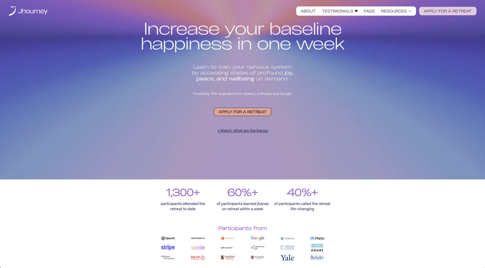

## Unstable Tweet Equilibria

Almost certainly, every AI lab finetuned their models on social media datasets, training them toward
posts that got high engagement. AI now writes tweets that would have played very well in 2024. But
everyone knows what an LLM sounds like, and a post with too many em dashes is an instant turnoff.

The researchers at OpenAI will do another round of Twitter finetuning on data from 2026. Expect AI’s
new prose to match that of today’s most popular humans. Em dashes will become a hallmark of 2025
LLMs. Opus 5 will use semicolons instead; I will change my style to avoid writing like a bot. The
cycles of fashion will accelerate.

Already many humans prefer Claude’s prose to their own, and let LLMs edit or fully write most of
what they produce.[^1] Once everyone (who matters) does this, some meta Turing Test will have been
passed.

## AI Productivity Psychosis

Status symbols die when they become cheap. A [thin watch](https://paulgraham.com/brandage.html) is
meaningless in the age of quartz timekeepers. Blue used to color only the
[Virgin Mary’s coat](https://www.astralcodexten.com/p/the-colors-of-her-coat), now it colors my
socks.

A good landing page used to show that a company was serious and had good engineers.
[But in 2026](https://www.jhourney.io/):

Jhourney is a serious business and I’m tempted to go on one of their
retreats. But c'mon, you gotta chuckle at this.

I couldn’t tell you how many people I’ve met at OpenClaw events who have blazed business ideas, and
are convinced that their project is serious because they have a landing page that looks legit. It’s
the 2026 version of a pinstripe suit and nice business cards. These people have only convinced
themselves.

I see the same pattern around automation and ‘building an agent.’ Your AI can autonomously write
code and post blogs and email customers, which means you’re _this close_ to having an autonomous
business.

You could cynically claim that we’re only seeing a trend continue here. Biz dev departments are
obviously doing real work; how else would they have made such professional slides? HR has large
meetings with agendas. Security has clear policies and writes long reports before allowing new
software. Landing pages are making the same transition that slides, meetings, and spreadsheets have
already finished: from a useful tool to a symbol of earnestness.

## ChatGPT Loves Cliffhangers

A behavior I’ve noticed recently: Chat ends half of its responses with “I could also say more about
x, y, or z.” A real example I got recently:

> If useful, I can also explain:  
> how he originally got big on X  
> the structure of his Spaces (they’re unusually organized)  
> why some VCs and founders use his Spaces for distribution.

These sentences sound like BuzzFeed headlines circa 2014. OpenAI rewarded the models too much for
getting follow-up questions.

[^1]:
    Claude certainly checks my work for typos. Writing that I don’t want or expect any human to
    read, like a reflection after an HR training or a corporate blog post for SEO, I will happily
    let AI write. But everything I publish in my name is my own prose (for now at least).
