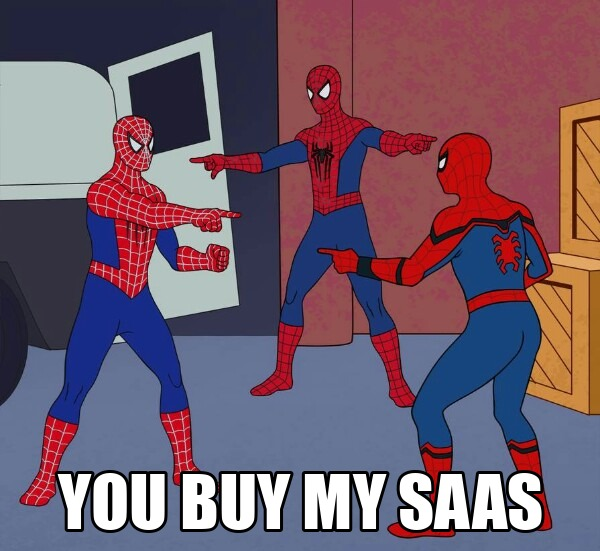

I'm going to start writing up why various startups of mine have failed.

You might think this one is obvious (OpenClaw, lol), but I'm going to write up anyway to better tune
my BS detector.

## Startup Incest

About a year ago haters would post on Twitter that AI spending was one giant circle. OpenAI forks
over billions for GPUs from Nvidia to sell tokens to startups that get their money from credulous
VCs and ... Nvidia. This criticism is usually stupid, but possibly not in the case of OpenClaw. We
got VC money to sell OpenClaw hosting to other startups. What did those startups do? Also try to
sell startups OpenClaw-related services! Payment rails, or browser agents, or skills, or
integrations. The few non-startup customers we had were, ironically, VCs.[^customers] The buck
stopped nowhere.

Clawcon NYC 2026, Stylized

[^customers]: And some tiny number of brick and mortar businesses.

## Productivity Porn

Our customers were enamored with the possibility of agents. There was so much they wanted to do and
now they could finally execute. Those six business ideas you'd been sitting on? Klaus had worked all
night to build landing pages and outbound campaigns. Our customers had big dreams. The happy ones
were blissfully unaware that their emails were getting spam-blocked, their websites were broken, and
their 4GB VM could not run Kimi locally.

## The Grifters

I've seen a lot of larping and incompetence in the SF startup scene:

- Crypto founders describing brazen fraud as normal accounting
- Peptide salespeople confusing milligrams and micrograms and not even pretending to know the
  mechanisms behind their product
- People with no finance background founding trading startups and with no strategy besides "Claude
  looked into macro trends"

These three scenes (crypto, peptides, trading) attract a disproportionate number of grifters.
[^disclaimer] I don't know whether these people are dishonest or incompetent, but a ton of them sure
loved OpenClaw. The hype was manufactured, as has become obvious in the past couple months.

[^disclaimer]: Certainly not everyone who works in one of these fields is a grifter.

## YOLO Mode

The OpenClaw codebase was a vibe-coded mess. An example: changing settings required restarting the
entire OpenClaw process, and restarts took 30 seconds. Our users got really annoyed by this.

After OpenClaw blew up, Peter backtracked on the project's YOLO Mode ethos and added ridiculously
overzealous safeguards, like banning certain terminal commands by default.

## Not Hard Enough

Canonical startup advice: the thing you're working on must be ambitious.

- VCs funds rely on the possibility of a 100x return.
- Unambitious companies are boring. No one will work for you, advise you, or try your demo.
- Anthropic will clone simple products.
